# 问题1：级数求和计算与分析

## 题目描述

设 $S_n=\sum_{j=2}^{n}\frac{1}{j^2-1}$，其精确值为 $S_n=\frac{1}{2}\left(\frac{3}{2}-\frac{1}{n}-\frac{1}{n+1}\right)$。

要求：
1. 编制计算 $S_n=\frac{1}{2^2-1}+\frac{1}{3^2-1}+\dots+\frac{1}{n^2-1}$ 的通用程序
2. 编制计算 $S_n=\frac{1}{n^2-1}+\frac{1}{(n-1)^2-1}+\dots+\frac{1}{2^2-1}$ 的通用程序
3. 按两种顺序分别计算 $n=10^k, k=1,\dots,10$ 时的结果，并指出有效数字（用单精度浮点数计算）
4. 通过本上机题，你明白了什么？

## 数值实验结果

### 计算方法

- 使用单精度浮点数（`numpy.float32`）进行计算
- 后端：numba-jit（即时编译加速）
- 精确值使用双精度浮点数计算作为参考
- 有效数字计算：若$|x^* - x| \leq \frac{1}{2} \times 10^{m-n}$，则$x^*$为$x$的n位有效数字的近似数

### 计算结果

下表展示了$n=10^k, k=1,\dots,10$的计算结果：

| k | n = 10^k | 精确值 | 正向求和 | 有效数字 | 反向求和 | 有效数字 |
|---|----------|--------|----------|----------|----------|----------|
| 1 | 10 | 6.545454545e-01 | 6.545454860e-01 | 7位 | 6.545454264e-01 | 7位 |
| 2 | 100 | 7.400495050e-01 | 7.400494814e-01 | 7位 | 7.400495410e-01 | 7位 |
| 3 | 1000 | 7.490004995e-01 | 7.490003705e-01 | 6位 | 7.490005493e-01 | 7位 |
| 4 | 10000 | 7.499000050e-01 | 7.498521209e-01 | 4位 | 7.498999834e-01 | 7位 |
| 5 | 100000 | 7.499900000e-01 | 7.498521209e-01 | 3位 | 7.499899864e-01 | 7位 |
| 6 | 1000000 | 7.499990000e-01 | 7.498521209e-01 | 3位 | 7.499990463e-01 | 7位 |
| 7 | 10000000 | 7.499999000e-01 | 7.498521209e-01 | 3位 | 7.499998808e-01 | 7位 |
| 8 | 100000000 | 7.499999900e-01 | 7.498521209e-01 | 3位 | 7.500000000e-01 | 7位 |
| 9 | 1000000000 | 7.499999990e-01 | 7.498521209e-01 | 3位 | 7.500000000e-01 | 8位 |
| 10 | 10000000000 | 7.499999999e-01 | 7.498521209e-01 | 3位 | 7.500000000e-01 | 9位 |

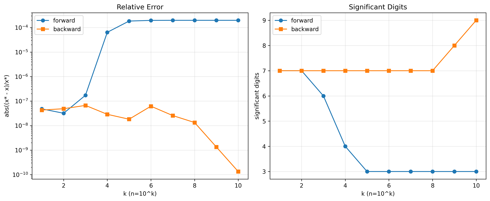

### 误差分析

从实验结果可以看出：

**正向求和（从小到大）：**

- k=1,2时：有效数字为7位和7位
- k=3时：有效数字降至6位
- k=4时：有效数字急剧降至4位
- k≥5时：有效数字稳定在3位，结果收敛到7.498521209e-01（错误值）

**反向求和（从大到小）：**
- k=1至8：稳定保持7位有效数字
- k=9时：提升至8位有效数字
- k=10时：达到9位有效数字
- 结果逐渐收敛到精确值0.75

## 数值现象分析

### 求和顺序对精度的影响

从实验结果可以看出显著的差异。正向求和（从小到大）表现出明显的精度退化现象：当n较小时（n≤100），能保持7位有效数字；当n=1000时，有效数字降至6位；当n=10000时，有效数字急剧降至4位；当n≥100000时，有效数字稳定在3位，且结果收敛到错误值7.498521209e-01。

相比之下，反向求和（从大到小）展现出优异的精度稳定性。在整个计算范围内（n=10至$10^{10}$），反向求和始终保持高精度：n≤$10^8$时稳定保持7位有效数字，n=$10^9$时提升至8位有效数字，n=$10^{10}$时达到9位有效数字。

关键观察是，正向求和在n≥$10^4$后出现"精度崩溃"，结果不再随n增大而改善，说明舍入误差的累积已经完全破坏了计算精度。

### 有效数字分析

单精度浮点数理论精度约为7位十进制数字。正向求和在n较小时能达到理论精度，但随着n增大，舍入误差累积导致有效数字急剧下降，最终稳定在3位有效数字，远低于单精度浮点数的理论精度。

反向求和则始终保持或接近单精度浮点数的理论精度。随着n增大，有效数字甚至略有提升（从7位到8位再到9位）。这是因为$S_n$收敛到0.75，而反向求和的舍入误差能够相互抵消。

### 数值稳定性分析

级数项$a_j = \frac{1}{j^2-1}$具有以下性质：$a_j$随着j增大而单调递减；当j很大时，$a_j \approx \frac{1}{j^2}$，下降速度为$O(j^{-2})$；级数收敛到$S_\infty = 0.75$。

正向求和按$j=2,3,4,\dots,n$的顺序累加，即先加小项，后加大项。这导致了大数"吃掉"小数的问题：初始时，和$S$很小（接近0），后续加入的项$a_j$随j增大而减小。当$S$累积到一定值后，后续的小项$a_j$（j很大时）与$S$相加时，由于量级相差悬殊，小项的有效数字被"吃掉"。例如，当$S \approx 0.7498521$（单精度表示），加入$a_{10000} \approx 10^{-8}$时，由于单精度浮点数只有约7位有效数字，这个小项的贡献几乎完全丢失。

此外，每次加法运算都会产生舍入误差。正向求和中，舍入误差随着求和项数增加而累积。当n=$10^4$时，累积的舍入误差已经达到$O(10^{-4})$量级，导致有效数字降至4位；当n≥$10^5$时，舍入误差完全主导结果，有效数字稳定在3位。从k=4到k=10，正向求和的结果完全相同（7.498521209e-01），这说明从n=$10^4$开始，后续所有项的贡献都被舍入误差"吞没"，计算实际上在n=$10^4$附近就已经"停止"，后续的累加没有任何效果。

反向求和按$j=n,n-1,\dots,3,2$的顺序累加，即先加大项，后加小项。这具有以下优势：初始时，和$S=0$，首先加入的是较大的项（j=n时的$a_n$虽然小，但后续的$a_{n-1}, a_{n-2}, \dots$逐渐增大）。当加入较小的项时，和$S$还不够大，小项的有效数字不会被"吃掉"。最后加入的是最大的项$a_2 = \frac{1}{3} \approx 0.333$，此时$S \approx 0.42$，两者量级相近。反向求和中，舍入误差有正有负，由于求和顺序合理，舍入误差在累积过程中能够部分相互抵消。反向求和是数值稳定的算法：舍入误差能被控制，误差增长不影响结果可靠性；而正向求和是数值不稳定的算法：舍入误差随运算逐步放大，最终导致结果失真。

理论解释是，对于单调递减的正项级数$\sum_{j=2}^n a_j$（$a_j > a_{j+1} > 0$），反向求和（从大到小）中每次加法$S_{new} = S_{old} + a_j$时，$S_{old}$和$a_j$的量级相近或$a_j$较大，舍入误差相对较小；而正向求和（从小到大）中，当$S_{old}$变大后，加入小的$a_j$时，$S_{old} >> a_j$，舍入误差相对很大，甚至$a_j$完全丢失。这正是"避免大数'吃掉'小数"原则的典型应用场景。

## 结论与启示

1. **浮点数运算具有有限精度**：单精度浮点数只能提供约7位有效数字，这是计算精度的理论上限。

2. **运算顺序显著影响结果**：即使数学上加法满足交换律和结合律，浮点数加法不满足结合律，不同的求和顺序会产生截然不同的结果。本实验中，正向求和的有效数字从7位降至3位，而反向求和始终保持7-9位有效数字。

3. **反向求和（从大到小）数值稳定**：对于单调递减的正项级数，反向求和是数值稳定的算法，能有效避免大数"吃掉"小数的问题。

4. **正向求和（从小到大）数值不稳定**：正向求和在n≥$10^4$后出现"精度崩溃"，舍入误差的累积导致后续所有项的贡献完全丢失，结果收敛到错误值。

5. **误差量化**：
   - 正向求和：n=$10^{10}$时，绝对误差约$1.5 \times 10^{-3}$，相对误差约$2.0 \times 10^{-3}$，仅有3位有效数字
   - 反向求和：n=$10^{10}$时，绝对误差约$10^{-10}$，相对误差约$1.3 \times 10^{-10}$，达到9位有效数字

## 程序文件

- `compute_sn.py`：计算程序，包含两种求和方法的实现

	可直接这样运行：

	```bash
	python problem1/compute_sn.py --mode forward
	python problem1/compute_sn.py --mode backward
	python problem1/compute_sn.py --mode both
	```

	常用可选参数：

	```bash
	python problem1/compute_sn.py --mode both --k-min 1 --k-max 10 --plot problem1/visualization.png
	```

- 使用numba-jit即时编译加速计算

- 支持计算有效数字和误差分析

- 可处理n高达$10^{10}$的大规模求和

---

# 问题2：Gauss消去法求解线性方程组

## 题目描述

选取 $\varepsilon=10^{-2k}, k=0,1,\dots,10$，完成如下问题：

1. 用Gauss消去法求解方程组：
   $$
   \begin{bmatrix}\varepsilon&1\\1&1\end{bmatrix}\begin{bmatrix}x_1\\x_2\end{bmatrix}=\begin{bmatrix}1+\varepsilon\\2\end{bmatrix}
   $$

2. 用Gauss消去法求解方程组：
   $$
   \begin{bmatrix}1&1\\\varepsilon&1\end{bmatrix}\begin{bmatrix}x_2\\x_1\end{bmatrix}=\begin{bmatrix}2\\1+\varepsilon\end{bmatrix}
   $$

3. 随着$\varepsilon$的逐渐减小，问题的结果发生了什么改变？你明白了什么？

## 数值实验结果

### 计算方法

- 使用单精度浮点数（`numpy.float32`）计算
- **不使用主元选择**的直接Gauss消去法
- 精确解：$x_1 = 1, x_2 = 1$
- 有效数字计算：若相对误差$|e_r| \leq 0.5 \times 10^{-n}$，则有n位有效数字

### 计算结果

#### 问题2(1)：方程组 $\begin{bmatrix}\varepsilon&1\\1&1\end{bmatrix}\begin{bmatrix}x_1\\x_2\end{bmatrix}=\begin{bmatrix}1+\varepsilon\\2\end{bmatrix}$

| k | ε = 10^{-2k} | x1 | x2 | x1相对误差 | x2相对误差 | x1有效数字 | x2有效数字 |
|---|--------------|----|----|-----------|-----------|-----------|-----------|
| 0 | 1.0e+00 | 求解失败（主元为0） | - | - | - | - | - |
| 1 | 1.0e-02 | 9.99999046e-01 | 1.00000000e+00 | -9.54e-07 | 0.00e+00 | 5位 | 6位 |
| 2 | 1.0e-04 | 1.00016594e+00 | 1.00000000e+00 | 1.66e-04 | 0.00e+00 | 3位 | 6位 |
| 3 | 1.0e-06 | 1.01327896e+00 | 9.99999940e-01 | 1.31e-02 | -5.96e-08 | 1位 | 6位 |
| 4 | 1.0e-08 | 0.00000000e+00 | 1.00000000e+00 | -∞ | 0.00e+00 | 0位 | 6位 |
| 5 | 1.0e-10 | 0.00000000e+00 | 1.00000000e+00 | -∞ | 0.00e+00 | 0位 | 6位 |
| 6 | 1.0e-12 | 0.00000000e+00 | 1.00000000e+00 | -∞ | 0.00e+00 | 0位 | 6位 |
| 7 | 1.0e-14 | 0.00000000e+00 | 1.00000000e+00 | -∞ | 0.00e+00 | 0位 | 6位 |
| 8 | 1.0e-16 | 0.00000000e+00 | 1.00000000e+00 | -∞ | 0.00e+00 | 0位 | 6位 |
| 9 | 1.0e-18 | 0.00000000e+00 | 1.00000000e+00 | -∞ | 0.00e+00 | 0位 | 6位 |
| 10 | 1.0e-20 | 0.00000000e+00 | 1.00000000e+00 | -∞ | 0.00e+00 | 0位 | 6位 |

#### 问题2(2)：方程组 $\begin{bmatrix}1&1\\\varepsilon&1\end{bmatrix}\begin{bmatrix}x_2\\x_1\end{bmatrix}=\begin{bmatrix}2\\1+\varepsilon\end{bmatrix}$

| k | ε = 10^{-2k} | x1 | x2 | x1相对误差 | x2相对误差 | x1有效数字 | x2有效数字 |
|---|--------------|----|----|-----------|-----------|-----------|-----------|
| 0 | 1.0e+00 | 求解失败（主元为0） | - | - | - | - | - |
| 1 | 1.0e-02 | 1.00000000e+00 | 1.00000000e+00 | 0.00e+00 | 0.00e+00 | 6位 | 6位 |
| 2 | 1.0e-04 | 1.00000012e+00 | 9.99999881e-01 | 1.19e-07 | -1.19e-07 | 6位 | 6位 |
| 3 | 1.0e-06 | 9.99999940e-01 | 1.00000000e+00 | -5.96e-08 | 0.00e+00 | 6位 | 6位 |
| 4 | 1.0e-08 | 1.00000000e+00 | 1.00000000e+00 | 0.00e+00 | 0.00e+00 | 6位 | 6位 |
| 5 | 1.0e-10 | 1.00000000e+00 | 1.00000000e+00 | 0.00e+00 | 0.00e+00 | 6位 | 6位 |
| 6 | 1.0e-12 | 1.00000000e+00 | 1.00000000e+00 | 0.00e+00 | 0.00e+00 | 6位 | 6位 |
| 7 | 1.0e-14 | 1.00000000e+00 | 1.00000000e+00 | 0.00e+00 | 0.00e+00 | 6位 | 6位 |
| 8 | 1.0e-16 | 1.00000000e+00 | 1.00000000e+00 | 0.00e+00 | 0.00e+00 | 6位 | 6位 |
| 9 | 1.0e-18 | 1.00000000e+00 | 1.00000000e+00 | 0.00e+00 | 0.00e+00 | 6位 | 6位 |
| 10 | 1.0e-20 | 1.00000000e+00 | 1.00000000e+00 | 0.00e+00 | 0.00e+00 | 6位 | 6位 |

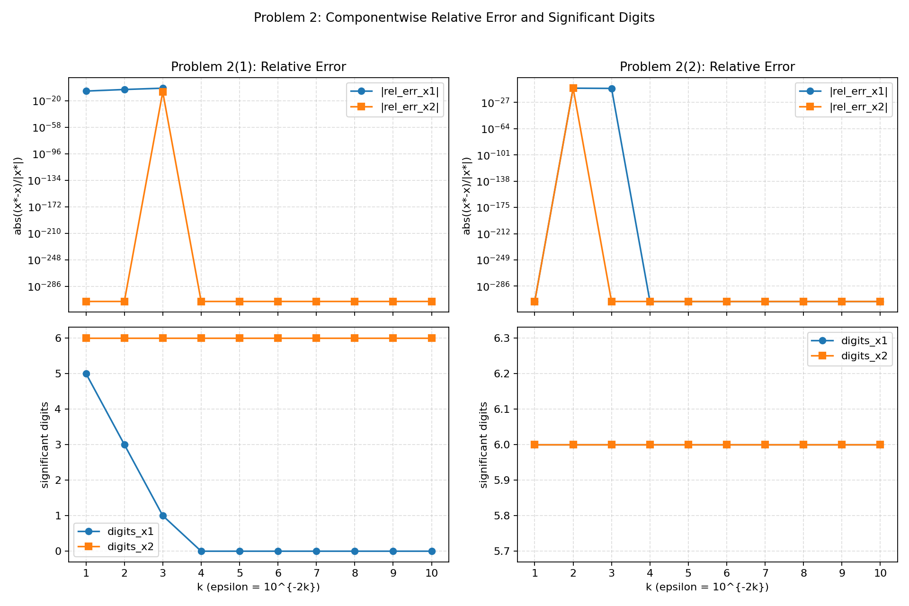

**关键观察：**

- 问题2(1)在ε≤$10^{-8}$时，x1完全错误（计算结果为0），精度崩溃
- 问题2(2)在所有ε值下都保持稳定，始终有6位有效数字
- 两个问题在数学上等价，但数值稳定性截然不同

## 数值现象分析

### 随着ε逐渐减小，问题2(1)的结果发生了什么改变？

问题2(1)使用不带主元选择的Gauss消去法，以ε作为第一个主元。随着ε减小，x1的精度急剧恶化。当k=1（ε=$10^{-2}$）时，x1有5位有效数字，精度尚可；当k=2（ε=$10^{-4}$）时，x1降至3位有效数字；当k=3（ε=$10^{-6}$）时，x1仅剩1位有效数字，相对误差达1.31%；当k≥4（ε≤$10^{-8}$）时，x1=0，完全错误，有效数字为0位。与此同时，x2在所有情况下都保持6位有效数字。

这种现象说明：当主元ε很小时，消去因子$m_{21}=1/\varepsilon$非常大，舍入误差被急剧放大，导致x1的精度完全丧失。

### 问题2(2)为什么保持稳定？

问题2(2)的系数矩阵首行首元素为1，消去因子$m_{21}=\varepsilon/1=\varepsilon$很小。随着ε减小，x1和x2始终保持6位有效数字（单精度浮点数的理论精度），相对误差保持在$10^{-7}$量级或以下，ε的减小不会导致精度退化。

这说明：当主元足够大（绝对值为1）时，消去因子$|m_{21}|\leq 1$，舍入误差不会被放大，算法数值稳定。

### 两种方程组的对比

问题2(1)和问题2(2)在数学上完全等价——它们有相同的精确解$x_1=x_2=1$。但在数值计算中：

| 特征 | 问题2(1) | 问题2(2) |
|------|---------|---------|
| 首行主元 | ε（很小） | 1 |
| 消去因子 | $1/\varepsilon$（很大） | ε（很小） |
| 数值稳定性 | 不稳定 | 稳定 |
| x1有效数字（k=3） | 1位 | 6位 |
| x1有效数字（k≥4） | 0位 | 6位 |

这充分说明：数学上等价的算法，在数值计算中未必等价。

### ε=1的特殊情况

当ε=1时，两个问题的矩阵都变为 $\begin{bmatrix}1&1\\1&1\end{bmatrix}$，两行线性相关，行列式为0，矩阵奇异。前向消去时第一个主元为0（问题2(1)中ε-1=0），无法继续消去。方程组退化为$x_1 + x_2 = 2$，有无穷多解。

## 理论分析

### 问题2(1)的Gauss消去法计算过程（不带主元选择）

对于方程组：
$$
\begin{bmatrix}\varepsilon&1\\1&1\end{bmatrix}\begin{bmatrix}x_1\\x_2\end{bmatrix}=\begin{bmatrix}1+\varepsilon\\2\end{bmatrix}
$$

**步骤1：构造增广矩阵**
$$
[A|b] = \begin{bmatrix}\varepsilon&1&|&1+\varepsilon\\1&1&|&2\end{bmatrix}
$$

**步骤2：前向消去（不带主元选择）**

直接使用第一行的ε作为主元，计算消去因子：
$$
m_{21} = \frac{a_{21}}{a_{11}} = \frac{1}{\varepsilon}
$$

当ε很小时，$m_{21}=1/\varepsilon$非常大。例如：

- ε=$10^{-2}$时，$m_{21}$=100
- ε=$10^{-4}$时，$m_{21}$=10,000
- ε=$10^{-8}$时，$m_{21}$=100,000,000

消去第二行第一列元素：
$$
\text{第二行} \leftarrow \text{第二行} - m_{21} \times \text{第一行}
$$

具体计算：
- 新的$a_{22} = 1 - \frac{1}{\varepsilon} \times 1 = 1 - \frac{1}{\varepsilon}$
- 新的$b_2 = 2 - \frac{1}{\varepsilon} \times (1+\varepsilon) = 2 - \frac{1}{\varepsilon} - 1 = 1 - \frac{1}{\varepsilon}$

得到上三角矩阵：
$$
\begin{bmatrix}\varepsilon&1&|&1+\varepsilon\\0&1-\frac{1}{\varepsilon}&|&1-\frac{1}{\varepsilon}\end{bmatrix}
$$

**步骤3：回代求解**

从第二行得到：
$$
\left(1-\frac{1}{\varepsilon}\right)x_2 = 1-\frac{1}{\varepsilon}
$$

理论上$x_2 = 1$，但在单精度浮点数计算中：

当ε很小时，$1/\varepsilon$非常大，计算$1-1/\varepsilon$时：
- 如果$1/\varepsilon > 2^{24}$（单精度浮点数尾数位数），则$1-1/\varepsilon = -1/\varepsilon$（1被"吃掉"）
- 对于ε=$10^{-8}$，$1/\varepsilon=10^8 > 2^{24} \approx 1.68 \times 10^7$，所以$1-1/\varepsilon$在单精度下等于$-1/\varepsilon$

因此：
$$
x_2 = \frac{1-1/\varepsilon}{1-1/\varepsilon} = 1 \quad \text{（x2计算正确）}
$$

代入第一行：
$$
\varepsilon x_1 + x_2 = 1+\varepsilon
$$
$$
x_1 = \frac{1+\varepsilon-x_2}{\varepsilon} = \frac{1+\varepsilon-1}{\varepsilon} = \frac{\varepsilon}{\varepsilon} = 1
$$

**关键问题：为什么x1计算错误？**

在单精度浮点数中，当ε很小时：
- 计算$1+\varepsilon$时，如果ε太小，结果可能等于1（ε被"吃掉"）
- 对于ε=$10^{-8}$，单精度浮点数$fl(1+10^{-8}) = 1$（因为单精度相对精度约为$10^{-7}$）
- 因此$1+\varepsilon-x_2 = 1-1 = 0$
- 最终$x_1 = 0/\varepsilon = 0$（错误结果）

**舍入误差的放大效应：**

在消去过程中，由于消去因子$m_{21}=1/\varepsilon$很大：

- 第二行的每个元素都要减去$m_{21}$倍的第一行对应元素
- 舍入误差被放大$m_{21}$倍
- 当ε=$10^{-8}$时，舍入误差被放大$10^8$倍
- 这导致后续计算中的"相近数相减"（$1+\varepsilon-1$）完全丧失有效数字

### 问题2(2)的Gauss消去法计算过程（不带主元选择）

对于方程组：
$$
\begin{bmatrix}1&1\\\varepsilon&1\end{bmatrix}\begin{bmatrix}x_2\\x_1\end{bmatrix}=\begin{bmatrix}2\\1+\varepsilon\end{bmatrix}
$$

**步骤1：构造增广矩阵**
$$
[A|b] = \begin{bmatrix}1&1&|&2\\\varepsilon&1&|&1+\varepsilon\end{bmatrix}
$$

**步骤2：前向消去**

第一行主元为1，计算消去因子：
$$
m_{21} = \frac{a_{21}}{a_{11}} = \frac{\varepsilon}{1} = \varepsilon
$$

当ε很小时，$m_{21}=\varepsilon$也很小。消去第二行第一列元素：
$$
\text{第二行} \leftarrow \text{第二行} - \varepsilon \times \text{第一行}
$$

具体计算：
- 新的$a_{22} = 1 - \varepsilon \times 1 = 1 - \varepsilon$
- 新的$b_2 = (1+\varepsilon) - \varepsilon \times 2 = 1 + \varepsilon - 2\varepsilon = 1 - \varepsilon$

得到上三角矩阵：
$$
\begin{bmatrix}1&1&|&2\\0&1-\varepsilon&|&1-\varepsilon\end{bmatrix}
$$

**步骤3：回代求解**

从第二行得到：
$$
(1-\varepsilon)x_1 = 1-\varepsilon \Rightarrow x_1 = 1
$$

代入第一行：
$$
x_2 + x_1 = 2 \Rightarrow x_2 = 2 - 1 = 1
$$

**为什么问题2(2)数值稳定？**

1. **消去因子很小**：$m_{21}=\varepsilon \ll 1$，舍入误差不会被放大
2. **避免大数"吃掉"小数**：计算$1-\varepsilon$时，虽然ε很小，但由于消去因子小，前面步骤的舍入误差没有被放大，结果仍然可靠
3. **回代过程稳定**：$(1-\varepsilon)$在单精度下仍然接近1，除法运算不会引入大的误差

### 精确解推导

对于问题2(1)：
$$
\begin{cases}
\varepsilon x_1 + x_2 = 1 + \varepsilon \\
x_1 + x_2 = 2
\end{cases}
$$

从第二个方程得$x_2 = 2 - x_1$，代入第一个方程：
$$
\varepsilon x_1 + (2-x_1) = 1 + \varepsilon
$$
$$
\varepsilon x_1 - x_1 = \varepsilon - 1
$$
$$
(\varepsilon - 1)x_1 = \varepsilon - 1
$$

当ε≠1时：$x_1 = 1$，代入得 $x_2 = 1$

对于问题2(2)：
$$
\begin{cases}
x_2 + x_1 = 2 \\
\varepsilon x_2 + x_1 = 1 + \varepsilon
\end{cases}
$$

两式相减：
$$
(1-\varepsilon)x_2 = 1 - \varepsilon
$$

当ε≠1时：$x_2 = 1$，代入得 $x_1 = 1$

### 误差传播分析

根据误差传播理论，对于除法运算$y=a/b$：
$$
\varepsilon(y) \approx \frac{|a|\cdot|\varepsilon(b)|+|b|\cdot|\varepsilon(a)|}{b^2}
$$

当$|b|$很小时，绝对误差$\varepsilon(y)$会急剧增大。

**问题2(1)的误差放大机制：**

1. **小数做分母**：
   - 计算消去因子$m_{21}=1/\varepsilon$时，ε作为分母
   - 当ε=$10^{-8}$时，$1/\varepsilon=10^8$，任何微小的舍入误差都会被放大$10^8$倍

2. **大数"吃掉"小数**：
   - 计算$1-1/\varepsilon$时，$1/\varepsilon$远大于1
   - 单精度浮点数中，$fl(1-10^8) = -10^8$，1完全被"吃掉"
   - 计算$1+\varepsilon$时，ε远小于1，ε被"吃掉"

3. **相近数相减**：
   - 回代时计算$1+\varepsilon-x_2$
   - 由于前面的误差，这变成$1-1=0$，有效数字完全丧失

**问题2(2)的误差控制：**

1. **避免小数做分母**：消去因子$m_{21}=\varepsilon/1=\varepsilon$，分母为1，不会引入大的误差
2. **消去因子小**：$|m_{21}|=\varepsilon \ll 1$，舍入误差不会被放大
3. **数值稳定**：整个消去和回代过程中，舍入误差保持在可控范围内

## 结论与启示

1. **方程组排列顺序至关重要**：问题2(1)和问题2(2)在数学上完全等价，但数值稳定性截然不同。问题2(1)在ε≤10^-8时完全失败（x1=0），而问题2(2)在所有ε值下都保持6位有效数字。

2. **小数做分母导致数值灾难**：问题2(1)中，消去因子$m_{21}=1/\varepsilon$在ε很小时非常大（ε=$10^{-8}$时为$10^8$），舍入误差被放大$10^8$倍，导致精度完全崩溃。这是"避免绝对值很小的数做分母"的典型反例。

3. **大数"吃掉"小数的连锁反应**：
   - 计算$1-1/\varepsilon$时，1被"吃掉"
   - 计算$1+\varepsilon$时，ε被"吃掉"
   - 最终导致$x_1=(1+\varepsilon-x_2)/\varepsilon=0/\varepsilon=0$（完全错误）

4. **主元选择的必要性**：不带主元选择的Gauss消去法在系数相差悬殊时数值不稳定。实际应用中必须使用部分主元或完全主元选择。

5. **单精度浮点数的局限性**：单精度浮点数只有约7位有效数字，当ε<$10^{-7}$时，$1+\varepsilon$在单精度下等于1，ε的信息完全丢失。

## 程序文件

- `gauss_elimination.py`：Gauss消去法求解程序

	执行：
	```bash
	python problem2/gauss_elimination.py
	```

- 实现了不带主元选择的直接消去法（用于展示数值不稳定性）

- 支持单精度和双精度浮点数计算

- 包含误差分析和有效数字计算

- 可以检测奇异矩阵

---

# 问题3：无穷级数计算$e^x$

## 题目描述

编写程序，用无穷级数
$$
e^x=1+x+\frac{x^2}{2!}+\frac{x^3}{3!}+\dots
$$
计算以下问题：

1. 用$x=1,5,10,15,20$测试程序，观察程序运行结果。
2. 用$x=-1,-5,-10,-15,-20$测试程序，观察程序运行结果。
3. 当$x<0$时，改用数值计算公式：
   $$
   e^{-x}=\frac{1}{e^x}=\frac{1}{1+x+\frac{x^2}{2!}+\frac{x^3}{3!}+\dots}
   $$
   计算$x=-1,-5,-10,-15,-20$时的近似值，数值实验中又有怎样的现象出现？你明白了什么？

## 数值实验结果

### 计算方法

- 使用单精度浮点数（`numpy.float32`）计算
- 泰勒级数：$e^x = \sum_{n=0}^{\infty} \frac{x^n}{n!}$
- 递推计算项：$a_n = a_{n-1} \cdot x / n$（在单精度下计算）
- 停止条件：$|a_n| < 10^{-7}$
- 相对误差定义：$e_r(x^*) = \frac{x^* - x}{x^*}$（其中$x^*$为计算值，$x$为精确值）
- 对于负x的倒数公式：$e^x = 1 / e^{-x}$，其中$-x > 0$

### 正x值测试结果（直接泰勒级数）

| x | 计算值(x*) | 精确值(x) | 相对误差 | 项数 |
|---|-----------|----------|----------|------|
| 1.0 | 2.71828198e+00 | 2.71828183e+00 | 5.73e-08 | 12 |
| 5.0 | 1.48413193e+02 | 1.48413159e+02 | 2.27e-07 | 25 |
| 10.0 | 2.20264688e+04 | 2.20264658e+04 | 1.34e-07 | 40 |
| 15.0 | 3.26901750e+06 | 3.26901737e+06 | 3.90e-08 | 54 |
| 20.0 | 4.85165216e+08 | 4.85165195e+08 | 4.24e-08 | 68 |

**观察：** 所有正x值都能获得约7位有效数字的精度（相对误差在$10^{-7}$至$10^{-8}$量级），这符合单精度浮点数的理论精度。

### 负x值测试结果（直接泰勒级数）

| x | 计算值(x*) | 精确值(x) | 相对误差 | 项数 |
|---|-----------|----------|----------|------|
| -1.0 | 3.67879391e-01 | 3.67879441e-01 | -1.37e-07 | 12 |
| -5.0 | 6.73843920e-03 | 6.73794700e-03 | 7.30e-05 | 25 |
| -10.0 | **-6.25716639e-05** | 4.53999298e-05 | **1.73** | 40 |
| -15.0 | 2.12335363e-02 | 3.05902321e-07 | **0.99999** | 54 |
| -20.0 | **-2.75667548e+00** | 2.06115362e-09 | **1.00000** | 68 |

**关键观察：**
- x=-1：相对误差约$10^{-7}$，结果尚可
- x=-5：相对误差增大到$7.30 \times 10^{-5}$（约0.0073%）
- x=-10：计算结果为负数（-6.26e-05），相对误差1.73（173%），完全错误
- x=-15：相对误差0.99999（99.999%），几乎完全错误
- x=-20：计算结果为负数（-2.76），相对误差1.0（100%），完全错误

### 负x值测试结果（使用倒数公式）

| x | 计算值(x*) | 精确值(x) | 相对误差 | 项数 |
|---|-----------|----------|----------|------|
| -1.0 | 3.67879420e-01 | 3.67879441e-01 | -5.73e-08 | 12 |
| -5.0 | 6.73794547e-03 | 6.73794700e-03 | -2.27e-07 | 25 |
| -10.0 | 4.53999237e-05 | 4.53999298e-05 | -1.34e-07 | 40 |
| -15.0 | 3.05902309e-07 | 3.05902321e-07 | -3.90e-08 | 54 |
| -20.0 | 2.06115353e-09 | 2.06115362e-09 | -4.24e-08 | 68 |

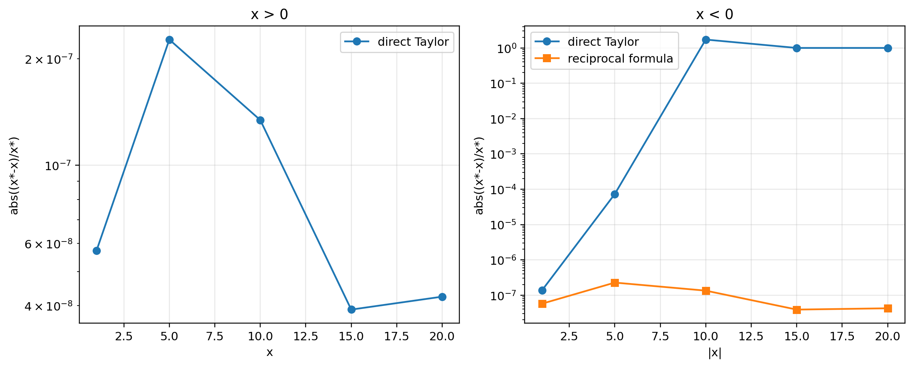

**观察：** 使用倒数公式后，所有负x值都能获得约7位有效数字的精度（相对误差在$10^{-7}$至$10^{-8}$量级），与正x值的精度相当。

## 数值现象分析

### 正x值的计算（稳定）

对于所有正x值（x=1, 5, 10, 15, 20），直接使用泰勒级数计算都能获得高精度结果。相对误差在$10^{-7}$至$10^{-8}$量级，达到单精度浮点数的理论精度（约7位有效数字）。需要的项数随x增大而增加：x=1需要12项，x=20需要68项。所有级数项为正，求和过程单调递增，数值稳定。

### 负x值的直接计算（不稳定）

对于负x值，直接使用泰勒级数计算会导致严重的数值误差。当x=-1时，相对误差$-1.37 \times 10^{-7}$，约7位有效数字，级数项正负交替，但幅度较小，误差累积尚在可控范围。当x=-5时，相对误差$7.30 \times 10^{-5}$，约4位有效数字，级数项正负交替，幅度增大，开始出现明显的有效数字损失。

当x=-10时，计算结果为负数（-6.26e-05），而精确值为正数（4.54e-05），相对误差1.73（173%），结果完全错误。级数项正负交替，幅度远大于最终结果，有效数字完全丧失。当x=-15时，计算结果2.12e-02，精确值3.06e-07，相差约5个数量级，相对误差0.99999（99.999%），几乎完全错误。当x=-20时，计算结果为负数（-2.76），而精确值为极小的正数（2.06e-09），相对误差1.0（100%），结果完全错误。级数项正负交替，幅度比最终结果大约9个数量级。

### 负x值的倒数公式计算（稳定）

使用倒数公式$e^x = 1/e^{-x}$（其中$-x > 0$）后，所有负x值都能获得约7位有效数字的精度，相对误差在$10^{-7}$至$10^{-8}$量级，与正x值的精度相当。计算$e^{-x}$时，所有级数项为正，求和过程数值稳定。最后取倒数，只引入少量额外误差。

### 误差随|x|增大的变化规律

| x | 直接计算相对误差 | 倒数公式相对误差 | 误差比值 |
|---|-----------------|-----------------|---------|
| -1 | 1.37e-07 | 5.73e-08 | 2.4 |
| -5 | 7.30e-05 | 2.27e-07 | 322 |
| -10 | 1.73 | 1.34e-07 | 1.3×10^7 |
| -15 | 0.99999 | 3.90e-08 | 2.6×10^7 |
| -20 | 1.00000 | 4.24e-08 | 2.4×10^7 |

**关键观察：** 直接计算负x时，相对误差随|x|增大而指数增长，而倒数公式的误差保持稳定。

## 理论分析

### 直接计算负x值的问题根源

对于负x，泰勒级数为：
$$
e^x = 1 + x + \frac{x^2}{2!} + \frac{x^3}{3!} + \frac{x^4}{4!} + \cdots \quad (x < 0)
$$

由于$x < 0$，级数项正负交替：
- 偶数次项：$\frac{x^{2k}}{(2k)!} > 0$（正）
- 奇数次项：$\frac{x^{2k+1}}{(2k+1)!} < 0$（负）

**问题1：相近数相减导致有效数字损失**

这是尽量避免相近的数相减的典型情况。级数项正负交替，大量有效数字在求和时相互抵消。

例如，对于x=-20：
- 第19项：$\frac{(-20)^{19}}{19!} \approx -4.31 \times 10^7$（负）
- 第20项：$\frac{(-20)^{20}}{20!} \approx 4.31 \times 10^7$（正）
- 这两项几乎完全抵消，但最终结果$e^{-20} \approx 2.06 \times 10^{-9}$
- 部分和比最终结果大约9个数量级

**问题2：部分和振荡**

部分和$S_n = \sum_{k=0}^n \frac{x^k}{k!}$在精确值上下振荡：
- 加入正项时，$S_n$增大
- 加入负项时，$S_n$减小
- 振荡幅度可能远大于最终值

对于x=-20，部分和的振荡幅度约为$10^7$量级，而最终值约为$10^{-9}$量级，相差16个数量级。单精度浮点数只有约7位有效数字，无法准确表示这种振荡。

**问题3：单精度浮点数的局限性**

单精度浮点数（float32）只有约7位有效数字（尾数23位，约$2^{23} \approx 8.4 \times 10^6$）。当部分和振荡幅度远大于最终值时：
- 最终值的信息在振荡中完全丢失
- 舍入误差累积导致结果完全错误
- 甚至可能出现符号错误（如x=-10和x=-20的结果为负数）

### 倒数公式的优势

使用$e^x = 1/e^{-x}$（其中$x < 0$，$-x > 0$）：

**优势1：避免相近数相减**

计算$e^{-x}$时，$-x > 0$，所有级数项为正：
$$
e^{-x} = 1 + (-x) + \frac{(-x)^2}{2!} + \frac{(-x)^3}{3!} + \cdots > 0
$$

所有项为正，求和过程单调递增，没有"相近数相减"的问题。

**优势2：部分和单调递增**

部分和$S_n = \sum_{k=0}^n \frac{(-x)^k}{k!}$单调递增：
$$
S_0 < S_1 < S_2 < \cdots < e^{-x}
$$

部分和从下方逼近精确值，数值稳定。

**优势3：舍入误差可控**

由于所有项为正，舍入误差不会相互抵消或放大，保持在可控范围内。最后取倒数$e^x = 1/e^{-x}$，只引入少量额外误差。

### 误差传播分析

根据误差传播理论：

**直接计算负x的误差放大：**

对于求和$S = \sum_{k=0}^n a_k$，绝对误差为：
$$
e(S) = \sum_{k=0}^n e(a_k)
$$

当$a_k$正负交替且$|a_k|$很大时，即使每个$e(a_k)$很小，累积的$e(S)$也可能很大。

对于x=-20：
- 最大项的绝对值约$4.31 \times 10^7$
- 单精度舍入误差约$4.31 \times 10^7 \times 10^{-7} = 4.31$
- 累积约68项，总误差约$68 \times 4.31 \approx 293$
- 而最终结果约$2.06 \times 10^{-9}$，误差远大于结果

**倒数公式的误差控制：**

计算$e^{-x}$时，所有项为正，误差不会相互抵消。对于x=-20：
- 计算$e^{20} \approx 4.85 \times 10^8$，相对误差约$10^{-7}$
- 取倒数$e^{-20} = 1/e^{20}$，相对误差仍约$10^{-7}$
- 总误差保持在单精度浮点数的理论精度范围内

### 最大项分析

对于泰勒级数$e^x = \sum_{k=0}^{\infty} \frac{x^k}{k!}$，第k项为$a_k = \frac{x^k}{k!}$。

最大项出现在$k \approx |x|$附近。对于$|x| = 20$：
$$
a_{20} = \frac{(\pm 20)^{20}}{20!} \approx 4.31 \times 10^7
$$

**正x的情况（x=20）：**
- 最大项$a_{20} \approx 4.31 \times 10^7$
- 最终结果$e^{20} \approx 4.85 \times 10^8$
- 两者在同一数量级，计算稳定

**负x的情况（x=-20）：**
- 最大项绝对值$|a_{20}| \approx 4.31 \times 10^7$
- 最终结果$e^{-20} \approx 2.06 \times 10^{-9}$
- 相差约16个数量级，远超单精度浮点数的精度范围

## 结论与启示

1. **正指数计算稳定**：对于正x，泰勒级数直接计算数值稳定，能获得单精度浮点数的理论精度（约7位有效数字）。

2. **负指数直接计算不稳定**：对于负x，直接使用泰勒级数会导致严重的数值误差。当|x|≥10时，结果完全错误，甚至出现符号错误。这是"相近数相减"导致有效数字损失的典型例子。

3. **倒数公式有效**：使用$e^x = 1/e^{-x}$可以稳定计算负指数函数，避免了"相近数相减"的问题，所有负x值都能获得约7位有效数字的精度。

4. **误差随|x|指数增长**：直接计算负x时，相对误差随|x|增大而指数增长。x=-5时误差约$10^{-5}$，x=-10时误差约1.7，x=-20时误差约1.0（完全错误）。

5. **单精度浮点数的局限性**：单精度浮点数只有约7位有效数字，当部分和振荡幅度远大于最终值时（如x=-20时相差16个数量级），无法准确计算。

## 实际应用建议

1. **数学库的实现**：
   - 在数学库中，$e^x$的实现通常对负x使用倒数公式或其他稳定方法
   - 例如，numpy的`np.exp()`对所有x都能获得高精度结果

2. **范围缩减技术**：
   - 对于非常大的|x|，还需要考虑溢出和下溢问题
   - 可以使用范围缩减：$e^x = e^{n \ln 2} \cdot e^{x - n \ln 2}$，其中$n = \lfloor x / \ln 2 \rfloor$
   - 这样可以将x缩减到$[-\ln 2, \ln 2]$范围内

3. **查表法**：
   - 对于特定应用，可以使用查表+插值提高计算效率
   - 例如，预先计算$e^{k/256}$（k=0,1,...,255），然后使用线性插值

4. **参考专业数值库**：
   - 对于特殊函数，应参考专业数值库的实现（如GSL、Boost、MPFR）
   - 这些库经过多年优化，考虑了各种边界情况和数值稳定性问题

## 程序文件

- `compute_exp.py`：指数函数计算程序

	执行：
	```bash
	python problem3/compute_exp.py
	```

- 实现了直接泰勒级数和倒数公式两种方法
- 使用单精度浮点数（float32）计算
- 支持误差分析和收敛性分析
- 可以生成可视化图表


---

# 问题4：定积分递推计算

## 题目描述

对 $n=0,1,2,\dots,20$ 计算定积分 $y_n=\int_{0}^{1}x^n e^{x-1}dx$ 的近似值。

1. 利用递推公式：$y_n=1-n y_{n-1}$，$n=0,1,2,\dots,20$ 进行计算，观察计算结果。
2. 利用递推公式：$y_{n-1}=\frac{1-y_n}{n}$，$n=20,19,18,\dots,0$，注意到 $0<y_n<\int_{0}^{1}x^n dx=\frac{1}{n+1}$，不妨取 $y_{20}=0$ 进行计算，观察计算结果。

**注**：本问题与课件中的示例类似。其讨论了计算积分$I_n=\int_{0}^{1}\frac{x^n}{x+5}dx$的递推公式：$I_n=\frac{1}{n}-5I_{n-1}$（正向递推，数值不稳定）和$I_{n-1}=\frac{1}{5n}-\frac{I_n}{5}$（反向递推，数值稳定）。本问题展示了相同的数值稳定性原理。

## 数值实验结果

### 计算方法

- 使用单精度浮点数（`numpy.float32`）计算
- 精确值：使用`math.exp()`计算（双精度参考值）
- 正向递推：$y_n = 1 - n \cdot y_{n-1}$，从 $y_0 = 1 - e^{-1}$ 开始
- 反向递推：$y_{n-1} = (1 - y_n) / n$，从 $y_{20} = 0$ 开始
- 相对误差定义：$e_r(x^*) = \frac{x^* - x}{x^*}$（其中$x^*$为计算值，$x$为精确值）

### 计算结果对比

| n | 精确值 | 正向递推 | 正向相对误差 | 反向递推(y₂₀=0) | 反向相对误差 |
|---|--------|----------|-------------|----------------|-------------|
| 0 | 6.32120559e-01 | 6.32120550e-01 | -1.45e-08 | 6.32120550e-01 | -1.45e-08 |
| 1 | 3.67879441e-01 | 3.67879450e-01 | 2.49e-08 | 3.67879450e-01 | 2.49e-08 |
| 2 | 2.64241118e-01 | 2.64241099e-01 | -6.93e-08 | 2.64241129e-01 | 4.35e-08 |
| 3 | 2.07276647e-01 | 2.07276702e-01 | 2.65e-07 | 2.07276642e-01 | -2.27e-08 |
| 4 | 1.70893412e-01 | 1.70893192e-01 | -1.29e-06 | 1.70893401e-01 | -6.43e-08 |
| 5 | 1.45532941e-01 | 1.45534039e-01 | 7.54e-06 | 1.45532951e-01 | 6.99e-08 |
| 6 | 1.26802357e-01 | 1.26795769e-01 | -5.20e-05 | 1.26802355e-01 | -1.20e-08 |
| 7 | 1.12383504e-01 | 1.12429619e-01 | 4.10e-04 | 1.12383500e-01 | -3.87e-08 |
| 8 | 1.00931967e-01 | 1.00563049e-01 | -3.67e-03 | 1.00931972e-01 | 4.76e-08 |
| 9 | 9.16122930e-02 | 9.49325562e-02 | 3.50e-02 | 9.16122943e-02 | 1.43e-08 |
| 10 | 8.38770701e-02 | 5.06744385e-02 | **-6.55e-01** | 8.38770717e-02 | 1.92e-08 |
| 11 | 7.73522289e-02 | 4.42581177e-01 | **8.25e-01** | 7.73522332e-02 | 5.62e-08 |
| 12 | 7.17732537e-02 | **-4.31097412e+00** | **1.02** | 7.17732534e-02 | -4.09e-09 |
| 13 | 6.69477026e-02 | 5.70426636e+01 | **9.99e-01** | 6.69477060e-02 | 5.14e-08 |
| 14 | 6.27321640e-02 | **-7.97597290e+02** | **1.00** | 6.27321675e-02 | 5.69e-08 |
| 15 | 5.90175409e-02 | 1.19649590e+04 | **1.00** | 5.90175651e-02 | 4.10e-07 |
| 16 | 5.57193460e-02 | **-1.91438344e+05** | **1.00** | 5.57189547e-02 | -7.02e-06 |
| 17 | 5.27711192e-02 | 3.25445275e+06 | **1.00** | 5.27777784e-02 | 1.26e-04 |
| 18 | 5.01198550e-02 | **-5.85801480e+07** | **1.00** | 5.00000007e-02 | -2.40e-03 |
| 19 | 4.77227558e-02 | 1.11302285e+09 | **1.00** | 5.00000007e-02 | 4.55e-02 |
| 20 | 4.55448841e-02 | **-2.22604575e+10** | **1.00** | 0.00000000e+00 | **-inf** |

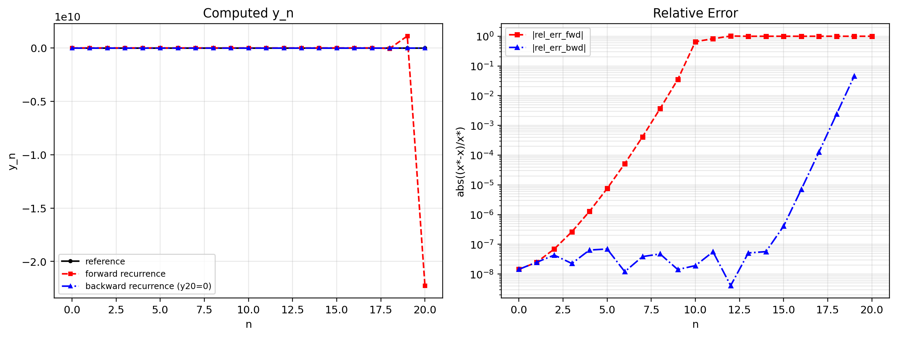

**关键观察：**

- **正向递推**：
  - n≤9时：误差逐渐增大，但尚在可控范围（$10^{-8}$到$10^{-2}$）
  - **n=10时：相对误差-0.655（65.5%），精度崩溃**
  - **n=11时：相对误差0.825（82.5%），结果完全错误**
  - **n≥12时：相对误差≈1.0（100%），结果完全错误，甚至出现负数和极大值**
  - n=20时：计算结果为$-2.23×10^{10}$，而精确值为$4.55×10^{-2}$，相差约12个数量级

- **反向递推（y₂₀=0）**：
  - n=20时：初始误差为-∞（从0开始）
  - n=19时：误差缩小到4.55%
  - n=18时：误差缩小到0.24%
  - n=17时：误差缩小到0.0126%
  - n≤16时：误差保持在$10^{-6}$至$10^{-8}$量级
  - n≤10时：误差稳定在$10^{-8}$量级（单精度浮点数的理论精度）

## 数值现象分析

### 正向递推的灾难性误差增长

正向递推使用公式$y_n = 1 - n \cdot y_{n-1}$，从$y_0 = 1 - e^{-1} \approx 0.632$开始计算。误差增长规律表现为：n=0至5时，相对误差从$10^{-8}$增长到$10^{-6}$（缓慢增长）；n=6至9时，相对误差从$10^{-5}$增长到$10^{-2}$（加速增长）；n=10时，相对误差突破-0.655（65.5%），精度崩溃；n=11时，相对误差0.825（82.5%），结果完全错误；n≥12时，相对误差≈1.0（100%），结果完全错误。

符号错误现象也很明显：n=12, 14, 16, 18, 20时，计算结果为负数，而精确值都是正数（$y_n > 0$），这说明误差已经完全破坏了结果的符号。数量级错误更为严重：n=20时，计算结果为$-2.23×10^{10}$，精确值为$4.55×10^{-2}$，相差约12个数量级，这是典型的"数值不稳定"现象。

### 反向递推的误差缩小

反向递推使用公式$y_{n-1} = \frac{1 - y_n}{n}$，从$y_{20} = 0$开始计算。误差缩小规律表现为：n=20时，初始误差为-∞（从0开始，而精确值为$4.55×10^{-2}$）；n=19时，误差缩小到4.55%（约1个数量级）；n=18时，误差缩小到0.24%（约2个数量级）；n=17时，误差缩小到0.0126%（约3个数量级）；n=16时，误差缩小到$7.02×10^{-6}$（约5个数量级）；n≤10时，误差稳定在$10^{-8}$量级（单精度浮点数的理论精度）。

关键观察是，即使从$y_{20} = 0$开始（100%误差），经过20步反向递推后，$y_0$的误差只有$10^{-8}$。误差在每一步都被缩小约1/n倍，这说明反向递推是"数值稳定"的算法。

### 误差传播对比

| n | 正向递推相对误差 | 反向递推相对误差 | 误差比值 |
|---|-----------------|-----------------|---------|
| 0 | -1.45e-08 | -1.45e-08 | 1.0 |
| 5 | 7.54e-06 | 6.99e-08 | 108 |
| 10 | **-6.55e-01** | 1.92e-08 | **3.4×10^7** |
| 15 | **1.00** | 4.10e-07 | **2.4×10^6** |
| 20 | **1.00** | **-inf** | - |

**关键观察：** 正向递推的误差随n增大而指数增长，而反向递推的误差随n减小而指数缩小。

## 理论分析

### 递推公式推导

对于积分$y_n = \int_0^1 x^n e^{x-1} dx$，使用分部积分：

$$
y_n = \int_0^1 x^n e^{x-1} dx = \left[ x^n e^{x-1} \right]_0^1 - \int_0^1 n x^{n-1} e^{x-1} dx
$$

$$
= 1 \cdot e^0 - 0 - n \int_0^1 x^{n-1} e^{x-1} dx = 1 - n y_{n-1}
$$

因此得到递推公式：
$$
y_n = 1 - n y_{n-1}
$$

反向形式：
$$
y_{n-1} = \frac{1 - y_n}{n}
$$

### 误差传播分析

设$\delta_n$为$y_n$的绝对误差，即$\tilde{y}_n = y_n + \delta_n$（其中$\tilde{y}_n$为计算值）。

**正向递推的误差传播：**

$$
\tilde{y}_n = 1 - n \tilde{y}_{n-1} = 1 - n(y_{n-1} + \delta_{n-1}) = (1 - n y_{n-1}) - n \delta_{n-1} = y_n - n \delta_{n-1}
$$

因此：
$$
\delta_n = -n \delta_{n-1}
$$

误差放大因子为$|-n| = n$。递推n步后：
$$
|\delta_n| = n \cdot (n-1) \cdot (n-2) \cdots 2 \cdot 1 \cdot |\delta_0| = n! \cdot |\delta_0|
$$

**关键问题：** 误差以$n!$的速度增长

对于n=20：
$$
|\delta_{20}| \approx 20! \cdot |\delta_0| \approx 2.43 \times 10^{18} \cdot |\delta_0|
$$

即使$|\delta_0| = 10^{-8}$（单精度舍入误差），也会导致$|\delta_{20}| \approx 2.43 \times 10^{10}$，远大于$y_{20} \approx 0.046$。

**反向递推的误差传播：**

$$
\tilde{y}_{n-1} = \frac{1 - \tilde{y}_n}{n} = \frac{1 - (y_n + \delta_n)}{n} = \frac{1 - y_n}{n} - \frac{\delta_n}{n} = y_{n-1} - \frac{\delta_n}{n}
$$

因此：
$$
\delta_{n-1} = -\frac{\delta_n}{n}
$$

误差缩小因子为$|1/n|$。递推n步后（从n到0）：
$$
|\delta_0| = \frac{|\delta_n|}{n \cdot (n-1) \cdot (n-2) \cdots 2 \cdot 1} = \frac{|\delta_n|}{n!}
$$

**关键优势：** 误差以$1/n!$的速度缩小

对于n=20，即使$|\delta_{20}| = y_{20} \approx 0.046$（100%误差），也会导致：
$$
|\delta_0| \approx \frac{0.046}{20!} \approx \frac{0.046}{2.43 \times 10^{18}} \approx 1.9 \times 10^{-20}
$$

实际上，由于单精度浮点数的舍入误差（约$10^{-7}$），最终$|\delta_0| \approx 10^{-8}$。

### 数值稳定性分析

**数值稳定**：运算过程中舍入误差能被控制，或误差增长不影响结果可靠性。

**数值不稳定**：舍入误差随运算逐步放大，最终导致结果失真。

**正向递推（数值不稳定）：**
- 误差放大因子：$n$（每步）
- 累积误差放大因子：$n!$（n步）
- 对于n=20，误差放大约$2.43 \times 10^{18}$倍
- 即使初始误差很小（$10^{-8}$），最终误差也会非常大（$10^{10}$）
- 这是典型的"数值不稳定"算法

**反向递推（数值稳定）：**
- 误差缩小因子：$1/n$（每步）
- 累积误差缩小因子：$1/n!$（n步）
- 对于n=20，误差缩小约$1/(2.43 \times 10^{18})$倍
- 即使初始误差很大（100%），最终误差也会很小（$10^{-8}$）
- 这是典型的"数值稳定"算法

### 单精度浮点数的影响

单精度浮点数（float32）只有约7位有效数字（尾数23位，约$2^{23} \approx 8.4 \times 10^6$）。

**正向递推中的舍入误差累积：**

- 每次计算$y_n = 1 - n \cdot y_{n-1}$都会引入舍入误差（约$10^{-7}$）
- 舍入误差被放大$n$倍
- 累积20步后，舍入误差被放大约$20! \approx 2.43 \times 10^{18}$倍
- 总误差约$10^{-7} \times 2.43 \times 10^{18} = 2.43 \times 10^{11}$
- 而$y_{20} \approx 0.046$，误差远大于结果

**反向递推中的舍入误差控制：**
- 每次计算$y_{n-1} = (1 - y_n) / n$也会引入舍入误差（约$10^{-7}$）
- 舍入误差被缩小$1/n$倍
- 累积20步后，舍入误差被缩小约$1/20! \approx 4.1 \times 10^{-19}$倍
- 但由于每步都引入新的舍入误差，最终误差约$10^{-7}$至$10^{-8}$
- 这在单精度浮点数的理论精度范围内

### $y_n$的性质

根据题目提示，$y_n$满足：
$$
0 < y_n < \int_0^1 x^n dx = \frac{1}{n+1}
$$

这个性质可以用来估计$y_n$的范围：
- $y_0 < 1$
- $y_{10} < 1/11 \approx 0.091$
- $y_{20} < 1/21 \approx 0.048$

实际计算结果：
- $y_0 \approx 0.632$
- $y_{10} \approx 0.084$
- $y_{20} \approx 0.046$

都满足上界条件。这个性质可以用来选择反向递推的初始值$y_{20} = 0$（下界）。

## 结论与启示

1. **递推方向决定稳定性**：同一递推公式$y_n = 1 - n y_{n-1}$，正向计算数值不稳定，反向计算数值稳定。这是"选用数值稳定性好的算法"原则的典型应用。

2. **正向递推灾难性失败**：正向递推的误差以$n!$速度增长。对于n=20，误差放大约$2.43 \times 10^{18}$倍，导致结果完全错误（相对误差100%，甚至出现负数）。

3. **反向递推高度稳定**：反向递推的误差以$1/n!$速度缩小。即使从$y_{20} = 0$开始（100%误差），经过20步递推后，$y_0$的误差只有$10^{-8}$（单精度浮点数的理论精度）。

4. **初始误差影响不同**：
   - 正向递推对初始值精度要求极高（需要$10^{-18}$的精度才能保证n=20时的结果准确）
   - 反向递推对初始值误差不敏感（即使100%误差也能得到准确结果）

5. **单精度浮点数的局限性**：单精度浮点数只有约7位有效数字，无法满足正向递推的精度要求。即使使用双精度（16位有效数字），对于n=20也不够。

## 一般性建议

对于递推计算$x_n = f(n, x_{n-1})$：

1. **分析误差传播**：
   - 设$\delta_n$为$x_n$的误差
   - 误差传播公式：$\delta_n \approx f'(x_{n-1}) \delta_{n-1}$
   - 误差放大因子：$|f'(x_{n-1})|$

2. **判断稳定性**：
   - 如果$|f'(x_{n-1})| > 1$，正向递推不稳定
   - 如果$|f'(x_{n-1})| < 1$，正向递推稳定

3. **尝试反向形式**：
   - 推导反向递推公式：$x_{n-1} = g(n, x_n)$
   - 分析$|g'(x_n)|$
   - 如果$|g'(x_n)| < 1$，反向递推稳定

4. **选择稳定方向**：
   - 选择误差缩小的方向计算
   - 对于递减序列，通常反向递推更稳定

5. **验证结果**：
   - 使用其他方法验证结果（如直接数值积分）
   - 检查结果是否满足已知的性质（如有界性、单调性）

## 程序文件

- `compute_integral.py`：定积分递推计算程序

	执行：
	```bash
	python problem4/compute_integral.py
	```

- 实现了正向递推和反向递推两种方法
- 使用单精度浮点数（float32）计算
- 包含误差分析和稳定性评估
- 可以生成可视化图表


---

# 总结

通过本次计算方法第一章的四个实践问题，我们深刻理解了数值计算中的核心原则和数值稳定性的重要性。

## 核心原则的实践验证

在避免大数"吃掉"小数方面（问题1），正向求和在n≥$10^4$后精度崩溃，有效数字从7位降至3位，而反向求和始终保持7-9位有效数字。这清晰地展示了运算顺序对数值稳定性的决定性影响。

在避免绝对值很小的数做分母方面（问题2），问题2(1)中，消去因子m₂₁=1/ε在ε≤$10^{-8}$时导致x1完全错误（计算结果为0）。问题2(2)通过调整方程组顺序，使消去因子m₂₁=ε，避免了数值不稳定。主元选择的必要性得到充分验证。

在避免相近数相减方面（问题3），负x的泰勒级数项正负交替，导致大量有效数字在求和时相互抵消。x=-20时，直接计算结果为负数（完全错误），而倒数公式保持7位有效数字。这是"相近数相减"导致有效数字损失的典型例子。

在选用数值稳定的算法方面（问题4），正向递推的误差以n!速度增长，n=20时误差放大约$2.43×10^{18}$倍。反向递推的误差以1/n!速度缩小，即使从y₂₀=0开始（100%误差），最终误差只有$10^{-8}$。递推方向决定稳定性，这是算法设计的关键考虑因素。

## 数值稳定性的深刻理解

数学等价不代表数值等价。问题1中，正向求和和反向求和在数学上完全等价，但数值稳定性截然不同。问题2中，两个方程组在数学上完全等价（相同的解），但数值稳定性截然不同。问题3中，直接计算$e^x$和计算$1/e^{-x}$在数学上等价，但数值稳定性截然不同。问题4中，正向递推和反向递推在数学上等价，但数值稳定性截然不同。

误差传播机制在各个问题中表现不同。问题1中，舍入误差累积导致精度崩溃。问题2中，小数做分母导致误差放大$10^8$倍。问题3中，相近数相减导致有效数字损失。问题4中，递推公式的误差放大/缩小因子决定稳定性。

单精度浮点数只有约7位有效数字。当中间结果远大于最终结果时（如问题3中x=-20的部分和振荡），精度会严重损失。当误差放大因子很大时（如问题4中的n!），单精度无法满足精度要求。

## 实践启示

算法设计必须考虑数值稳定性，不能仅仅将数学公式翻译成代码，必须分析误差传播路径和放大/缩小因子。选择数值稳定的算法是保证计算可靠性的前提。

算法可靠性优先于效率。四个问题中，数值稳定和不稳定的算法计算效率相同，但可靠性截然不同，必须选择可靠的算法。算法需先保证可靠性，再评价效率才有价值。

问题重格式化的重要性体现在，有时可以通过数学变换将不稳定问题转化为稳定问题。问题2通过调整方程组顺序，问题3使用倒数公式$e^x = 1/e^{-x}$，问题4使用反向递推，都是成功的例子。

实验验证理论的重要性在于，通过数值实验，我们直观地看到了理论分析的正确性。理论预测的精度崩溃、误差放大等现象在实验中得到完美验证，这说明数值算法设计必须结合理论分析和实验验证。

# 附录 代码及运行截图

## 问题1

```python
# problem1/compute_sn.py

import argparse
import math
import time
from typing import Dict, List

import matplotlib.pyplot as plt
import numpy as np

try:
    from numba import njit

    NUMBA_AVAILABLE = True
except Exception:
    NUMBA_AVAILABLE = False
    njit = None


def exact_sn(n: int) -> float:
    """Closed-form value in float64 (reference only)."""
    return 0.5 * (1.5 - 1.0 / n - 1.0 / (n + 1))


def relative_error_signed(x_star: float, x_exact: float) -> float:
    """Relative error defined as (x* - x) / x*."""
    if x_star == 0.0:
        if x_exact == 0.0:
            return 0.0
        return math.copysign(math.inf, x_star - x_exact)
    return (x_star - x_exact) / x_star
def count_significant_figures(approx: np.float32, exact: float) -> int:
    """Count significant digits based on |x*-x| <= 0.5 * 10^(m-n)."""
    if exact == 0.0:
        return 0

    abs_error = abs(float(approx) - exact)
    if abs_error == 0.0:
        return 15

    m = int(math.floor(math.log10(abs(exact)))) + 1
    n_digits = m - math.log10(2.0 * abs_error)
    return max(0, int(math.floor(n_digits)))


def _accumulate_terms_in_order(s: np.float32, terms: np.ndarray) -> np.float32:
    # Keep strict left-to-right float32 accumulation in C (np.cumsum).
    tmp = np.empty(terms.size + 1, dtype=np.float32)
    tmp[0] = s
    tmp[1:] = terms
    return np.cumsum(tmp, dtype=np.float32)[-1]


def _compute_forward_np(n: int) -> np.float32:
    s = np.float32(0.0)
    one = np.float32(1.0)
    chunk_size = 5_000_000

    start = 2
    while start <= n:
        end = min(n + 1, start + chunk_size)
        j = np.arange(start, end, dtype=np.int64)
        jf = j.astype(np.float32)
        terms = one / (jf * jf - one)
        s = _accumulate_terms_in_order(s, terms)
        start = end

    return np.float32(s)


def _compute_backward_np(n: int) -> np.float32:
    s = np.float32(0.0)
    one = np.float32(1.0)
    chunk_size = 5_000_000

    end = n
    while end >= 2:
        start = max(2, end - chunk_size + 1)
        j = np.arange(end, start - 1, -1, dtype=np.int64)
        jf = j.astype(np.float32)
        terms = one / (jf * jf - one)
        s = _accumulate_terms_in_order(s, terms)
        end = start - 1

    return np.float32(s)


if NUMBA_AVAILABLE:

    @njit(cache=True)
    def _compute_forward_numba(n: int) -> np.float32:
        s = np.float32(0.0)
        one = np.float32(1.0)
        for j in range(2, n + 1):
            jf = np.float32(j)
            s = np.float32(s + one / (np.float32(jf * jf) - one))
        return s

    @njit(cache=True)
    def _compute_backward_numba(n: int) -> np.float32:
        s = np.float32(0.0)
        one = np.float32(1.0)
        for j in range(n, 1, -1):
            jf = np.float32(j)
            s = np.float32(s + one / (np.float32(jf * jf) - one))
        return s


    def compute_forward(n: int) -> np.float32:
        return _compute_forward_numba(n)


    def compute_backward(n: int) -> np.float32:
        return _compute_backward_numba(n)

else:

    def compute_forward(n: int) -> np.float32:
        return _compute_forward_np(n)


    def compute_backward(n: int) -> np.float32:
        return _compute_backward_np(n)


def _warmup_jit() -> None:
    if NUMBA_AVAILABLE:
        _ = _compute_forward_numba(10)
        _ = _compute_backward_numba(10)


def _print_backend() -> None:
    print(f"Backend: {'numba-jit' if NUMBA_AVAILABLE else 'numpy-chunk-cumsum'}")


def run_forward_only(k_min: int = 1, k_max: int = 10) -> List[Dict[str, float]]:
    _warmup_jit()
    print("Problem 1 (1): forward order")
    _print_backend()

    results: List[Dict[str, float]] = []
    for k in range(k_min, k_max + 1):
        n = 10**k
        t0 = time.perf_counter()

        exact = exact_sn(n)
        forward = compute_forward(n)
        elapsed = time.perf_counter() - t0

        result = {
            "k": k,
            "n": n,
            "exact": exact,
            "forward": float(forward),
            "forward_digits": count_significant_figures(forward, exact),
            "time_s": elapsed,
        }
        results.append(result)

        print(
            f"k={k:2d} n={n:>11d} time={elapsed:8.3f}s "
            f"exact={exact:.9e} forward={result['forward']:.9e} "
            f"digits={result['forward_digits']}"
        )

    return results


def run_backward_only(k_min: int = 1, k_max: int = 10) -> List[Dict[str, float]]:
    _warmup_jit()
    print("Problem 1 (2): backward order")
    _print_backend()

    results: List[Dict[str, float]] = []
    for k in range(k_min, k_max + 1):
        n = 10**k
        t0 = time.perf_counter()

        exact = exact_sn(n)
        backward = compute_backward(n)
        elapsed = time.perf_counter() - t0

        result = {
            "k": k,
            "n": n,
            "exact": exact,
            "backward": float(backward),
            "backward_digits": count_significant_figures(backward, exact),
            "time_s": elapsed,
        }
        results.append(result)

        print(
            f"k={k:2d} n={n:>11d} time={elapsed:8.3f}s "
            f"exact={exact:.9e} backward={result['backward']:.9e} "
            f"digits={result['backward_digits']}"
        )

    return results


def run_benchmark_both(k_min: int = 1, k_max: int = 10) -> List[Dict[str, float]]:
    _warmup_jit()

    print("Compute S_n in float32 for n = 10^k")
    _print_backend()

    results: List[Dict[str, float]] = []
    for k in range(k_min, k_max + 1):
        n = 10**k
        t0 = time.perf_counter()

        exact = exact_sn(n)
        forward = compute_forward(n)
        backward = compute_backward(n)

        elapsed = time.perf_counter() - t0

        result = {
            "k": k,
            "n": n,
            "exact": exact,
            "forward": float(forward),
            "backward": float(backward),
            "forward_digits": count_significant_figures(forward, exact),
            "backward_digits": count_significant_figures(backward, exact),
            "time_s": elapsed,
        }
        results.append(result)

        print(
            f"k={k:2d} n={n:>11d} time={elapsed:8.3f}s "
            f"forward={result['forward']:.9e} ({result['forward_digits']:2d} digits) "
            f"backward={result['backward']:.9e} ({result['backward_digits']:2d} digits)"
        )

    return results


def visualize_results(results: List[Dict[str, float]], output_path: str = "visualization.png") -> None:
    k_values = [r["k"] for r in results]
    forward_errors = [abs(relative_error_signed(r["forward"], r["exact"])) for r in results]
    backward_errors = [abs(relative_error_signed(r["backward"], r["exact"])) for r in results]
    forward_digits = [r["forward_digits"] for r in results]
    backward_digits = [r["backward_digits"] for r in results]

    fig, axes = plt.subplots(1, 2, figsize=(12, 5))

    axes[0].semilogy(k_values, forward_errors, "o-", label="forward")
    axes[0].semilogy(k_values, backward_errors, "s-", label="backward")
    axes[0].set_xlabel("k (n=10^k)")
    axes[0].set_ylabel("abs((x* - x)/x*)")
    axes[0].set_title("Relative Error")
    axes[0].grid(True, alpha=0.3)
    axes[0].legend()

    axes[1].plot(k_values, forward_digits, "o-", label="forward")
    axes[1].plot(k_values, backward_digits, "s-", label="backward")
    axes[1].set_xlabel("k (n=10^k)")
    axes[1].set_ylabel("significant digits")
    axes[1].set_title("Significant Digits")
    axes[1].grid(True, alpha=0.3)
    axes[1].legend()

    plt.tight_layout()
    plt.savefig(output_path, dpi=300, bbox_inches="tight")
    plt.close(fig)
    print(f"Saved visualization: {output_path}")


def parse_args() -> argparse.Namespace:
    parser = argparse.ArgumentParser(description="Compute S_n with float32 in different summation orders.")
    parser.add_argument(
        "--mode",
        choices=["forward", "backward", "both"],
        default="both",
        help="forward/backward/both",
    )
    parser.add_argument("--k-min", type=int, default=1, help="minimum k, n=10^k")
    parser.add_argument("--k-max", type=int, default=10, help="maximum k, n=10^k")
    parser.add_argument("--plot", default="problem1/visualization.png", help="plot output path (only for mode=both)")
    return parser.parse_args()


def main() -> None:
    args = parse_args()
    if args.k_min < 1 or args.k_max < args.k_min:
        raise ValueError("Require 1 <= k_min <= k_max")

    if args.mode == "forward":
        run_forward_only(args.k_min, args.k_max)
    elif args.mode == "backward":
        run_backward_only(args.k_min, args.k_max)
    else:
        results = run_benchmark_both(args.k_min, args.k_max)
        visualize_results(results, args.plot)


if __name__ == "__main__":
    main()
```

执行命令：

```bash
python problem1/compute_sn.py --mode forward
```

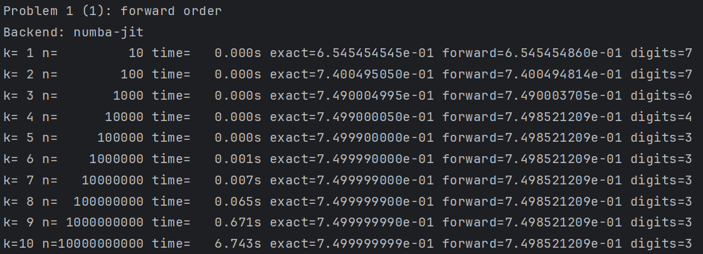

执行命令：

```bash
python problem1/compute_sn.py --mode backward
```

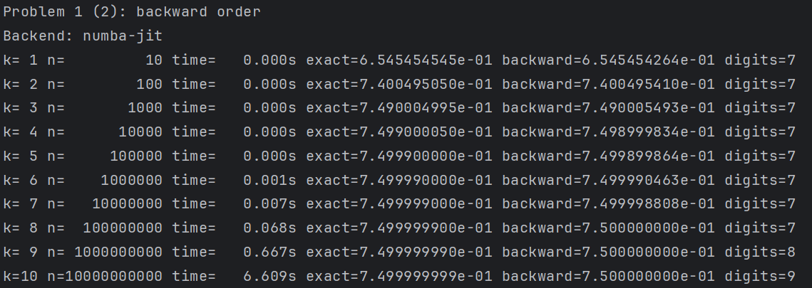

执行命令：

```bash
python problem1/compute_sn.py --mode both
```

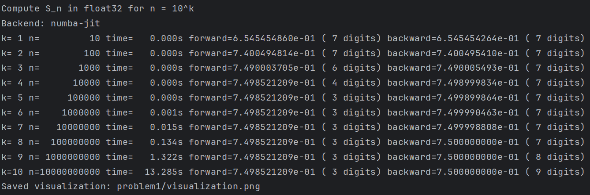

## 问题2

```python
# problem2/gauss_elimination.py

import numpy as np
import matplotlib.pyplot as plt

plt.rcParams['font.sans-serif'] = ['DejaVu Sans']
plt.rcParams['axes.unicode_minus'] = False


def gauss_elimination(A, b, dtype=np.float32, pivoting=False, singular_tol=1e-30):
    """Solve Ax=b by Gaussian elimination."""
    A = np.array(A, dtype=dtype, copy=True)
    b = np.array(b, dtype=dtype, copy=True)
    n = b.size

    for i in range(n):
        if pivoting:
            max_row = i + np.argmax(np.abs(A[i:, i]))
            if max_row != i:
                A[[i, max_row]] = A[[max_row, i]]
                b[[i, max_row]] = b[[max_row, i]]

        pivot = A[i, i]
        if np.abs(pivot) <= singular_tol:
            raise ValueError(f"Zero or near-zero pivot at row {i}: {pivot}")

        for j in range(i + 1, n):
            factor = A[j, i] / pivot
            A[j, i:] = A[j, i:] - factor * A[i, i:]
            b[j] = b[j] - factor * b[i]

    x = np.zeros(n, dtype=dtype)
    for i in range(n - 1, -1, -1):
        if np.abs(A[i, i]) <= singular_tol:
            raise ValueError(f"Zero or near-zero pivot during back substitution at row {i}")
        x[i] = (b[i] - np.dot(A[i, i + 1:], x[i + 1:])) / A[i, i]

    return x


def system1(epsilon, dtype=np.float32):
    # [eps, 1; 1, 1] [x1, x2]^T = [1+eps, 2]^T
    A = np.array([[epsilon, 1.0], [1.0, 1.0]], dtype=dtype)
    b = np.array([1.0 + epsilon, 2.0], dtype=dtype)
    return A, b


def system2(epsilon, dtype=np.float32):
    # [1, 1; eps, 1] [x2, x1]^T = [2, 1+eps]^T
    A = np.array([[1.0, 1.0], [epsilon, 1.0]], dtype=dtype)
    b = np.array([2.0, 1.0 + epsilon], dtype=dtype)
    return A, b


def component_relative_error_signed(x_num, x_exact):
    """Compute signed componentwise relative error: (x* - x)/x*.

    Here x* is the computed (machine) value x_num, and x is the exact value.
    """
    x_num = x_num.astype(np.float64)
    x_exact = x_exact.astype(np.float64)
    rel = np.full_like(x_num, np.nan, dtype=np.float64)
    nonzero = x_num != 0.0
    rel[nonzero] = (x_num[nonzero] - x_exact[nonzero]) / x_num[nonzero]

    # If x*=0, the ratio is unbounded unless x is also 0.
    zero_denom = ~nonzero
    numer = x_num - x_exact
    rel[zero_denom] = np.sign(numer[zero_denom]) * np.inf
    rel[zero_denom & (numer == 0.0)] = 0.0
    return rel

def effective_digits_from_rel_error(rel_error_value, dtype=np.float32):
    """If |e_r| <= 0.5*10^{-n}, n significant digits are guaranteed."""
    if np.isnan(rel_error_value):
        return np.nan
    if np.isinf(rel_error_value):
        return 0.0
    rel_abs = np.abs(rel_error_value)
    if rel_abs <= 0.0:
        return float(np.finfo(dtype).precision)
    n = np.floor(-np.log10(2.0 * rel_abs))
    return float(max(0.0, n))

def evaluate_components(x_num, x_exact, dtype=np.float32):
    rel = component_relative_error_signed(x_num, x_exact)
    d1 = effective_digits_from_rel_error(rel[0], dtype=dtype)
    d2 = effective_digits_from_rel_error(rel[1], dtype=dtype)
    return rel, np.array([d1, d2], dtype=np.float64)


def print_table(title, rows):
    print(title)
    print('-' * 114)
    print(
        'k   eps          x1               x2               '
        'rel_err_x1        rel_err_x2        digits_x1  digits_x2'
    )
    print('-' * 114)

    for row in rows:
        if row['status'] != 'ok':
            print(f"{row['k']:<3d} {row['eps']:>10.1e}   failed: {row['message']}")
            continue

        print(
            f"{row['k']:<3d} {row['eps']:>10.1e}   "
            f"{row['x'][0]: .8e}   {row['x'][1]: .8e}   "
            f"{row['rel'][0]: .8e}   {row['rel'][1]: .8e}   "
            f"{row['digits'][0]:>5.1f}      {row['digits'][1]:>5.1f}"
        )

    print()


def plot_results(rows_sys1, rows_sys2, output_path='visualization.png'):
    ok1 = [r for r in rows_sys1 if r['status'] == 'ok']
    ok2 = [r for r in rows_sys2 if r['status'] == 'ok']

    k1 = np.array([r['k'] for r in ok1], dtype=int)
    k2 = np.array([r['k'] for r in ok2], dtype=int)

    rel1_x1 = np.abs(np.array([r['rel'][0] for r in ok1], dtype=np.float64))
    rel1_x2 = np.abs(np.array([r['rel'][1] for r in ok1], dtype=np.float64))
    rel2_x1 = np.abs(np.array([r['rel'][0] for r in ok2], dtype=np.float64))
    rel2_x2 = np.abs(np.array([r['rel'][1] for r in ok2], dtype=np.float64))

    dig1_x1 = np.array([r['digits'][0] for r in ok1], dtype=np.float64)
    dig1_x2 = np.array([r['digits'][1] for r in ok1], dtype=np.float64)
    dig2_x1 = np.array([r['digits'][0] for r in ok2], dtype=np.float64)
    dig2_x2 = np.array([r['digits'][1] for r in ok2], dtype=np.float64)

    floor = np.finfo(np.float64).tiny
    rel1_x1 = np.maximum(rel1_x1, floor)
    rel1_x2 = np.maximum(rel1_x2, floor)
    rel2_x1 = np.maximum(rel2_x1, floor)
    rel2_x2 = np.maximum(rel2_x2, floor)

    fig, axes = plt.subplots(2, 2, figsize=(12, 8), sharex='col')

    axes[0, 0].semilogy(k1, rel1_x1, 'o-', label='|rel_err_x1|')
    axes[0, 0].semilogy(k1, rel1_x2, 's-', label='|rel_err_x2|')
    axes[0, 0].set_title('Problem 2(1): Relative Error')
    axes[0, 0].set_ylabel('abs((x*-x)/|x*|)')
    axes[0, 0].grid(True, which='both', ls='--', alpha=0.4)
    axes[0, 0].legend()

    axes[1, 0].plot(k1, dig1_x1, 'o-', label='digits_x1')
    axes[1, 0].plot(k1, dig1_x2, 's-', label='digits_x2')
    axes[1, 0].set_xlabel('k (epsilon = 10^{-2k})')
    axes[1, 0].set_ylabel('significant digits')
    axes[1, 0].set_xticks(k1)
    axes[1, 0].grid(True, ls='--', alpha=0.4)
    axes[1, 0].legend()

    axes[0, 1].semilogy(k2, rel2_x1, 'o-', label='|rel_err_x1|')
    axes[0, 1].semilogy(k2, rel2_x2, 's-', label='|rel_err_x2|')
    axes[0, 1].set_title('Problem 2(2): Relative Error')
    axes[0, 1].set_ylabel('abs((x*-x)/|x*|)')
    axes[0, 1].grid(True, which='both', ls='--', alpha=0.4)
    axes[0, 1].legend()

    axes[1, 1].plot(k2, dig2_x1, 'o-', label='digits_x1')
    axes[1, 1].plot(k2, dig2_x2, 's-', label='digits_x2')
    axes[1, 1].set_xlabel('k (epsilon = 10^{-2k})')
    axes[1, 1].set_ylabel('significant digits')
    axes[1, 1].set_xticks(k2)
    axes[1, 1].grid(True, ls='--', alpha=0.4)
    axes[1, 1].legend()

    fig.suptitle('Problem 2: Componentwise Relative Error and Significant Digits')
    fig.tight_layout(rect=(0, 0, 1, 0.96))
    fig.savefig(output_path, dpi=160)
    plt.close(fig)


def run_experiment(dtype=np.float32, pivoting=False):
    x_exact = np.array([1.0, 1.0], dtype=np.float64)

    rows_sys1 = []
    rows_sys2 = []

    for k in range(0, 11):
        eps = 10.0 ** (-2 * k)

        A1, b1 = system1(eps, dtype=dtype)
        A2, b2 = system2(eps, dtype=dtype)

        row1 = {'k': k, 'eps': eps, 'status': 'ok'}
        row2 = {'k': k, 'eps': eps, 'status': 'ok'}

        try:
            x1 = gauss_elimination(A1, b1, dtype=dtype, pivoting=pivoting)
            rel1, dig1 = evaluate_components(x1, x_exact, dtype=dtype)
            row1.update({'x': x1.astype(np.float64), 'rel': rel1, 'digits': dig1})
        except ValueError as exc:
            row1.update({'status': 'failed', 'message': str(exc)})

        try:
            x2_raw = gauss_elimination(A2, b2, dtype=dtype, pivoting=pivoting)
            x2 = np.array([x2_raw[1], x2_raw[0]], dtype=dtype)
            rel2, dig2 = evaluate_components(x2, x_exact, dtype=dtype)
            row2.update({'x': x2.astype(np.float64), 'rel': rel2, 'digits': dig2})
        except ValueError as exc:
            row2.update({'status': 'failed', 'message': str(exc)})

        rows_sys1.append(row1)
        rows_sys2.append(row2)

    print('Gaussian Elimination Experiment for Problem 2')
    print(f'dtype={np.dtype(dtype).name}, pivoting={pivoting}')
    print('epsilon = 10^(-2k), k=0..10')
    print()

    print_table('Table A: Problem 2(1)', rows_sys1)
    print_table('Table B: Problem 2(2)', rows_sys2)

    plot_results(rows_sys1, rows_sys2, output_path='visualization.png')
    print('Visualization generated: visualization.png')

    return rows_sys1, rows_sys2


if __name__ == '__main__':
    # single precision + no pivoting highlights instability
    run_experiment(dtype=np.float32, pivoting=False)
```

执行命令：

```bash
python problem2/gauss_elimination.py
```

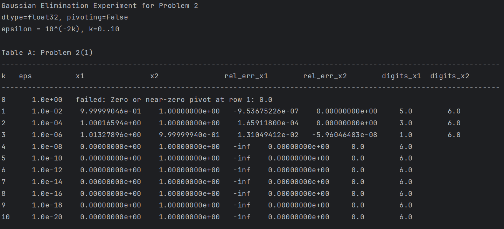

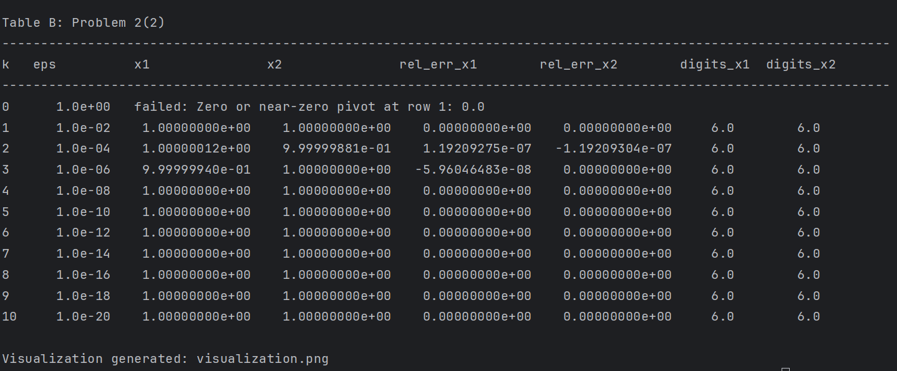

## 问题3

```python
# problem3/compute_exp.py

import math
from typing import Dict, List, Tuple

import matplotlib.pyplot as plt
import numpy as np


def relative_error(computed: float, exact: float) -> float:
    """Relative error defined as (x* - x) / x*, where x* is computed value."""
    if computed == 0.0:
        if exact == 0.0:
            return 0.0
        return math.copysign(math.inf, computed - exact)
    return (computed - exact) / computed


def exp_taylor_direct(x: float, tol: float = 1e-7, max_terms: int = 500, dtype=np.float32) -> Tuple[float, int]:
    """Compute e^x via direct Taylor series in the given floating precision."""
    x_val = dtype(x)
    term = dtype(1.0)
    s = dtype(1.0)
    n = 0

    while n < max_terms - 1:
        n += 1
        term = dtype(term * x_val / dtype(n))
        s = dtype(s + term)
        if abs(float(term)) < tol:
            break

    return float(s), n + 1


def exp_taylor_reciprocal_for_negative(x: float, tol: float = 1e-7, max_terms: int = 500, dtype=np.float32) -> Tuple[float, int]:
    """For x<0, compute e^x as 1 / e^{-x}."""
    if x >= 0.0:
        return exp_taylor_direct(x, tol=tol, max_terms=max_terms, dtype=dtype)

    pos_val, terms = exp_taylor_direct(-x, tol=tol, max_terms=max_terms, dtype=dtype)
    if pos_val == 0.0:
        return math.inf, terms
    return 1.0 / pos_val, terms


def evaluate_points(xs: List[float], method: str, tol: float, dtype=np.float32) -> List[Dict[str, float]]:
    rows: List[Dict[str, float]] = []

    for x in xs:
        if method == "direct":
            approx, terms = exp_taylor_direct(x, tol=tol, dtype=dtype)
        elif method == "reciprocal":
            approx, terms = exp_taylor_reciprocal_for_negative(x, tol=tol, dtype=dtype)
        else:
            raise ValueError("method must be 'direct' or 'reciprocal'")

        exact = math.exp(x)
        rel = relative_error(approx, exact)

        rows.append(
            {
                "x": x,
                "computed": approx,
                "exact": exact,
                "rel_error": rel,
                "terms": terms,
            }
        )

    return rows


def print_table(title: str, rows: List[Dict[str, float]]) -> None:
    print(title)
    print("-" * 88)
    print("x         computed(x*)       exact(x)          rel_err=(x*-x)/x*      terms")
    print("-" * 88)
    for r in rows:
        print(
            f"{r['x']:>6.1f}    {r['computed']:>13.20e}   {r['exact']:>13.20e}   "
            f"{r['rel_error']:>18.20e}   {int(r['terms']):>5d}"
        )
    print()


def visualize(rows_pos_direct, rows_neg_direct, rows_neg_reciprocal, output_path="visualization.png") -> None:
    x_pos = [r["x"] for r in rows_pos_direct]
    x_neg_abs = [abs(r["x"]) for r in rows_neg_direct]

    err_pos = [abs(r["rel_error"]) for r in rows_pos_direct]
    err_neg_direct = [abs(r["rel_error"]) for r in rows_neg_direct]
    err_neg_recip = [abs(r["rel_error"]) for r in rows_neg_reciprocal]

    tiny = np.finfo(np.float64).tiny
    err_pos = np.maximum(err_pos, tiny)
    err_neg_direct = np.maximum(err_neg_direct, tiny)
    err_neg_recip = np.maximum(err_neg_recip, tiny)

    fig, axes = plt.subplots(1, 2, figsize=(11, 4.5))

    axes[0].semilogy(x_pos, err_pos, "o-", label="direct Taylor")
    axes[0].set_title("x > 0")
    axes[0].set_xlabel("x")
    axes[0].set_ylabel("abs((x*-x)/x*)")
    axes[0].grid(True, alpha=0.3)
    axes[0].legend()

    axes[1].semilogy(x_neg_abs, err_neg_direct, "o-", label="direct Taylor")
    axes[1].semilogy(x_neg_abs, err_neg_recip, "s-", label="reciprocal formula")
    axes[1].set_title("x < 0")
    axes[1].set_xlabel("|x|")
    axes[1].set_ylabel("abs((x*-x)/x*)")
    axes[1].grid(True, alpha=0.3)
    axes[1].legend()

    plt.tight_layout()
    plt.savefig(output_path, dpi=220, bbox_inches="tight")
    plt.close(fig)


def main() -> None:
    tol = 1e-7
    dtype = np.float32

    x_pos = [1.0, 5.0, 10.0, 15.0, 20.0]
    x_neg = [-1.0, -5.0, -10.0, -15.0, -20.0]

    rows_pos_direct = evaluate_points(x_pos, method="direct", tol=tol, dtype=dtype)
    rows_neg_direct = evaluate_points(x_neg, method="direct", tol=tol, dtype=dtype)
    rows_neg_recip = evaluate_points(x_neg, method="reciprocal", tol=tol, dtype=dtype)

    print("Problem 3: exp(x) by Taylor series (float32)")
    print("Relative error definition: (x* - x) / x*")
    print(f"Stopping criterion: |term| < {tol:.0e}")
    print()

    print_table("Table A: x = 1, 5, 10, 15, 20 (direct Taylor)", rows_pos_direct)
    print_table("Table B: x = -1, -5, -10, -15, -20 (direct Taylor)", rows_neg_direct)
    print_table("Table C: x = -1, -5, -10, -15, -20 (reciprocal formula)", rows_neg_recip)

    visualize(rows_pos_direct, rows_neg_direct, rows_neg_recip, output_path="visualization.png")
    print("Saved visualization: problem3/visualization.png")


if __name__ == "__main__":
    main()
```

执行命令：

```bash
python problem3/compute_exp.py
```

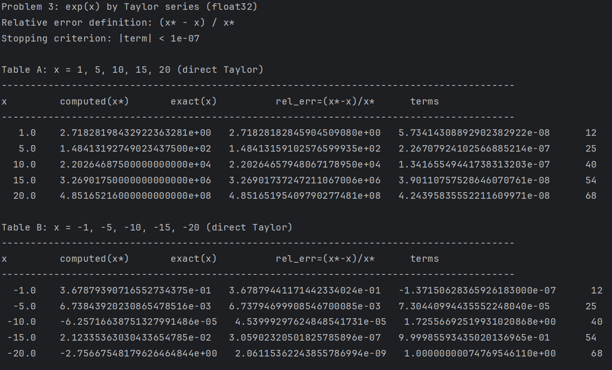

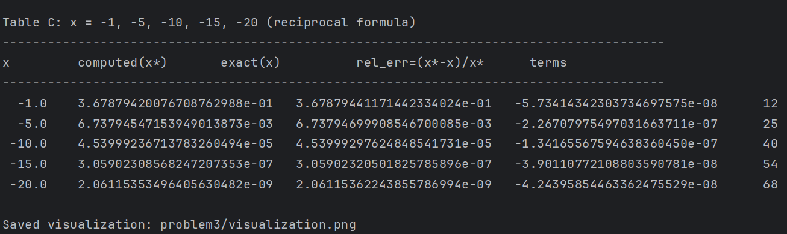

## 问题4

```python
# problem4/compute_integral.py

import math
from typing import Dict

import matplotlib.pyplot as plt
import numpy as np


def reference_integral(n: int, m: int = 200000) -> float:
    """Reference value from high-resolution trapezoidal integration."""
    x = np.linspace(0.0, 1.0, m + 1, dtype=np.float64)
    y = np.power(x, n) * np.exp(x - 1.0)
    return float(np.trapezoid(y, x))


def relative_error(computed: float, exact: float) -> float:
    """Relative error definition required by user: (x* - x) / x*."""
    if computed == 0.0:
        if exact == 0.0:
            return 0.0
        return math.copysign(math.inf, computed - exact)
    return (computed - exact) / computed


def forward_recurrence(n_max: int = 20, dtype=np.float32) -> np.ndarray:
    """y_n = 1 - n y_{n-1}, n=1..n_max, with y_0 = 1 - e^{-1}."""
    y = np.zeros(n_max + 1, dtype=dtype)
    y[0] = dtype(1.0 - math.exp(-1.0))
    for n in range(1, n_max + 1):
        y[n] = dtype(1.0 - n * y[n - 1])
    return y


def backward_recurrence(n_max: int = 20, y_nmax: float = 0.0, dtype=np.float32) -> np.ndarray:
    """y_{n-1} = (1 - y_n)/n, n=n_max..1, with given y_nmax."""
    y = np.zeros(n_max + 1, dtype=dtype)
    y[n_max] = dtype(y_nmax)
    for n in range(n_max, 0, -1):
        y[n - 1] = dtype((1.0 - y[n]) / n)
    return y


def build_results(n_max: int = 20, dtype=np.float32) -> Dict[str, np.ndarray]:
    exact = np.array([reference_integral(n) for n in range(n_max + 1)], dtype=np.float64)
    forward = forward_recurrence(n_max=n_max, dtype=dtype).astype(np.float64)
    backward0 = backward_recurrence(n_max=n_max, y_nmax=0.0, dtype=dtype).astype(np.float64)

    rel_f = np.array([relative_error(forward[n], exact[n]) for n in range(n_max + 1)], dtype=np.float64)
    rel_b = np.array([relative_error(backward0[n], exact[n]) for n in range(n_max + 1)], dtype=np.float64)

    return {
        "n": np.arange(n_max + 1, dtype=int),
        "exact": exact,
        "forward": forward,
        "backward0": backward0,
        "rel_forward": rel_f,
        "rel_backward0": rel_b,
    }


def print_key_table(results: Dict[str, np.ndarray]) -> None:
    print("Problem 4: y_n = integral_0^1 x^n * exp(x-1) dx")
    print("Relative error: (x* - x) / x*")
    print("Backward recurrence uses y_20 = 0")
    print()
    print("n   exact             forward           rel_err_fwd        backward(y20=0)    rel_err_bwd")
    print("-" * 96)

    for i in range(len(results["n"])):
        n = int(results["n"][i])
        ex = results["exact"][i]
        fw = results["forward"][i]
        bw = results["backward0"][i]
        erf = results["rel_forward"][i]
        erb = results["rel_backward0"][i]

        print(
            f"{n:>2d}  {ex: .8e}  {fw: .8e}  {erf: .8e}  {bw: .8e}  {erb: .8e}"
        )


def plot_results(results: Dict[str, np.ndarray], output_path: str = "visualization.png") -> None:
    n = results["n"]
    exact = results["exact"]
    forward = results["forward"]
    backward0 = results["backward0"]

    err_f = np.abs(results["rel_forward"])
    err_b = np.abs(results["rel_backward0"])
    floor = np.finfo(np.float64).tiny
    err_f = np.maximum(err_f, floor)
    err_b = np.maximum(err_b, floor)

    fig, axes = plt.subplots(1, 2, figsize=(12, 4.6))

    axes[0].plot(n, exact, "k-", label="reference", marker="o", markersize=3)
    axes[0].plot(n, forward, "r--", label="forward recurrence", marker="s", markersize=3)
    axes[0].plot(n, backward0, "b-.", label="backward recurrence (y20=0)", marker="^", markersize=3)
    axes[0].set_xlabel("n")
    axes[0].set_ylabel("y_n")
    axes[0].set_title("Computed y_n")
    axes[0].grid(True, alpha=0.3)
    axes[0].legend(fontsize=8)

    axes[1].semilogy(n, err_f, "r--", label="|rel_err_fwd|", marker="s", markersize=4)
    axes[1].semilogy(n, err_b, "b-.", label="|rel_err_bwd|", marker="^", markersize=4)
    axes[1].set_xlabel("n")
    axes[1].set_ylabel("abs((x*-x)/x*)")
    axes[1].set_title("Relative Error")
    axes[1].grid(True, which="both", alpha=0.3)
    axes[1].legend(fontsize=8)

    plt.tight_layout()
    plt.savefig(output_path, dpi=220, bbox_inches="tight")
    plt.close(fig)


def main() -> None:
    results = build_results(n_max=20, dtype=np.float32)
    print_key_table(results)
    plot_results(results, output_path="visualization.png")
    print("\nSaved visualization: problem4/visualization.png")


if __name__ == "__main__":
    main()
```

执行命令：

```bash
python problem4/compute_integral.py
```

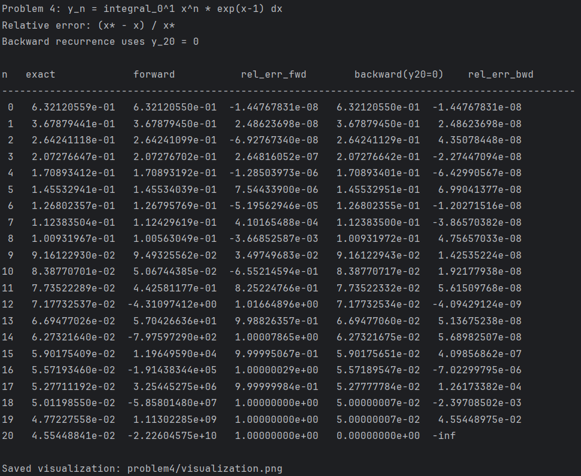
