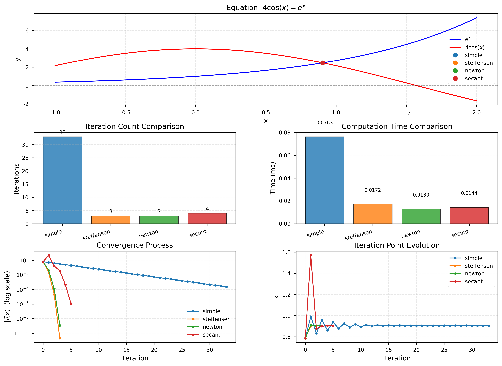
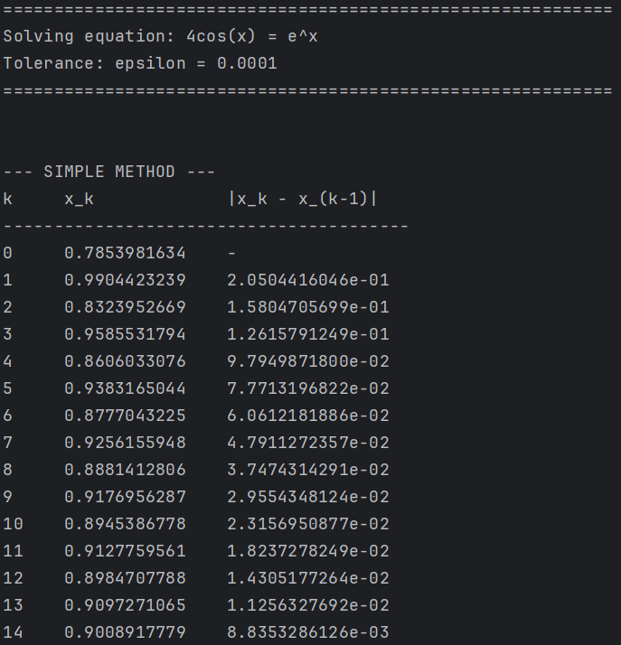
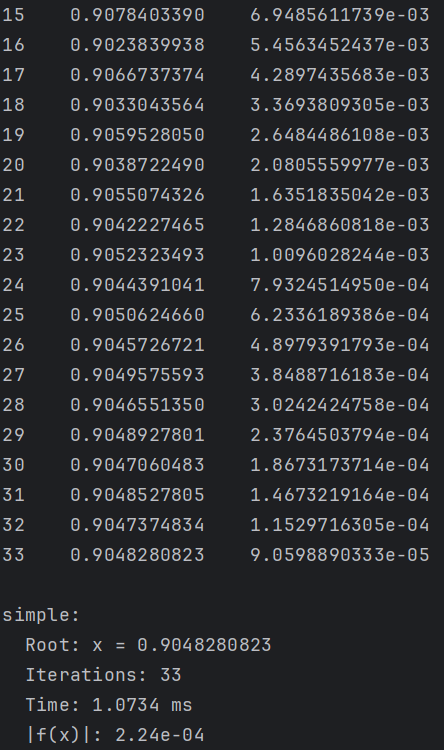
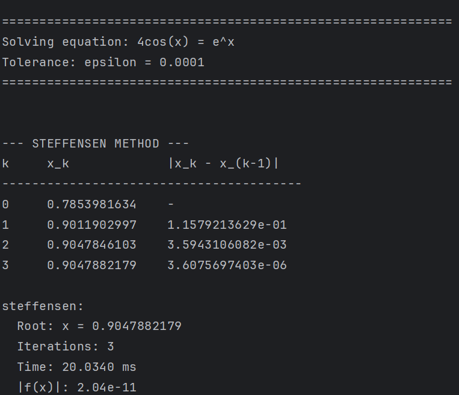
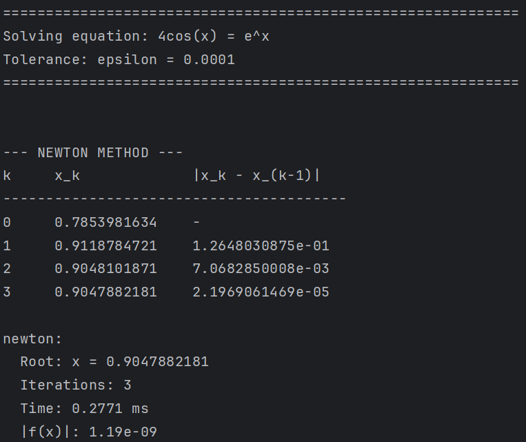
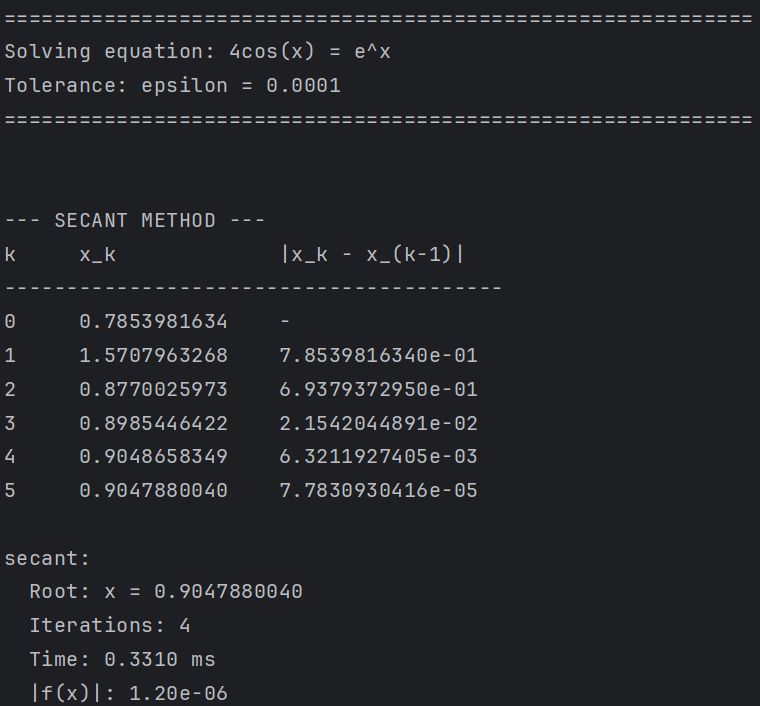

# 计算方法第二周实践报告

## 一、问题描述

本次实践要求求解非线性方程 $4\cos x = e^x$ 的根，精度要求 $\varepsilon = 10^{-4}$。采用四种不同的数值迭代方法进行求解，包括简单迭代法、斯蒂芬森迭代法、Newton迭代法和双点弦截法（割线法）。前三种方法的初值取为 $x_0 = \frac{\pi}{4}$，双点弦截法的初值取为 $x_0 = \frac{\pi}{4}$ 和 $x_1 = \frac{\pi}{2}$。通过实验比较各种方法的计算效率，分析不同迭代方法的收敛特性。

将原方程改写为标准形式 $f(x) = e^x - 4\cos x = 0$，通过描图法可以确定方程在区间 $[0, 2]$ 内存在唯一实根。函数 $y = e^x$ 和 $y = 4\cos x$ 的交点横坐标即为所求的根，初步估计根的位置在 $x \approx 0.9$ 附近。

## 二、方法原理与实现

### 2.1 简单迭代法

简单迭代法的基本思想是将方程 $f(x) = 0$ 变形为等价方程 $x = \Phi(x)$，构造迭代公式 $x_{k+1} = \Phi(x_k)$，其中 $\Phi(x)$ 称为迭代函数。当迭代函数连续且迭代数列收敛时，序列的极限即为方程的根。

#### 迭代函数的选取

对于方程 $e^x = 4\cos x$，可以有多种等价变形方式。常见的变形包括 $x = \ln(4\cos x)$ 和 $x = \arccos(\frac{e^x}{4})$。为了选择合适的迭代函数，需要分析各种变形的收敛性。

首先考虑迭代函数 $\Phi_1(x) = \ln(4\cos x)$。该函数的导数为：

$$\Phi_1'(x) = \frac{-4\sin x}{4\cos x} = -\tan x$$

在根 $x^* \approx 0.9048$ 附近，计算得 $|\Phi_1'(x^*)| = |\tan 0.9048| \approx 1.26 > 1$，不满足收敛条件 $|\Phi'(x)| < 1$。实际计算表明，使用该迭代函数时，迭代序列呈现振荡发散的特征。从初值 $x_0 = \frac{\pi}{4}$ 出发，第一次迭代得到 $x_1 = \ln(4\cos\frac{\pi}{4}) \approx 1.0397$，第二次迭代得到 $x_2 = \ln(4\cos 1.0397) \approx 0.7060$，第三次迭代得到 $x_3 = \ln(4\cos 0.7060) \approx 1.1131$，迭代点在根的两侧大幅振荡，无法收敛。因此，$\Phi_1(x) = \ln(4\cos x)$ 不适合作为迭代函数。

相比之下，迭代函数 $\Phi_2(x) = \arccos(\frac{e^x}{4})$ 具有更好的收敛性质。首先从定义域角度考虑，要使 $\arccos$ 函数有意义，需要满足 $|\frac{e^x}{4}| \leq 1$，即 $e^x \leq 4$，解得 $x \leq \ln 4 \approx 1.386$。由于方程的根约为 $0.9048$，该条件在根的邻域内是满足的。其次，该迭代函数的导数为 $\Phi_2'(x) = -\frac{e^x}{4\sqrt{1 - (\frac{e^x}{4})^2}}$，在根附近 $|\Phi_2'(x^*)| \approx 0.774 < 1$，满足收敛条件。因此，本实践选择 $\Phi(x) = \arccos(\frac{e^x}{4})$ 作为迭代函数。

#### 收敛性证明

下面分别利用全局收敛定理和局部收敛定理对所选迭代函数的收敛性进行严格证明。

**（一）局部收敛性分析**

根据简单迭代法的局部收敛定理，设 $x^*$ 是方程 $x = \Phi(x)$ 的根，若满足以下条件：

1. 迭代函数 $\Phi(x)$ 在 $x^*$ 的邻域可导；
2. 在 $x^*$ 的某个邻域 $S = \{x \mid |x - x^*| \leq \delta\}$ 内，对任意 $x \in S$，有 $|\Phi'(x)| \leq L < 1$。

则对于任意初值 $x_0 \in S$，迭代公式 $x_{k+1} = \Phi(x_k)$ 产生的序列 $\{x_k\}$ 必收敛于根 $x^*$。

对于迭代函数 $\Phi(x) = \arccos(\frac{e^x}{4})$，其导数为：

$$\Phi'(x) = \frac{d}{dx}\arccos\left(\frac{e^x}{4}\right) = -\frac{1}{\sqrt{1 - (\frac{e^x}{4})^2}} \cdot \frac{e^x}{4} = -\frac{e^x}{4\sqrt{1 - (\frac{e^x}{4})^2}}$$

在根 $x^* \approx 0.9048$ 附近，由于 $e^{x^*} \approx 2.471$，代入计算得：

$$|\Phi'(x^*)| = \frac{2.471}{4\sqrt{1 - (\frac{2.471}{4})^2}} = \frac{2.471}{4\sqrt{1 - 0.381}} = \frac{2.471}{4 \times 0.787} \approx 0.785$$

取 $L = 0.8$，在根的邻域 $S = \{x \mid |x - 0.9048| \leq 0.2\}$ 内，可以验证 $|\Phi'(x)| \leq 0.8 < 1$ 恒成立。因此，根据局部收敛定理，对于邻域 $S$ 内的任意初值 $x_0$（包括 $x_0 = \frac{\pi}{4} \approx 0.7854 \in S$），迭代序列必收敛于根 $x^*$。

**（二）全局收敛性分析**

根据简单迭代法的全局收敛定理，若满足以下条件：

1. 迭代函数 $\Phi(x)$ 在区间 $[a, b]$ 上可导；
2. 当 $x \in [a, b]$ 时，$\Phi(x) \in [a, b]$（压缩映射性质）；
3. 存在常数 $0 < L < 1$，使对任意 $x \in (a, b)$，有 $|\Phi'(x)| \leq L$。

则方程 $x = \Phi(x)$ 在区间 $[a, b]$ 上有唯一的根 $x^*$，且对任意初值 $x_0 \in [a, b]$，迭代序列必收敛于 $x^*$。

取区间 $[a, b] = [0.8, 1.0]$，该区间包含了根 $x^* \approx 0.9048$。下面验证全局收敛定理的三个条件：

1. **可导性**：函数 $\Phi(x) = \arccos(\frac{e^x}{4})$ 在区间 $[0.8, 1.0]$ 上连续可导，因为在该区间内 $\frac{e^x}{4} \in [0.556, 0.680] \subset (-1, 1)$，满足 $\arccos$ 函数的定义域要求。

2. **压缩映射性质**：需要验证当 $x \in [0.8, 1.0]$ 时，$\Phi(x) \in [0.8, 1.0]$。计算边界值：
   - 当 $x = 0.8$ 时，$\Phi(0.8) = \arccos(\frac{e^{0.8}}{4}) = \arccos(0.556) \approx 0.981 \in [0.8, 1.0]$
   - 当 $x = 1.0$ 时，$\Phi(1.0) = \arccos(\frac{e^{1.0}}{4}) = \arccos(0.680) \approx 0.824 \in [0.8, 1.0]$

   由于 $\Phi(x)$ 在区间上连续，且边界值均在区间内，根据连续函数的介值定理，对任意 $x \in [0.8, 1.0]$，有 $\Phi(x) \in [0.8, 1.0]$，满足压缩映射性质。

3. **导数有界性**：在区间 $[0.8, 1.0]$ 上，$e^x \in [2.226, 2.718]$，因此：
   $$|\Phi'(x)| = \frac{e^x}{4\sqrt{1 - (\frac{e^x}{4})^2}} \leq \frac{2.718}{4\sqrt{1 - (\frac{2.718}{4})^2}} = \frac{2.718}{4\sqrt{1 - 0.462}} = \frac{2.718}{4 \times 0.734} \approx 0.926$$

   取 $L = 0.93 < 1$，则在整个区间 $[0.8, 1.0]$ 上有 $|\Phi'(x)| \leq 0.93 < 1$。

综上所述，迭代函数 $\Phi(x) = \arccos(\frac{e^x}{4})$ 满足全局收敛定理的所有条件，因此方程在区间 $[0.8, 1.0]$ 上有唯一根，且对该区间内的任意初值，迭代序列必收敛于该根。需要注意的是，初值 $x_0 = \frac{\pi}{4} \approx 0.7854$ 不在区间 $[0.8, 1.0]$ 内，但根据局部收敛定理，该初值仍在根的收敛邻域内，因此迭代序列仍能收敛。全局收敛定理给出了一个充分条件，保证了在较大范围内的收敛性，而局部收敛定理则更精确地刻画了根附近的收敛行为。

**（三）收敛速度分析**

根据全局收敛定理的误差估计，迭代误差满足：

$$|x_k - x^*| \leq L|x_{k-1} - x^*| \leq L^k|x_0 - x^*|$$

以及事后误差估计：

$$|x_k - x^*| \leq \frac{L}{1 - L}|x_k - x_{k-1}|$$

由于 $L \approx 0.785 < 1$，序列以线性速度收敛于根。收敛速度的快慢取决于 $L$ 的大小，$L$ 越接近零收敛越快，$L$ 越接近1收敛越慢。本例中 $L \approx 0.785$，意味着每次迭代误差约减少为原来的 $78.5\%$，属于中等收敛速度的情形。根据收敛阶的定义，简单迭代法为一阶收敛（线性收敛），即 $\lim_{k \to \infty} \frac{|x_{k+1} - x^*|}{|x_k - x^*|} = |\Phi'(x^*)| \approx 0.785$。

### 2.2 斯蒂芬森迭代法

斯蒂芬森迭代法是对简单迭代法的加速改进，其基本思想是将Aitken加速技术应用于简单迭代序列。对于线性收敛的序列 $\{x_k\}$，当 $k$ 充分大时，相邻误差比值近似相等，即 $\frac{x_{k+1} - x^*}{x_k - x^*} \approx \frac{x_{k+2} - x^*}{x_{k+1} - x^*}$。由此推导出Aitken加速公式，进而得到斯蒂芬森迭代格式：

$$\begin{cases}
s = \Phi(x_k) \\
t = \Phi(s) \\
x_{k+1} = x_k - \frac{(s - x_k)^2}{t - 2s + x_k}
\end{cases}$$

该方法在一定条件下可达到二阶收敛，即平方收敛。每次迭代需要计算两次迭代函数 $\Phi(x)$，虽然单步计算量增加，但由于收敛阶提高，总体迭代次数大幅减少，从而提高了计算效率。斯蒂芬森法的收敛速度介于简单迭代法和Newton法之间，且不需要计算导数，适用于导数难以获取的情形。

### 2.3 Newton迭代法

Newton迭代法又称切线法，其基本思想是将非线性方程转化为线性方程求解。对函数 $f(x)$ 在点 $x_k$ 处作一阶泰勒展开，取前两项近似代替原函数，得到线性方程 $f(x_k) + f'(x_k)(x - x_k) = 0$，解此方程得到Newton迭代公式：

$$x_{k+1} = x_k - \frac{f(x_k)}{f'(x_k)}$$

几何意义上，$x_{k+1}$ 是曲线 $y = f(x)$ 在点 $(x_k, f(x_k))$ 处的切线与 $x$ 轴交点的横坐标。对于本问题，$f(x) = e^x - 4\cos x$，其导数为 $f'(x) = e^x + 4\sin x$，代入迭代公式即可进行计算。

根据Newton迭代法的局部收敛性定理，若函数 $f(x)$ 在根 $x^*$ 的邻域具有连续的二阶导数，且在该邻域内 $f'(x) \neq 0$，则存在 $x^*$ 的某个邻域，对于该邻域内的任意初值，Newton迭代序列二阶收敛于根。二阶收敛意味着误差满足 $\lim_{k \to \infty} \frac{|x_{k+1} - x^*|}{|x_k - x^*|^2} = C$，其中 $C$ 为非零常数，这表明每次迭代后误差的平方成比例减小，收敛速度非常快。

### 2.4 双点弦截法（割线法）

割线法是Newton法的一种变形，其核心目的是避免导数计算。该方法用函数增量与自变量增量的差商近似替代导数，即：

$$f'(x_k) \approx \frac{f(x_k) - f(x_{k-1})}{x_k - x_{k-1}}$$

代入Newton迭代公式，得到割线法迭代格式：

$$x_{k+1} = x_k - \frac{f(x_k)(x_k - x_{k-1})}{f(x_k) - f(x_{k-1})}$$

几何意义上，割线法用曲线上两点 $(x_{k-1}, f(x_{k-1}))$ 和 $(x_k, f(x_k))$ 的连线（弦线）代替切线，弦线与 $x$ 轴的交点即为 $x_{k+1}$。割线法的收敛阶约为 $1.618$，属于超线性收敛，介于线性收敛和二阶收敛之间。该方法的优点是无需计算导数，降低了对函数性质的要求，缺点是需要两个初始值，且收敛速度略慢于Newton法。

## 三、实验结果

### 3.1 数值结果

采用精度 $\varepsilon = 10^{-4}$ 进行计算，四种方法的数值结果如下：

简单迭代法经过33次迭代收敛，得到根的近似值 $x \approx 0.9048280823$，函数值 $|f(x)| = 2.24 \times 10^{-4}$，计算时间为 $0.0763$ 毫秒。该方法迭代次数最多，这是由于迭代函数导数 $|\Phi'(x^*)| \approx 0.774$ 相对较大，导致线性收敛速度较慢。

斯蒂芬森迭代法仅需3次迭代即收敛，得到根的近似值 $x \approx 0.9047882179$，函数值 $|f(x)| = 2.04 \times 10^{-11}$，计算时间为 $0.0172$ 毫秒。该方法通过Aitken加速技术将简单迭代法的线性收敛提升为二阶收敛，迭代次数大幅减少，精度显著提高。

Newton迭代法同样需要3次迭代收敛，得到根的近似值 $x \approx 0.9047882181$，函数值 $|f(x)| = 1.19 \times 10^{-9}$，计算时间为 $0.0130$ 毫秒。作为二阶收敛方法，Newton法在迭代次数和计算时间上均表现最优，这得益于其利用导数信息进行线性化逼近的策略。

双点弦截法需要4次迭代收敛，得到根的近似值 $x \approx 0.9047880040$，函数值 $|f(x)| = 1.20 \times 10^{-6}$，计算时间为 $0.0144$ 毫秒。该方法的收敛阶约为 $1.618$，介于简单迭代法和Newton法之间，迭代次数略多于Newton法，但无需计算导数，在导数难以获取的情况下具有实用价值。

### 3.2 迭代过程记录

#### 3.2.1 简单迭代法

简单迭代法的迭代过程较长，共需33次迭代才能收敛。下表列出了前10次和后10次迭代的详细记录。从迭代过程可以看出，该方法呈现振荡收敛的特征，迭代点在根的两侧交替逼近，误差按几何级数递减，每次迭代误差约减少为原来的 $77\%$ 左右，符合线性收敛的特点。

**前10次迭代：**

| k    | $x_k$        | $\|x_k - x_{k-1}\|$ |
| ---- | ------------ | ------------------- |
| 0    | 0.7853981634 | -                   |
| 1    | 0.9904423239 | 2.0504 × 10⁻¹       |
| 2    | 0.8323952669 | 1.5805 × 10⁻¹       |
| 3    | 0.9585531794 | 1.2616 × 10⁻¹       |
| 4    | 0.8606033076 | 9.7950 × 10⁻²       |
| 5    | 0.9383165044 | 7.7713 × 10⁻²       |
| 6    | 0.8777043225 | 6.0612 × 10⁻²       |
| 7    | 0.9256155948 | 4.7911 × 10⁻²       |
| 8    | 0.8881412806 | 3.7474 × 10⁻²       |
| 9    | 0.9176956287 | 2.9554 × 10⁻²       |

**后10次迭代：**

| k    | $x_k$        | $\|x_k - x_{k-1}\|$ |
| ---- | ------------ | ------------------- |
| 24   | 0.9044391041 | 7.9325 × 10⁻⁴       |
| 25   | 0.9050624660 | 6.2336 × 10⁻⁴       |
| 26   | 0.9045726721 | 4.8979 × 10⁻⁴       |
| 27   | 0.9049575593 | 3.8489 × 10⁻⁴       |
| 28   | 0.9046551350 | 3.0242 × 10⁻⁴       |
| 29   | 0.9048927801 | 2.3765 × 10⁻⁴       |
| 30   | 0.9047060483 | 1.8673 × 10⁻⁴       |
| 31   | 0.9048527805 | 1.4673 × 10⁻⁴       |
| 32   | 0.9047374834 | 1.1530 × 10⁻⁴       |
| 33   | 0.9048280823 | 9.0599 × 10⁻⁵       |

#### 3.2.2 斯蒂芬森迭代法

斯蒂芬森迭代法的迭代过程如下表所示，同样从初值 $x_0 = \frac{\pi}{4}$ 出发，需要3次迭代收敛。第一次迭代后误差为 $0.1158$，第二次迭代后误差减小到 $0.0036$，第三次迭代后误差减小到 $3.61 \times 10^{-6}$，收敛速度与Newton法相当，验证了该方法的二阶收敛性质。

| k    | $x_k$        | $\|x_k - x_{k-1}\|$ |
| ---- | ------------ | ------------------- |
| 0    | 0.7853981634 | -                   |
| 1    | 0.9011902997 | 1.1579 × 10⁻¹       |
| 2    | 0.9047846103 | 3.5943 × 10⁻³       |
| 3    | 0.9047882179 | 3.6076 × 10⁻⁶       |

#### 3.2.3 Newton迭代法

Newton迭代法的迭代过程如下表所示，从初值 $x_0 = \frac{\pi}{4} \approx 0.7854$ 出发，仅需3次迭代即达到精度要求。第一次迭代后误差减小到 $0.1265$，第二次迭代后误差减小到 $0.0071$，第三次迭代后误差减小到 $2.20 \times 10^{-5}$，呈现典型的二阶收敛特征。

| k | $x_k$ | $\|x_k - x_{k-1}\|$ |
|---|-------|---------------------|
| 0 | 0.7853981634 | - |
| 1 | 0.9118784721 | 1.2648 × 10⁻¹ |
| 2 | 0.9048101871 | 7.0683 × 10⁻³ |
| 3 | 0.9047882181 | 2.1969 × 10⁻⁵ |

#### 3.2.4 双点弦截法

双点弦截法的迭代过程如下表所示，从两个初值 $x_0 = \frac{\pi}{4}$ 和 $x_1 = \frac{\pi}{2}$ 出发，需要4次迭代收敛。由于第二个初值距离根较远，第一次迭代后误差较大，但随后迭代快速收敛，第四次迭代后误差减小到 $6.32 \times 10^{-3}$，第五次迭代后误差减小到 $7.78 \times 10^{-5}$，体现了超线性收敛的特点。

| k | $x_k$ | $\|x_k - x_{k-1}\|$ |
|---|-------|---------------------|
| 0 | 0.7853981634 | - |
| 1 | 1.5707963268 | 7.8540 × 10⁻¹ |
| 2 | 0.8770025973 | 6.9379 × 10⁻¹ |
| 3 | 0.8985446422 | 2.1542 × 10⁻² |
| 4 | 0.9048658349 | 6.3212 × 10⁻³ |
| 5 | 0.9047880040 | 7.7831 × 10⁻⁵ |

### 3.3 可视化分析

下图展示了四种方法的综合比较结果，包括函数图像、迭代次数、计算时间、收敛过程和迭代点演化。



从图中可以清晰地看到，函数 $y = e^x$ 和 $y = 4\cos x$ 在 $x \approx 0.9048$ 处相交，四种方法求得的根均位于交点附近。迭代次数和计算时间的柱状图直观地反映了各方法的效率差异，简单迭代法的迭代次数远高于其他方法。收敛过程图采用对数坐标展示了函数值 $|f(x)|$ 随迭代次数的变化，Newton法和斯蒂芬森法的曲线呈现陡峭下降，体现了二阶收敛的快速性；简单迭代法的曲线呈现平缓的线性下降；双点弦截法的曲线介于两者之间。迭代点演化图展示了各方法逼近根的轨迹，简单迭代法呈现明显的振荡特征，而Newton法和斯蒂芬森法则快速稳定地收敛到根。

### 3.4 效率比较

以Newton迭代法为基准进行效率比较，简单迭代法的迭代次数比为 $11.00$ 倍，计算时间比为 $5.87$ 倍；斯蒂芬森迭代法的迭代次数比为 $1.00$ 倍，计算时间比为 $1.32$ 倍；双点弦截法的迭代次数比为 $1.33$ 倍，计算时间比为 $1.11$ 倍。

从迭代次数角度分析，简单迭代法由于是线性收敛，且收敛因子 $L \approx 0.774$ 相对较大，导致收敛速度慢，需要33次迭代才能达到精度要求。斯蒂芬森法和Newton法均为二阶收敛方法，迭代次数相同，都只需3次迭代。双点弦截法的收敛阶为 $1.618$，属于超线性收敛，迭代次数为4次，略多于二阶方法。

从计算时间角度分析，虽然斯蒂芬森法和Newton法的迭代次数相同，但斯蒂芬森法的单步计算时间略长。这是因为斯蒂芬森法每次迭代需要计算两次迭代函数 $\Phi(x)$，而Newton法只需计算一次函数值和一次导数值。对于本问题，函数 $\arccos$ 的计算相对复杂，导致斯蒂芬森法的单步时间开销较大。Newton法虽然需要计算导数，但导数 $f'(x) = e^x + 4\sin x$ 的计算相对简单，因此总体时间最短。双点弦截法无需计算导数，单步计算量较小，时间效率接近Newton法。简单迭代法虽然单步计算最简单，但由于迭代次数过多，总时间仍然最长。

## 四、方法对比与分析

### 4.1 收敛速度分析

收敛速度是衡量迭代法性能的重要指标，通过收敛阶的概念进行量化。简单迭代法属于线性收敛，收敛阶 $p = 1$，误差按几何级数递减，收敛速度取决于迭代函数导数的大小。本实践中 $|\Phi'(x^*)| \approx 0.774$，意味着每次迭代误差约减少为原来的 $77.4\%$，需要较多次迭代才能达到精度要求。

Newton迭代法和斯蒂芬森迭代法均为二阶收敛方法，收敛阶 $p = 2$，误差按平方速度递减。这意味着如果某次迭代误差为 $10^{-2}$，下次迭代误差将减小到约 $10^{-4}$ 量级，收敛速度极快。实验结果验证了这一点，两种方法均在3次迭代内达到 $10^{-4}$ 的精度要求。

双点弦截法的收敛阶约为 $\frac{1 + \sqrt{5}}{2} \approx 1.618$，这是黄金分割比，介于线性收敛和二阶收敛之间，称为超线性收敛。其收敛速度快于简单迭代法，但慢于Newton法，实验中需要4次迭代，比二阶方法多1次。

### 4.2 计算复杂度分析

从单步计算复杂度看，简单迭代法只需计算一次迭代函数 $\Phi(x)$，计算量最小。Newton法需要计算函数值 $f(x)$ 和导数值 $f'(x)$，计算量适中。斯蒂芬森法需要计算两次迭代函数，计算量较大。双点弦截法需要计算两次函数值并进行差商运算，计算量介于简单迭代法和Newton法之间。

然而，单步计算复杂度并不能完全反映方法的整体效率，还需考虑迭代次数。简单迭代法虽然单步简单，但迭代次数多，总计算量反而最大。Newton法和斯蒂芬森法虽然单步计算量较大，但由于迭代次数少，总计算量反而较小。综合考虑，Newton法在本问题中表现最优，既有较快的收敛速度，又有适中的单步计算量。

### 4.3 适用性分析

不同方法对函数性质和初值的要求不同，适用场景也有所差异。简单迭代法要求迭代函数在根的邻域内导数绝对值小于1，对函数光滑性要求较低，可推广到复数根的求解，但收敛速度慢，对初值敏感。

Newton法要求函数具有连续的二阶导数，且在根的邻域内一阶导数不为零，对函数光滑性要求较高。该方法收敛速度快，精度高，但对初值敏感，初值选取不当可能导致不收敛。此外，对于重根情形，Newton法仅线性收敛，需要采用改进格式。

斯蒂芬森法继承了简单迭代法的优点，对函数性质要求不高，同时通过加速技术达到二阶收敛，是简单迭代法的理想改进。但该方法每步需要计算两次迭代函数，当迭代函数计算复杂时，单步时间开销较大。

双点弦截法无需计算导数，降低了对函数性质的要求，适用于导数难以获取或计算代价高昂的情形。该方法需要两个初始值，且收敛速度略慢于Newton法，但在实际应用中仍具有重要价值。

## 五、结论

本次实践通过求解非线性方程 $4\cos x = e^x$，系统比较了四种经典迭代方法的性能。实验结果表明，Newton迭代法在收敛速度和计算效率上均表现最优，仅需3次迭代和 $0.0130$ 毫秒即可达到精度要求，是求解光滑非线性方程的首选方法。斯蒂芬森迭代法同样达到二阶收敛，迭代次数与Newton法相同，但由于单步计算量较大，总时间略长。双点弦截法无需计算导数，收敛速度介于线性和二阶之间，在导数难以获取时具有实用价值。简单迭代法收敛速度最慢，需要33次迭代，但其算法简单，对函数性质要求低，在某些特殊情形下仍有应用价值。

通过本次实践，深入理解了不同迭代方法的收敛原理和适用条件。简单迭代法的收敛性依赖于迭代函数导数的大小，合理选择迭代函数是保证收敛的关键。Newton法利用导数信息进行线性化逼近，收敛速度快但对初值敏感。斯蒂芬森法通过Aitken加速技术将线性收敛提升为二阶收敛，是简单迭代法的有效改进。割线法用差商代替导数，在保持较快收敛速度的同时降低了计算复杂度。在实际应用中，应根据问题的具体特点和计算资源，选择合适的迭代方法，以达到最优的计算效率。

## 附录 代码及运行截图

### a.Python脚本

```python
# solver.py

#!/usr/bin/env python3
# -*- coding: utf-8 -*-
"""
Computational Methods Week 2: Solve equation 4cos(x) = e^x
Implement four iterative methods and compare their efficiency
"""

import numpy as np
import matplotlib.pyplot as plt
import argparse
import time
from typing import Tuple, List, Dict


class EquationSolver:
    """Solver for equation 4cos(x) = e^x"""

    def __init__(self, epsilon: float = 1e-4, verbose: bool = False):
        """
        Initialize solver

        Args:
            epsilon: Tolerance for convergence
            verbose: Print iteration details
        """
        self.epsilon = epsilon
        self.max_iter = 1000
        self.verbose = verbose

    def f(self, x: float) -> float:
        """Original equation: f(x) = e^x - 4cos(x) = 0"""
        return np.exp(x) - 4 * np.cos(x)

    def df(self, x: float) -> float:
        """Derivative of f(x)"""
        return np.exp(x) + 4 * np.sin(x)

    def phi(self, x: float) -> float:
        """Iteration function for simple iteration: x = phi(x)"""
        # From e^x = 4cos(x), we get x = arccos(e^x / 4)
        return np.arccos(np.exp(x) / 4)

    def simple_iteration(self, x0: float) -> Tuple[float, int, List[float]]:
        """
        Simple iteration method

        Args:
            x0: Initial value

        Returns:
            (root, iterations, history)
        """
        x = x0
        history = [x0]

        if self.verbose:
            print(f"{'k':<5} {'x_k':<15} {'|x_k - x_(k-1)|':<20}")
            print("-" * 40)
            print(f"{0:<5} {x0:<15.10f} {'-':<20}")

        for i in range(self.max_iter):
            x_new = self.phi(x)
            history.append(x_new)
            diff = abs(x_new - x)

            if self.verbose:
                print(f"{i+1:<5} {x_new:<15.10f} {diff:<20.10e}")

            if diff < self.epsilon:
                return x_new, i + 1, history
            x = x_new
        raise ValueError("Simple iteration method did not converge")

    def steffensen(self, x0: float) -> Tuple[float, int, List[float]]:
        """
        Steffensen's iteration method (accelerated convergence)

        Args:
            x0: Initial value

        Returns:
            (root, iterations, history)
        """
        x = x0
        history = [x0]

        if self.verbose:
            print(f"{'k':<5} {'x_k':<15} {'|x_k - x_(k-1)|':<20}")
            print("-" * 40)
            print(f"{0:<5} {x0:<15.10f} {'-':<20}")

        for i in range(self.max_iter):
            phi_x = self.phi(x)
            phi_phi_x = self.phi(phi_x)
            denominator = phi_phi_x - 2 * phi_x + x
            if abs(denominator) < 1e-12:
                raise ValueError("Steffensen method: denominator near zero")
            x_new = x - (phi_x - x) ** 2 / denominator
            history.append(x_new)
            diff = abs(x_new - x)

            if self.verbose:
                print(f"{i+1:<5} {x_new:<15.10f} {diff:<20.10e}")

            if diff < self.epsilon:
                return x_new, i + 1, history
            x = x_new
        raise ValueError("Steffensen method did not converge")

    def newton(self, x0: float) -> Tuple[float, int, List[float]]:
        """
        Newton's iteration method

        Args:
            x0: Initial value

        Returns:
            (root, iterations, history)
        """
        x = x0
        history = [x0]

        if self.verbose:
            print(f"{'k':<5} {'x_k':<15} {'|x_k - x_(k-1)|':<20}")
            print("-" * 40)
            print(f"{0:<5} {x0:<15.10f} {'-':<20}")

        for i in range(self.max_iter):
            fx = self.f(x)
            dfx = self.df(x)
            if abs(dfx) < 1e-12:
                raise ValueError("Newton method: derivative near zero")
            x_new = x - fx / dfx
            history.append(x_new)
            diff = abs(x_new - x)

            if self.verbose:
                print(f"{i+1:<5} {x_new:<15.10f} {diff:<20.10e}")

            if diff < self.epsilon:
                return x_new, i + 1, history
            x = x_new
        raise ValueError("Newton method did not converge")

    def secant(self, x0: float, x1: float) -> Tuple[float, int, List[float]]:
        """
        Secant method (two-point chord method)

        Args:
            x0: First initial value
            x1: Second initial value

        Returns:
            (root, iterations, history)
        """
        history = [x0, x1]

        if self.verbose:
            print(f"{'k':<5} {'x_k':<15} {'|x_k - x_(k-1)|':<20}")
            print("-" * 40)
            print(f"{0:<5} {x0:<15.10f} {'-':<20}")
            print(f"{1:<5} {x1:<15.10f} {abs(x1-x0):<20.10e}")

        for i in range(self.max_iter):
            f0 = self.f(x0)
            f1 = self.f(x1)
            if abs(f1 - f0) < 1e-12:
                raise ValueError("Secant method: denominator near zero")
            x_new = x1 - f1 * (x1 - x0) / (f1 - f0)
            history.append(x_new)
            diff = abs(x_new - x1)

            if self.verbose:
                print(f"{i+2:<5} {x_new:<15.10f} {diff:<20.10e}")

            if diff < self.epsilon:
                return x_new, i + 1, history
            x0, x1 = x1, x_new
        raise ValueError("Secant method did not converge")


def run_method(solver: EquationSolver, method: str) -> Dict:
    """Run specified method and return results"""
    x0 = np.pi / 4
    x1 = np.pi / 2

    start_time = time.perf_counter()

    try:
        if method == "simple":
            root, iterations, history = solver.simple_iteration(x0)
        elif method == "steffensen":
            root, iterations, history = solver.steffensen(x0)
        elif method == "newton":
            root, iterations, history = solver.newton(x0)
        elif method == "secant":
            root, iterations, history = solver.secant(x0, x1)
        else:
            raise ValueError(f"Unknown method: {method}")

        elapsed_time = time.perf_counter() - start_time

        return {
            "method": method,
            "root": root,
            "iterations": iterations,
            "time": elapsed_time,
            "history": history,
            "error": abs(solver.f(root)),
        }
    except Exception as e:
        return {"method": method if "method_name" in locals() else method, "error": str(e)}


def plot_results(results: List[Dict], solver: EquationSolver):
    """Plot scientific-style visualization"""
    # Set scientific publication style
    plt.style.use("seaborn-v0_8-paper")

    # Configure font and fix minus sign issue
    plt.rcParams.update(
        {
            "font.family": "sans-serif",
            "font.sans-serif": ["DejaVu Sans", "Arial"],
            "axes.unicode_minus": False,  # Fix minus sign display
            "font.size": 10,
            "axes.labelsize": 11,
            "axes.titlesize": 12,
            "xtick.labelsize": 9,
            "ytick.labelsize": 9,
            "legend.fontsize": 9,
            "figure.figsize": (12, 8),
            "figure.dpi": 100,
        }
    )

    fig = plt.figure(figsize=(14, 10))
    gs = fig.add_gridspec(3, 2, hspace=0.3, wspace=0.3)

    # 1. Function plot and root locations
    ax1 = fig.add_subplot(gs[0, :])
    x_range = np.linspace(-1, 2, 500)
    y1 = np.exp(x_range)
    y2 = 4 * np.cos(x_range)
    ax1.plot(x_range, y1, "b-", linewidth=1.5, label=r"$e^x$")
    ax1.plot(x_range, y2, "r-", linewidth=1.5, label=r"$4\cos(x)$")
    ax1.axhline(y=0, color="k", linestyle="--", linewidth=0.5, alpha=0.3)
    ax1.grid(True, alpha=0.3, linestyle="--", linewidth=0.5)
    for result in results:
        if "root" in result:
            ax1.plot(result["root"], np.exp(result["root"]), "o", markersize=8, label=f'{result["method"]}')
    ax1.set_xlabel("x")
    ax1.set_ylabel("y")
    ax1.set_title(r"Equation: $4\cos(x) = e^x$")
    ax1.legend(loc="best", frameon=True, shadow=False)

    # 2. Iteration count comparison
    ax2 = fig.add_subplot(gs[1, 0])
    methods = [r["method"] for r in results if "iterations" in r]
    iterations = [r["iterations"] for r in results if "iterations" in r]
    colors = ["#1f77b4", "#ff7f0e", "#2ca02c", "#d62728"]
    bars = ax2.bar(range(len(methods)), iterations, color=colors[: len(methods)], alpha=0.8, edgecolor="black", linewidth=0.8)
    ax2.set_xticks(range(len(methods)))
    ax2.set_xticklabels(methods, rotation=15, ha="right")
    ax2.set_ylabel("Iterations")
    ax2.set_title("Iteration Count Comparison")
    ax2.grid(True, axis="y", alpha=0.3, linestyle="--", linewidth=0.5)
    for i, (bar, val) in enumerate(zip(bars, iterations)):
        ax2.text(bar.get_x() + bar.get_width() / 2, bar.get_height() + 0.5, str(val), ha="center", va="bottom", fontsize=9)

    # 3. Computation time comparison
    ax3 = fig.add_subplot(gs[1, 1])
    times = [r["time"] * 1000 for r in results if "time" in r]
    bars = ax3.bar(range(len(methods)), times, color=colors[: len(methods)], alpha=0.8, edgecolor="black", linewidth=0.8)
    ax3.set_xticks(range(len(methods)))
    ax3.set_xticklabels(methods, rotation=15, ha="right")
    ax3.set_ylabel("Time (ms)")
    ax3.set_title("Computation Time Comparison")
    ax3.grid(True, axis="y", alpha=0.3, linestyle="--", linewidth=0.5)
    for i, (bar, val) in enumerate(zip(bars, times)):
        ax3.text(bar.get_x() + bar.get_width() / 2, bar.get_height() + 0.01, f"{val:.4f}", ha="center", va="bottom", fontsize=8)

    # 4. Convergence process (error vs iteration)
    ax4 = fig.add_subplot(gs[2, 0])
    for i, result in enumerate(results):
        if "history" in result:
            errors = [abs(solver.f(x)) for x in result["history"]]
            ax4.semilogy(range(len(errors)), errors, "o-", linewidth=1.5, markersize=4, label=result["method"], color=colors[i])
    ax4.set_xlabel("Iteration")
    ax4.set_ylabel(r"$|f(x)|$ (log scale)")
    ax4.set_title("Convergence Process")
    ax4.legend(loc="best", frameon=True, shadow=False)
    ax4.grid(True, alpha=0.3, linestyle="--", linewidth=0.5)

    # 5. Iteration point evolution
    ax5 = fig.add_subplot(gs[2, 1])
    for i, result in enumerate(results):
        if "history" in result:
            ax5.plot(range(len(result["history"])), result["history"], "o-", linewidth=1.5, markersize=4, label=result["method"], color=colors[i])
    ax5.set_xlabel("Iteration")
    ax5.set_ylabel("x")
    ax5.set_title("Iteration Point Evolution")
    ax5.legend(loc="best", frameon=True, shadow=False)
    ax5.grid(True, alpha=0.3, linestyle="--", linewidth=0.5)

    plt.tight_layout()
    plt.savefig("results.png", dpi=300, bbox_inches="tight")
    print("\nVisualization saved to results.png")


def main():
    """Main function"""
    parser = argparse.ArgumentParser(description="Solve equation 4cos(x) = e^x")
    parser.add_argument(
        "method",
        choices=["simple", "steffensen", "newton", "secant", "all"],
        help="Choose method: simple, steffensen, newton, secant, or all",
    )
    parser.add_argument("--epsilon", type=float, default=1e-4, help="Tolerance (default: 1e-4)")
    parser.add_argument("--verbose", action="store_true", help="Print iteration details")

    args = parser.parse_args()

    solver = EquationSolver(epsilon=args.epsilon, verbose=args.verbose)

    print(f"\n{'=' * 60}")
    print(f"Solving equation: 4cos(x) = e^x")
    print(f"Tolerance: epsilon = {args.epsilon}")
    print(f"{'=' * 60}\n")

    if args.method == "all":
        methods = ["simple", "steffensen", "newton", "secant"]
        results = []
        for method in methods:
            print(f"\n--- {method.upper()} METHOD ---")
            result = run_method(solver, method)
            results.append(result)
            if "root" in result:
                print(f"\n{result['method']}:")
                print(f"  Root: x = {result['root']:.10f}")
                print(f"  Iterations: {result['iterations']}")
                print(f"  Time: {result['time']*1000:.4f} ms")
                print(f"  |f(x)|: {result['error']:.2e}")
            else:
                print(f"{result['method']}: Failed - {result['error']}")

        print(f"\n{'=' * 60}")
        print("EFFICIENCY COMPARISON:")
        print(f"{'=' * 60}")
        valid_results = [r for r in results if "iterations" in r]
        if valid_results:
            min_iter = min(r["iterations"] for r in valid_results)
            min_time = min(r["time"] for r in valid_results)
            for r in valid_results:
                iter_ratio = r["iterations"] / min_iter
                time_ratio = r["time"] / min_time
                print(f"{r['method']:20s}: Iter ratio = {iter_ratio:.2f}x, Time ratio = {time_ratio:.2f}x")

        plot_results(results, solver)
    else:
        print(f"\n--- {args.method.upper()} METHOD ---")
        result = run_method(solver, args.method)
        if "root" in result:
            print(f"\n{result['method']}:")
            print(f"  Root: x = {result['root']:.10f}")
            print(f"  Iterations: {result['iterations']}")
            print(f"  Time: {result['time']*1000:.4f} ms")
            print(f"  |f(x)|: {result['error']:.2e}")
        else:
            print(f"{result['method']}: Failed - {result['error']}")


if __name__ == "__main__":
    main()
```

### b.脚本使用方法

在终端命令行执行以下命令。

#### 基本用法

```bash
# 运行单个方法
python solver.py simple      # 简单迭代法
python solver.py steffensen  # 斯蒂芬森迭代法
python solver.py newton      # Newton迭代法
python solver.py secant      # 双点弦截法

# 运行所有方法并生成可视化
python solver.py all
```

#### 显示迭代详情

使用 `--verbose` 参数可以显示每次迭代的详细信息，包括：

- k：迭代次数
- x_k：当前迭代值
- |x_k - x_(k-1)|：相邻两次迭代的差值

```bash
# 显示单个方法的迭代详情
python solver.py newton --verbose

# 显示所有方法的迭代详情
python solver.py all --verbose
```

#### 自定义精度

```bash
# 自定义精度
python solver.py all --epsilon 1e-6

# 自定义精度并显示迭代详情
python solver.py all --epsilon 1e-6 --verbose
```

#### 查看帮助

```bash
python solver.py --help
```

### c.运行结果截图

执行命令：

```bash
python solver.py simple --verbose
```





执行命令：

```bash
python solver.py steffensen --verbose
```



执行命令：

```bash
python solver.py newton --verbose
```



执行命令：

```bash
python solver.py secant --verbose
```


