# 计算方法H 第三章实践作业 实验报告

## 一、问题描述

本次实验要求分别使用Gauss顺序消去法、全主元Gauss消去法、Doolittle分解法、Jacobi迭代法、Gauss-Seidel迭代法和SOR逐次超松弛迭代法，求解如下四元线性方程组：

$$
A\vec{x} = \vec{b}, \quad
A = \begin{bmatrix} -4 & 1 & 1 & 1 \\ 1 & -4 & 1 & 1 \\ 1 & 1 & -4 & 1 \\ 1 & 1 & 1 & -4 \end{bmatrix}, \quad
\vec{b} = \begin{bmatrix} 1 \\ 1 \\ 1 \\ 1 \end{bmatrix}
$$

由方程组的对称性可知精确解为 $\vec{x}^* = [-1, -1, -1, -1]^T$。迭代法取初始向量 $\vec{x}^{(0)} = [0, 0, 0, 0]^T$，终止条件为 $\max_{1 \le i \le 4} |x_i^{(k+1)} - x_i^{(k)}| \le 10^{-5}$。

## 二、系数矩阵性质分析

在求解之前，有必要分析系数矩阵 $A$ 的性质，这直接决定了各方法的适用性和收敛性。

$A$ 是实对称矩阵（$A = A^T$），其特征值为 $\lambda_1 = -1$（一重）和 $\lambda_{2,3,4} = -5$（三重），全部为负数。虽然特征值均为负，但 $-A$ 的特征值全正，因此 $A$ 是负定矩阵。$A$ 的条件数为 $\text{cond}(A) = 5$，属于良态矩阵，数值计算不会因病态性而产生严重的舍入误差放大。

对于对角占优性，每行 $|a_{ii}| = 4$，而同行非对角元素绝对值之和为 $\sum_{j \neq i} |a_{ij}| = 3$，满足 $|a_{ii}| > \sum_{j \neq i} |a_{ij}|$，因此 $A$ 按行严格对角占优。这一性质保证了Gauss顺序消去法无需选主元即可稳定执行，同时也是Jacobi迭代法和Gauss-Seidel迭代法收敛的充分条件。

$A$ 的各阶顺序主子式分别为 $-4, 15, -52, 175$，均不为零，满足Doolittle分解存在且唯一的充要条件。

## 三、直接法求解过程与结果

### 3.1 Gauss顺序消去法

Gauss顺序消去法的核心思想是通过初等行变换将增广矩阵 $[A|\vec{b}]$ 化为上三角形式，再回代求解。对本题，消元过程共需 $n-1=3$ 步。

第1步消元：以 $a_{11}^{(1)} = -4$ 为主元，计算消元因子 $l_{21} = 1/(-4) = -0.25$，$l_{31} = -0.25$，$l_{41} = -0.25$，分别用第1行消去第2、3、4行的第1列元素。第2、3步类似，依次消去下方元素。经过3步消元后得到上三角方程组，再从第4个方程开始回代，依次求出 $x_4, x_3, x_2, x_1$。

由于 $A$ 严格对角占优，消元过程中各步主元均不为零，算法稳定执行，无需选主元。

### 3.2 全主元Gauss消去法

全主元Gauss消去法在每步消元前，从当前子矩阵中选取绝对值最大的元素作为主元，通过行交换和列交换将其移至主元位置，再进行消元。列交换会改变未知量的次序，回代后需恢复原始排列。

对本题而言，由于 $A$ 本身严格对角占优且条件数仅为5，全主元法与顺序消去法的结果几乎一致。全主元法的优势主要体现在病态矩阵上，对本题的良态矩阵而言改善不明显。

### 3.3 Doolittle分解法

Doolittle分解法将系数矩阵分解为 $A = LU$，其中 $L$ 为单位下三角矩阵（对角元为1），$U$ 为上三角矩阵。分解完成后，原方程组转化为两个三角方程组：先前推求解 $L\vec{y} = \vec{b}$，再回代求解 $U\vec{x} = \vec{y}$。

由第二节分析，$A$ 的前 $n-1=3$ 阶顺序主子式均不为零，因此Doolittle分解存在且唯一。分解过程按紧凑格式逐行逐列计算 $U$ 的第 $k$ 行和 $L$ 的第 $k$ 列，公式为：

$$
u_{kj} = a_{kj} - \sum_{m=1}^{k-1} l_{km} u_{mj}, \quad
l_{ik} = \frac{1}{u_{kk}} \left( a_{ik} - \sum_{m=1}^{k-1} l_{im} u_{mk} \right)
$$

### 3.4 直接法结果汇总

三种直接法的计算结果如下表所示：

| 方法 | $x_1$ | $x_2$ | $x_3$ | $x_4$ | 误差（$\infty$范数） | 执行时间 |
|------|-------|-------|-------|-------|-------------------|---------|
| Gauss顺序消去法 | $-1.0000000$ | $-1.0000000$ | $-1.0000000$ | $-1.0000000$ | $3.33 \times 10^{-16}$ | $6.81 \times 10^{-4}$ s |
| 全主元Gauss消去法 | $-1.0000000$ | $-1.0000000$ | $-1.0000000$ | $-1.0000000$ | $3.33 \times 10^{-16}$ | $5.9 \times 10^{-5}$ s |
| Doolittle分解法 | $-1.0000000$ | $-1.0000000$ | $-1.0000000$ | $-1.0000000$ | $1.11 \times 10^{-16}$ | $2.56 \times 10^{-4}$ s |

三种直接法均达到了机器精度（$\sim 10^{-16}$）级别的误差，这与 $A$ 的良态性（$\text{cond}(A) = 5$）一致。其中Doolittle分解法的误差最小，这是因为其分解过程中的运算路径与Gauss消去法略有不同，舍入误差的累积方式也有差异。

## 四、迭代法收敛性分析与求解结果

### 4.1 Jacobi迭代法

Jacobi迭代法将 $A$ 分解为 $A = D - L - U$（$D$ 为对角矩阵，$L$、$U$ 分别为严格下、上三角矩阵的负矩阵），构造迭代格式 $\vec{x}^{(k+1)} = B_J \vec{x}^{(k)} + \vec{g}_J$，其中Jacobi迭代矩阵 $B_J = D^{-1}(L+U)$。对本题：

$$
B_J = \begin{bmatrix} 0 & -0.25 & -0.25 & -0.25 \\ -0.25 & 0 & -0.25 & -0.25 \\ -0.25 & -0.25 & 0 & -0.25 \\ -0.25 & -0.25 & -0.25 & 0 \end{bmatrix}
$$

$B_J$ 的特征值为 $0.25$（三重）和 $-0.75$（一重），谱半径 $\rho(B_J) = 0.75 < 1$，满足迭代法收敛的充要条件。同时 $\|B_J\|_\infty = 0.75 < 1$，也满足收敛的充分条件。这与 $A$ 严格对角占优的性质一致。

由于方程组的对称性，Jacobi迭代的每步结果中四个分量始终相等。经37次迭代达到精度要求，部分迭代结果如下：

| $k$ | $x_1^{(k)}$ | $x_2^{(k)}$ | $x_3^{(k)}$ | $x_4^{(k)}$ | 精度 |
|-----|------------|------------|------------|------------|------|
| 1 | $-0.25000000$ | $-0.25000000$ | $-0.25000000$ | $-0.25000000$ | $2.50 \times 10^{-1}$ |
| 5 | $-0.76269531$ | $-0.76269531$ | $-0.76269531$ | $-0.76269531$ | $7.91 \times 10^{-2}$ |
| 10 | $-0.94368649$ | $-0.94368649$ | $-0.94368649$ | $-0.94368649$ | $1.88 \times 10^{-2}$ |
| 20 | $-0.99682879$ | $-0.99682879$ | $-0.99682879$ | $-0.99682879$ | $1.06 \times 10^{-3}$ |
| 30 | $-0.99982142$ | $-0.99982142$ | $-0.99982142$ | $-0.99982142$ | $5.95 \times 10^{-5}$ |
| 37 | $-0.99997616$ | $-0.99997616$ | $-0.99997616$ | $-0.99997616$ | $7.95 \times 10^{-6}$ |

### 4.2 Gauss-Seidel迭代法

Gauss-Seidel迭代法（G-S迭代法）是Jacobi迭代法的改进，核心区别在于每次计算 $x_i^{(k+1)}$ 时，充分利用本轮已计算出的新分量 $x_1^{(k+1)}, \dots, x_{i-1}^{(k+1)}$，而非全部使用上一轮的旧值。其迭代矩阵为 $B_{GS} = (D-L)^{-1}U$，谱半径 $\rho(B_{GS}) \approx 0.5699 < 1$，小于Jacobi迭代矩阵的谱半径0.75，因此收敛更快。

由于G-S迭代法在同一轮内逐个更新分量，四个分量不再保持相等。经21次迭代达到精度要求，部分迭代结果如下：

| $k$ | $x_1^{(k)}$ | $x_2^{(k)}$ | $x_3^{(k)}$ | $x_4^{(k)}$ | 精度 |
|-----|------------|------------|------------|------------|------|
| 1 | $-0.25000000$ | $-0.31250000$ | $-0.39062500$ | $-0.48828125$ | $4.88 \times 10^{-1}$ |
| 5 | $-0.91649521$ | $-0.92744716$ | $-0.93696043$ | $-0.94522570$ | $6.30 \times 10^{-2}$ |
| 10 | $-0.99497815$ | $-0.99563663$ | $-0.99620877$ | $-0.99670589$ | $3.79 \times 10^{-3}$ |
| 15 | $-0.99969799$ | $-0.99973759$ | $-0.99977199$ | $-0.99980189$ | $2.28 \times 10^{-4}$ |
| 21 | $-0.99998965$ | $-0.99999101$ | $-0.99999218$ | $-0.99999321$ | $7.81 \times 10^{-6}$ |

### 4.3 SOR逐次超松弛迭代法

SOR方法在G-S迭代法的基础上引入松弛因子 $\omega$，通过调整迭代步长加速收敛。当 $\omega = 1$ 时退化为G-S迭代法；$1 < \omega < 2$ 为超松弛，用于加速收敛。SOR方法收敛的必要条件为 $0 < \omega < 2$。由于 $A$ 对称且严格对角占优，对 $0 < \omega \le 1$ 时SOR方法必收敛；又因 $-A$ 对称正定，对 $0 < \omega < 2$ 时SOR方法均收敛。

利用Jacobi迭代矩阵的谱半径，可计算理论最佳松弛因子：

$$
\omega_{opt} = \frac{2}{1 + \sqrt{1 - \rho(B_J)^2}} = \frac{2}{1 + \sqrt{1 - 0.75^2}} \approx 1.2038
$$

程序通过试算法（先以步长0.1粗搜，再以步长0.01细搜）得到 $\omega_{opt} = 1.25$，与理论值接近。使用该松弛因子仅需10次迭代即达到精度要求，迭代过程如下：

| $k$ | $x_1^{(k)}$ | $x_2^{(k)}$ | $x_3^{(k)}$ | $x_4^{(k)}$ | 精度 |
|-----|------------|------------|------------|------------|------|
| 1 | $-0.31250000$ | $-0.41015625$ | $-0.53833008$ | $-0.70655823$ | $7.07 \times 10^{-1}$ |
| 3 | $-0.94921694$ | $-0.96469725$ | $-0.97166158$ | $-0.98655879$ | $1.98 \times 10^{-1}$ |
| 5 | $-0.99831452$ | $-0.99932190$ | $-0.99891199$ | $-0.99982299$ | $9.71 \times 10^{-3}$ |
| 7 | $-0.99995438$ | $-1.00005334$ | $-0.99995972$ | $-1.00001000$ | $3.37 \times 10^{-4}$ |
| 10 | $-1.00000297$ | $-0.99999833$ | $-1.00000078$ | $-1.00000072$ | $9.36 \times 10^{-6}$ |

### 4.4 迭代法结果汇总

| 方法 | 迭代次数 | 误差（$\infty$范数） | 执行时间 |
|------|---------|-------------------|---------|
| Jacobi迭代法 | 37 | $2.38 \times 10^{-5}$ | $1.21 \times 10^{-3}$ s |
| Gauss-Seidel迭代法 | 21 | $1.04 \times 10^{-5}$ | $3.09 \times 10^{-4}$ s |
| SOR迭代法（$\omega=1.25$） | 10 | $2.97 \times 10^{-6}$ | $1.65 \times 10^{-4}$ s |

SOR方法的迭代次数仅为Jacobi迭代法的27%、G-S迭代法的48%，加速效果显著。三种迭代法的误差均在 $10^{-5} \sim 10^{-6}$ 量级，受限于终止精度 $\varepsilon = 10^{-5}$，远不及直接法的机器精度。

## 五、高阶方程组扩展比较

为进一步比较各方法的性能差异，构造与题目形式相同的高阶方程组：$n$ 阶系数矩阵对角元为 $-n$，非对角元为 $1$，右端向量为全1向量（精确解仍为全 $-1$ 向量）。对 $n = 4, 8, 16, 32, 64, 128$ 分别测试。

### 5.1 执行时间比较

| $n$ | Gauss | 全主元Gauss | Doolittle | Jacobi | G-S | SOR |
|-----|-------|-----------|-----------|--------|-----|-----|
| 4 | $3.9 \times 10^{-5}$ | $3.0 \times 10^{-5}$ | $3.3 \times 10^{-5}$ | $5.5 \times 10^{-4}$ | $3.1 \times 10^{-4}$ | $3.8 \times 10^{-4}$ |
| 8 | $1.4 \times 10^{-4}$ | $1.8 \times 10^{-4}$ | $1.2 \times 10^{-4}$ | $1.7 \times 10^{-3}$ | $1.1 \times 10^{-3}$ | $5.9 \times 10^{-4}$ |
| 16 | $2.8 \times 10^{-4}$ | $4.6 \times 10^{-4}$ | $4.9 \times 10^{-4}$ | $9.0 \times 10^{-3}$ | $5.4 \times 10^{-3}$ | $1.9 \times 10^{-3}$ |
| 32 | $1.0 \times 10^{-3}$ | $2.5 \times 10^{-3}$ | $3.0 \times 10^{-3}$ | $5.6 \times 10^{-2}$ | $3.0 \times 10^{-2}$ | $8.0 \times 10^{-3}$ |
| 64 | $4.0 \times 10^{-3}$ | $1.5 \times 10^{-2}$ | $2.1 \times 10^{-2}$ | $3.8 \times 10^{-1}$ | $2.0 \times 10^{-1}$ | $3.8 \times 10^{-2}$ |
| 128 | $1.6 \times 10^{-2}$ | $1.0 \times 10^{-1}$ | $1.6 \times 10^{-1}$ | $2.6$ | $1.5$ | $2.2 \times 10^{-1}$ |

（单位：秒）

### 5.2 迭代次数比较

| $n$ | Jacobi | Gauss-Seidel | SOR |
|-----|--------|-------------|-----|
| 4 | 37 | 21 | 12 |
| 8 | 72 | 40 | 18 |
| 16 | 137 | 76 | 25 |
| 32 | 255 | 140 | 35 |
| 64 | 468 | 258 | 47 |
| 128 | 851 | 471 | 64 |

从数据中可以观察到以下规律。直接法方面，Gauss顺序消去法始终最快，其计算量为 $O(n^3/3)$；全主元Gauss消去法因选主元的额外开销，在高阶时明显慢于顺序消去法；Doolittle分解法的计算量与Gauss消去法同阶，但Python实现中逐元素循环的开销使其略慢。

迭代法方面，Jacobi和G-S迭代法的迭代次数随 $n$ 近似线性增长，这是因为该类方程组的Jacobi迭代矩阵谱半径 $\rho(B_J) = (n-1)/n$ 随 $n$ 增大趋近于1，收敛速度变慢。G-S迭代法的迭代次数始终约为Jacobi的55%，体现了利用最新迭代信息的优势。SOR方法使用理论最佳松弛因子后，迭代次数增长最为缓慢（$n$ 从4增至128时仅从12增至64），在高阶时优势极为突出。当 $n=128$ 时，SOR的执行时间已与直接法中最慢的Doolittle分解法相当，而Jacobi和G-S迭代法则慢了一个数量级以上。

## 六、可视化分析

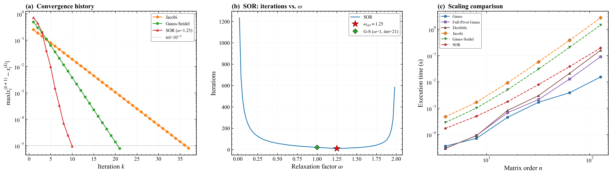

上图包含三个子图。

子图(a)展示了三种迭代法在求解4阶方程组时的收敛历史。纵轴为相邻两次迭代的最大分量差（对数尺度），灰色虚线为终止精度 $10^{-5}$。可以看到，三条曲线均呈近似直线下降（对数尺度下），说明收敛速度是几何级数式的，这与迭代矩阵谱半径小于1的理论一致。SOR方法（$\omega = 1.25$）的下降斜率最大，仅10步即穿过精度线；G-S迭代法次之，21步达标；Jacobi迭代法最慢，需37步。值得注意的是，SOR曲线在后期出现轻微振荡，这是超松弛（$\omega > 1$）的典型特征——步长偏大导致解在精确值附近来回摆动，但整体仍快速收敛。

子图(b)展示了SOR方法的迭代次数随松弛因子 $\omega$ 的变化关系。曲线呈明显的"U"形：$\omega$ 过小时为低松弛，收敛缓慢；$\omega$ 过大时接近发散边界，迭代次数急剧增加。最低点对应最佳松弛因子 $\omega_{opt} = 1.25$，此时迭代次数最少。图中同时标注了G-S迭代法（$\omega = 1$）的位置，其迭代次数为21次，明显多于最优SOR的10次，直观说明了超松弛加速的效果。

子图(c)以双对数坐标展示了各方法在高阶方程组上的执行时间随阶数 $n$ 的变化。直接法（实线）的时间增长斜率约为3（对应 $O(n^3)$ 复杂度），其中Gauss顺序消去法始终最快。迭代法（虚线）中，Jacobi和G-S的增长斜率更陡，这是因为每次迭代的计算量为 $O(n^2)$，而迭代次数本身也随 $n$ 线性增长，总复杂度约为 $O(n^3)$，但常数因子较大。SOR方法由于迭代次数增长缓慢，在高阶时执行时间显著低于其他两种迭代法，甚至在 $n=128$ 时与Gauss顺序消去法的差距已缩小至一个数量级以内。

## 七、结论

对于本题的4阶严格对角占优方程组，六种方法均能成功求解。直接法在精度上具有绝对优势（机器精度 $\sim 10^{-16}$），适合对精度要求极高的场景。迭代法的精度受限于终止条件（$10^{-5}$），但在高阶稀疏方程组中具有存储和计算量上的潜在优势。

三种迭代法中，SOR方法通过选取最佳松弛因子 $\omega_{opt}$，能够大幅减少迭代次数，在高阶方程组中的性能优势尤为突出。实验结果与理论分析完全吻合：$A$ 的严格对角占优性保证了Jacobi和G-S迭代法的收敛，而SOR方法在 $0 < \omega < 2$ 范围内均收敛，最佳松弛因子的试算值（1.25）与理论公式计算值（1.2038）基本一致。

## 附录 代码及运行截图

main.py：

```python
"""
计算方法H 第三章实践作业 - 主脚本
求解四元线性方程组，比较各方法的结果

用法:
    python main.py                  # 全部方法执行并比较（含可视化）
    python main.py gauss            # 仅执行Gauss顺序消去法
    python main.py gauss_full       # 仅执行全主元Gauss消去法
    python main.py doolittle        # 仅执行Doolittle分解法
    python main.py jacobi           # 仅执行Jacobi迭代法
    python main.py gauss_seidel     # 仅执行Gauss-Seidel迭代法
    python main.py sor              # 仅执行SOR逐次超松弛迭代法
"""
import sys
import time
import warnings
import numpy as np

warnings.filterwarnings('ignore', category=RuntimeWarning)

from gauss import gauss_elimination
from gauss_full_pivot import gauss_full_pivot
from doolittle import doolittle_decomposition
from jacobi import jacobi_iteration
from gauss_seidel import gauss_seidel_iteration
from sor import sor_iteration, find_optimal_omega, scan_omega

TOL = 1e-5
MAX_ITER = 10000

METHOD_NAMES = {
    'gauss': 'Gauss顺序消去法', 'gauss_full': '全主元Gauss消去法',
    'doolittle': 'Doolittle分解法', 'jacobi': 'Jacobi迭代法',
    'gauss_seidel': 'Gauss-Seidel迭代法', 'sor': 'SOR逐次超松弛迭代法',
}
METHOD_NAMES_EN = {
    'gauss': 'Gauss', 'gauss_full': 'Full-Pivot Gauss',
    'doolittle': 'Doolittle', 'jacobi': 'Jacobi',
    'gauss_seidel': 'Gauss-Seidel', 'sor': 'SOR',
}


def generate_system(n):
    """生成n阶同形方程组: 对角元=-n, 非对角元=1, b=全1, 精确解=全-1"""
    A = np.ones((n, n)) - (n + 1) * np.eye(n)
    b = np.ones(n)
    exact = -np.ones(n)
    return A, b, exact

# ========== 求解与单方法输出 ==========
A4, b4, EXACT4 = generate_system(4)


def solve(mk, A_mat, b_vec, tol=TOL, record_history=False, omega=None):
    """统一求解接口，返回 (x, ok, iters, elapsed, info, history)"""
    t0 = time.perf_counter()
    hist = []
    iters = 0
    if mk == 'gauss':
        x, ok = gauss_elimination(A_mat, b_vec)
    elif mk == 'gauss_full':
        x, ok = gauss_full_pivot(A_mat, b_vec)
    elif mk == 'doolittle':
        x, ok = doolittle_decomposition(A_mat, b_vec)
    elif mk == 'jacobi':
        x, ok, iters, hist = jacobi_iteration(
            A_mat, b_vec, tol=tol, max_iter=MAX_ITER,
            record_history=record_history)
    elif mk == 'gauss_seidel':
        x, ok, iters, hist = gauss_seidel_iteration(
            A_mat, b_vec, tol=tol, max_iter=MAX_ITER,
            record_history=record_history)
    elif mk == 'sor':
        if omega is None:
            omega, _ = find_optimal_omega(A_mat, b_vec, tol=tol,
                                          max_iter=MAX_ITER)
        x, ok, iters, hist = sor_iteration(
            A_mat, b_vec, omega=omega, tol=tol, max_iter=MAX_ITER,
            record_history=record_history)
    else:
        return None, False, 0, 0, "", []
    elapsed = time.perf_counter() - t0

    # 构造info
    if mk in ('jacobi', 'gauss_seidel'):
        info = f"迭代{iters}次" if ok else f"未收敛({iters}次)"
    elif mk == 'sor':
        info = f"ω={omega:.2f}, 迭代{iters}次"
    else:
        info = ""
    return x, ok, iters, elapsed, info, hist


def print_solution(mk):
    """单方法详细输出（含计时、迭代逐步结果）"""
    need_hist = mk in ('jacobi', 'gauss_seidel', 'sor')
    omega = None
    if mk == 'sor':
        omega, _ = find_optimal_omega(A4, b4, tol=TOL, max_iter=MAX_ITER)
    x, ok, iters, elapsed, info, hist = solve(
        mk, A4, b4, record_history=need_hist, omega=omega)

    name = METHOD_NAMES[mk]
    print(f"\n{'='*70}")
    print(f"  {name}")
    print(f"{'='*70}")

    if need_hist and hist:
        n = len(EXACT4)
        hdr = "  k |" + "".join(f"{'x'+str(i+1):>12s}" for i in range(n))
        hdr += " | 精度"
        print(hdr)
        print("  " + "-" * (len(hdr) - 2))
        for k, xk, acc in hist:
            row = f"  {k:>2d} |"
            row += "".join(f"{v:>12.8f}" for v in xk)
            row += f" | {acc:.6e}"
            print(row)

    if ok and x is not None:
        err = np.linalg.norm(x - EXACT4, ord=np.inf)
        print(f"\n  解向量: x = [{', '.join(f'{v:.10f}' for v in x)}]")
        print(f"  精确解: x*= [{', '.join(f'{v:.1f}' for v in EXACT4)}]")
        print(f"  误差(∞范数): {err:.6e}")
        print(f"  执行时间: {elapsed:.6f} s")
        if info:
            print(f"  {info}")
    else:
        print(f"  求解失败  {info}")


# ========== 全部执行 ==========
def run_all():
    """全部方法求解4阶方程组，打印比较表格"""
    methods = list(METHOD_NAMES.keys())
    results = {}
    for mk in methods:
        x, ok, iters, elapsed, info, _ = solve(mk, A4, b4)
        err = np.linalg.norm(x - EXACT4, ord=np.inf) if (ok and x is not None) else float('inf')
        results[mk] = dict(x=x, ok=ok, iters=iters, err=err,
                           elapsed=elapsed, info=info)

    print(f"\n{'='*95}")
    print("  各方法求解结果比较 (n=4)")
    print(f"{'='*95}")
    print(f"{'方法':<22s} | {'x1':>11s} {'x2':>11s} {'x3':>11s} {'x4':>11s}"
          f" | {'误差':>10s} | {'时间/s':>10s}")
    print("-" * 95)
    for mk in methods:
        r = results[mk]
        name = METHOD_NAMES[mk]
        if r['ok'] and r['x'] is not None:
            xs = ''.join(f"{v:>11.7f} " for v in r['x'])
            print(f"{name:<22s} | {xs}| {r['err']:>10.3e} | {r['elapsed']:>10.6f}")
        else:
            print(f"{name:<22s} | {'求解失败':>48s} |")
    print(f"{'精确解':<22s} | "
          f"{''.join(f'{v:>11.7f} ' for v in EXACT4)}|")

    print(f"\n--- 迭代法详细信息 ---")
    for mk in ('jacobi', 'gauss_seidel', 'sor'):
        r = results[mk]
        print(f"  {METHOD_NAMES[mk]}: {r['info']}, 耗时 {r['elapsed']:.6f}s")

    return results


# ========== 要求4: 高阶方程组扩展比较 ==========
N_SCALING = [4, 8, 16, 32, 64, 128]


def run_scaling():
    """对同形高阶方程组，比较各方法执行时间与迭代次数"""
    methods = list(METHOD_NAMES.keys())
    data = {mk: {'ns': [], 'times': [], 'iters': []} for mk in methods}

    print(f"\n{'='*95}")
    print("  要求4: 高阶同形方程组各方法性能比较")
    print(f"{'='*95}")
    hdr = f"{'n':>5s}"
    for mk in methods:
        hdr += f" | {METHOD_NAMES_EN[mk]+'/s':>14s}"
    print(hdr)
    print("-" * (5 + 17 * len(methods)))

    for n in N_SCALING:
        An, bn, _ = generate_system(n)
        row = f"{n:>5d}"
        for mk in methods:
            # SOR用理论最优omega加速
            omega = None
            if mk == 'sor':
                rho_J = (n - 1) / n
                omega = 2.0 / (1.0 + np.sqrt(1.0 - rho_J ** 2))
            x, ok, iters, elapsed, info, _ = solve(
                mk, An, bn, omega=omega)
            data[mk]['ns'].append(n)
            data[mk]['times'].append(elapsed)
            data[mk]['iters'].append(iters if ok else None)
            if ok:
                row += f" | {elapsed:>14.6f}"
            else:
                row += f" | {'fail':>14s}"
        print(row)


    # 迭代法迭代次数表
    iter_methods = ['jacobi', 'gauss_seidel', 'sor']
    print(f"\n--- 迭代次数 ---")
    hdr2 = f"{'n':>5s}"
    for mk in iter_methods:
        hdr2 += f" | {METHOD_NAMES_EN[mk]:>14s}"
    print(hdr2)
    print("-" * (5 + 17 * len(iter_methods)))
    for i, n in enumerate(N_SCALING):
        row = f"{n:>5d}"
        for mk in iter_methods:
            it = data[mk]['iters'][i]
            row += f" | {it:>14d}" if it else f" | {'fail':>14s}"
        print(row)

    return data

# ========== 可视化 ==========
def _setup_rc():
    import matplotlib.pyplot as plt
    plt.rcParams.update({
        'font.family': 'serif',
        'font.serif': ['Times New Roman', 'DejaVu Serif'],
        'mathtext.fontset': 'stix', 'font.size': 11,
        'axes.linewidth': 1.0, 'axes.labelsize': 13,
        'axes.titlesize': 13, 'axes.unicode_minus': False,
        'xtick.direction': 'in', 'ytick.direction': 'in',
        'xtick.major.width': 0.8, 'ytick.major.width': 0.8,
        'xtick.minor.visible': True, 'ytick.minor.visible': True,
        'xtick.top': True, 'ytick.right': True,
        'legend.frameon': True, 'legend.framealpha': 0.9,
        'legend.edgecolor': '0.6', 'legend.fontsize': 9,
        'lines.linewidth': 1.4, 'lines.markersize': 5,
        'grid.alpha': 0.25, 'grid.linewidth': 0.5,
        'grid.linestyle': '--',
        'savefig.dpi': 300, 'figure.dpi': 150,
    })


def visualize(scaling_data):
    """
    三子图:
      (a) 迭代法收敛曲线 (精度 vs 迭代次数)
      (b) SOR ω-迭代次数
      (c) 高阶方程组执行时间 vs n
    """
    import matplotlib
    matplotlib.use('Agg')
    import matplotlib.pyplot as plt
    _setup_rc()

    iter_keys = ['jacobi', 'gauss_seidel', 'sor']
    iter_colors = {'jacobi': '#ff7f0e', 'gauss_seidel': '#2ca02c',
                   'sor': '#d62728'}
    iter_markers = {'jacobi': 'D', 'gauss_seidel': 's', 'sor': '^'}

    fig, axes = plt.subplots(1, 3, figsize=(17, 5))

    # ---- (a) 收敛曲线 ----
    ax = axes[0]
    best_w, _ = find_optimal_omega(A4, b4, tol=TOL, max_iter=MAX_ITER)
    for mk in iter_keys:
        omega = best_w if mk == 'sor' else None
        _, _, _, _, _, hist = solve(mk, A4, b4, record_history=True,
                                    omega=omega)
        if hist:
            ks = [h[0] for h in hist]
            accs = [h[2] for h in hist]
            lbl = METHOD_NAMES_EN[mk]
            if mk == 'sor':
                lbl += rf' ($\omega$={best_w:.2f})'
            ax.semilogy(ks, accs, marker=iter_markers[mk],
                        color=iter_colors[mk], label=lbl, markersize=4)
    ax.axhline(y=TOL, color='gray', linestyle=':', linewidth=1,
               label=rf'tol=$10^{{-5}}$')
    ax.set_xlabel('Iteration $k$')
    ax.set_ylabel(r'$\max|x_i^{(k+1)}-x_i^{(k)}|$')
    ax.set_title('(a)  Convergence history', loc='left', fontweight='bold')
    ax.legend(loc='upper right')
    ax.grid(True)


    # ---- (b) SOR ω 曲线 ----
    ax = axes[1]
    omegas, iters_list = scan_omega(A4, b4, tol=TOL, max_iter=MAX_ITER,
                                    step=0.02)
    pw = [w for w, it in zip(omegas, iters_list) if it is not None]
    pi = [it for it in iters_list if it is not None]
    ax.plot(pw, pi, '-', color='#1f77b4', linewidth=1.5, label='SOR')
    ax.plot(best_w, min(pi), 'r*', markersize=14, markeredgecolor='black',
            markeredgewidth=0.5, zorder=5,
            label=rf'$\omega_{{opt}}={best_w:.2f}$')
    _, gs_ok, gs_it, _ = gauss_seidel_iteration(A4, b4, tol=TOL,
                                                  max_iter=MAX_ITER)
    if gs_ok:
        ax.plot(1.0, gs_it, 'D', color='#2ca02c', markersize=7,
                markeredgecolor='black', markeredgewidth=0.5, zorder=5,
                label=f'G-S ($\\omega$=1, iter={gs_it})')
    ax.set_xlabel(r'Relaxation factor $\omega$')
    ax.set_ylabel('Iterations')
    ax.set_title(r'(b)  SOR: iterations vs. $\omega$',
                 loc='left', fontweight='bold')
    ax.legend(loc='upper right')
    ax.grid(True)

    # ---- (c) 高阶扩展: 执行时间 vs n ----
    ax = axes[2]
    all_methods = list(METHOD_NAMES.keys())
    styles = {
        'gauss': ('-', 'o', '#1f77b4'), 'gauss_full': ('-', 's', '#9467bd'),
        'doolittle': ('-', '^', '#8c564b'),
        'jacobi': ('--', 'D', '#ff7f0e'), 'gauss_seidel': ('--', 'v', '#2ca02c'),
        'sor': ('--', 'p', '#d62728'),
    }
    for mk in all_methods:
        ns = scaling_data[mk]['ns']
        ts = scaling_data[mk]['times']
        ls, m, c = styles[mk]
        ax.loglog(ns, ts, linestyle=ls, marker=m, color=c,
                  label=METHOD_NAMES_EN[mk], markeredgecolor='black',
                  markeredgewidth=0.3)
    ax.set_xlabel('Matrix order $n$')
    ax.set_ylabel('Execution time (s)')
    ax.set_title('(c)  Scaling comparison', loc='left', fontweight='bold')
    ax.legend(loc='upper left', fontsize=8)
    ax.grid(True)


    plt.tight_layout(w_pad=2.5)
    plt.savefig('comparison.png', bbox_inches='tight')
    plt.close(fig)
    print("\n可视化结果已保存至 comparison.png")


# ========== 入口 ==========
def main():
    if len(sys.argv) > 1:
        mk = sys.argv[1]
        if mk not in METHOD_NAMES:
            print(f"未知方法: {mk}")
            print(f"可选: {', '.join(METHOD_NAMES.keys())}")
            sys.exit(1)
        print_solution(mk)
    else:
        run_all()
        scaling_data = run_scaling()
        visualize(scaling_data)


if __name__ == '__main__':
    main()
```

gauss.py：

```python
"""
Gauss顺序消去法模块
实现Gauss消去法求解线性方程组
"""
import numpy as np


def gauss_elimination(A, b):
    """
    Gauss顺序消去法求解线性方程组 Ax = b

    参数:
        A: 系数矩阵 (n×n)
        b: 右端向量 (n×1)

    返回:
        x: 解向量
        success: 是否成功求解
    """
    n = len(b)
    A = A.astype(float).copy()
    b = b.astype(float).copy()

    # 消元过程
    for k in range(n - 1):
        # 检查主元是否为零
        if abs(A[k, k]) < 1e-15:
            return None, False

        # 计算消元因子并消元
        for i in range(k + 1, n):
            l_ik = A[i, k] / A[k, k]
            A[i, k:n] = A[i, k:n] - l_ik * A[k, k:n]
            b[i] = b[i] - l_ik * b[k]

    # 回代过程
    x = np.zeros(n)
    for k in range(n - 1, -1, -1):
        if abs(A[k, k]) < 1e-15:
            return None, False
        x[k] = (b[k] - np.dot(A[k, k+1:n], x[k+1:n])) / A[k, k]

    return x, True
```

gauss_full_pivot.py：

```python
"""
全主元Gauss消去法模块
实现全主元Gauss消去法求解线性方程组
"""
import numpy as np


def gauss_full_pivot(A, b):
    """
    全主元Gauss消去法求解线性方程组 Ax = b

    参数:
        A: 系数矩阵 (n×n)
        b: 右端向量 (n×1)

    返回:
        x: 解向量
        success: 是否成功求解
    """
    n = len(b)
    A = A.astype(float).copy()
    b = b.astype(float).copy()

    # 记录列交换信息
    col_order = list(range(n))

    # 消元过程
    for k in range(n - 1):
        # 在k~n行、k~n列中选取绝对值最大的元素
        max_val = 0
        max_i, max_j = k, k
        for i in range(k, n):
            for j in range(k, n):
                if abs(A[i, j]) > max_val:
                    max_val = abs(A[i, j])
                    max_i, max_j = i, j

        if max_val < 1e-15:
            return None, False

        # 行交换
        if max_i != k:
            A[[k, max_i], :] = A[[max_i, k], :]
            b[k], b[max_i] = b[max_i], b[k]

        # 列交换
        if max_j != k:
            A[:, [k, max_j]] = A[:, [max_j, k]]
            col_order[k], col_order[max_j] = col_order[max_j], col_order[k]

        # 计算消元因子并消元
        for i in range(k + 1, n):
            l_ik = A[i, k] / A[k, k]
            A[i, k:n] = A[i, k:n] - l_ik * A[k, k:n]
            b[i] = b[i] - l_ik * b[k]

    # 回代过程
    y = np.zeros(n)
    for k in range(n - 1, -1, -1):
        if abs(A[k, k]) < 1e-15:
            return None, False
        y[k] = (b[k] - np.dot(A[k, k+1:n], y[k+1:n])) / A[k, k]

    # 恢复未知量次序
    x = np.zeros(n)
    for i in range(n):
        x[col_order[i]] = y[i]

    return x, True
```

doolittle.py：

```python
"""
Doolittle分解法模块
实现Doolittle三角分解法求解线性方程组
"""
import numpy as np


def doolittle_decomposition(A, b):
    """
    Doolittle分解法求解线性方程组 Ax = b
    A = LU，其中L为单位下三角矩阵，U为上三角矩阵

    参数:
        A: 系数矩阵 (n×n)
        b: 右端向量 (n×1)

    返回:
        x: 解向量
        success: 是否成功求解
    """
    n = len(b)
    A = A.astype(float).copy()
    b = b.astype(float).copy()

    L = np.zeros((n, n))
    U = np.zeros((n, n))

    # Doolittle分解
    for k in range(n):
        # 计算U的第k行
        for j in range(k, n):
            U[k, j] = A[k, j] - sum(L[k, m] * U[m, j] for m in range(k))

        # 检查对角元素
        if abs(U[k, k]) < 1e-15:
            return None, False

        # L的对角元素为1
        L[k, k] = 1.0

        # 计算L的第k列
        for i in range(k + 1, n):
            L[i, k] = (A[i, k] - sum(L[i, m] * U[m, k]
                       for m in range(k))) / U[k, k]

    # 前推求解 Ly = b
    y = np.zeros(n)
    for k in range(n):
        y[k] = b[k] - sum(L[k, m] * y[m] for m in range(k))

    # 回代求解 Ux = y
    x = np.zeros(n)
    for k in range(n - 1, -1, -1):
        x[k] = (y[k] - sum(U[k, m] * x[m] for m in range(k + 1, n))) / U[k, k]

    return x, True
```

jacobi.py：

```python
"""
Jacobi迭代法模块
实现Jacobi迭代法求解线性方程组
"""
import numpy as np


def jacobi_iteration(A, b, tol=1e-10, max_iter=10000, record_history=False):
    """
    Jacobi迭代法求解线性方程组 Ax = b

    迭代格式: x_i^{(k+1)} = (b_i - sum_{j!=i} a_ij * x_j^{(k)}) / a_ii

    返回:
        (x, success, iterations, history)
        history: record_history=True时为[(k, x_copy, accuracy), ...]
    """
    n = len(b)
    A = A.astype(float)
    b = b.astype(float)

    for i in range(n):
        if abs(A[i, i]) < 1e-15:
            return None, False, 0, []

    x = np.zeros(n)
    x_new = np.zeros(n)
    history = []

    for k in range(max_iter):
        for i in range(n):
            s = sum(A[i, j] * x[j] for j in range(n) if j != i)
            x_new[i] = (b[i] - s) / A[i, i]

        if np.any(np.isnan(x_new)) or np.any(np.isinf(x_new)):
            return x_new.copy(), False, k + 1, history

        acc = np.linalg.norm(x_new - x, ord=np.inf)
        if record_history:
            history.append((k + 1, x_new.copy(), acc))

        if acc < tol:
            return x_new.copy(), True, k + 1, history

        x = x_new.copy()

    return x_new.copy(), False, max_iter, history
```

gauss_seidel.py：

```python
"""
Gauss-Seidel迭代法模块
实现G-S迭代法求解线性方程组
"""
import numpy as np


def gauss_seidel_iteration(A, b, tol=1e-10, max_iter=10000,
                           record_history=False):
    """
    Gauss-Seidel迭代法求解线性方程组 Ax = b

    返回:
        (x, success, iterations, history)
    """
    n = len(b)
    A = A.astype(float)
    b = b.astype(float)

    for i in range(n):
        if abs(A[i, i]) < 1e-15:
            return None, False, 0, []

    x = np.zeros(n)
    history = []

    for k in range(max_iter):
        x_old = x.copy()
        for i in range(n):
            s1 = sum(A[i, j] * x[j] for j in range(i))
            s2 = sum(A[i, j] * x_old[j] for j in range(i + 1, n))
            x[i] = (b[i] - s1 - s2) / A[i, i]

        if np.any(np.isnan(x)) or np.any(np.isinf(x)):
            return x.copy(), False, k + 1, history

        acc = np.linalg.norm(x - x_old, ord=np.inf)
        if record_history:
            history.append((k + 1, x.copy(), acc))

        if acc < tol:
            return x.copy(), True, k + 1, history

    return x.copy(), False, max_iter, history
```

sor.py：

```python
"""
SOR逐次超松弛迭代法模块
实现SOR方法求解线性方程组
"""
import numpy as np


def sor_iteration(A, b, omega=1.5, tol=1e-10, max_iter=10000,
                  record_history=False):
    """
    SOR逐次超松弛迭代法求解线性方程组 Ax = b

    返回:
        (x, success, iterations, history)
    """
    n = len(b)
    A = A.astype(float)
    b = b.astype(float)

    for i in range(n):
        if abs(A[i, i]) < 1e-15:
            return None, False, 0, []

    x = np.zeros(n)
    history = []

    for k in range(max_iter):
        x_old = x.copy()
        for i in range(n):
            s1 = sum(A[i, j] * x[j] for j in range(i))
            s2 = sum(A[i, j] * x_old[j] for j in range(i, n))
            x[i] = x_old[i] + omega / A[i, i] * (b[i] - s1 - s2)

        if np.any(np.isnan(x)) or np.any(np.isinf(x)):
            return x.copy(), False, k + 1, history

        acc = np.linalg.norm(x - x_old, ord=np.inf)
        if record_history:
            history.append((k + 1, x.copy(), acc))

        if acc < tol:
            return x.copy(), True, k + 1, history

    return x.copy(), False, max_iter, history


def find_optimal_omega(A, b, tol=1e-5, max_iter=10000):
    """两轮搜索寻找最佳松弛因子: 粗搜(0.1) + 细搜(0.01)"""
    best_omega = 1.0
    min_iters = max_iter

    for omega_10 in range(1, 20):
        omega = omega_10 / 10.0
        _, success, iters, _ = sor_iteration(A, b, omega, tol, max_iter)
        if success and iters < min_iters:
            min_iters = iters
            best_omega = omega

    lo = max(0.01, best_omega - 0.15)
    hi = min(1.99, best_omega + 0.15)
    steps = int(round((hi - lo) / 0.01)) + 1
    for i in range(steps):
        omega = lo + i * 0.01
        _, success, iters, _ = sor_iteration(A, b, omega, tol, max_iter)
        if success and iters < min_iters:
            min_iters = iters
            best_omega = omega

    return best_omega, min_iters


def scan_omega(A, b, tol=1e-5, max_iter=10000, step=0.02):
    """全范围扫描omega与迭代次数的关系"""
    omegas, iters_list = [], []
    omega = step
    while omega < 2.0:
        _, success, iters, _ = sor_iteration(A, b, omega, tol, max_iter)
        omegas.append(round(omega, 4))
        iters_list.append(iters if success else None)
        omega += step
    return omegas, iters_list
```

执行以下命令：

```bash
python main.py
```

运行结果：

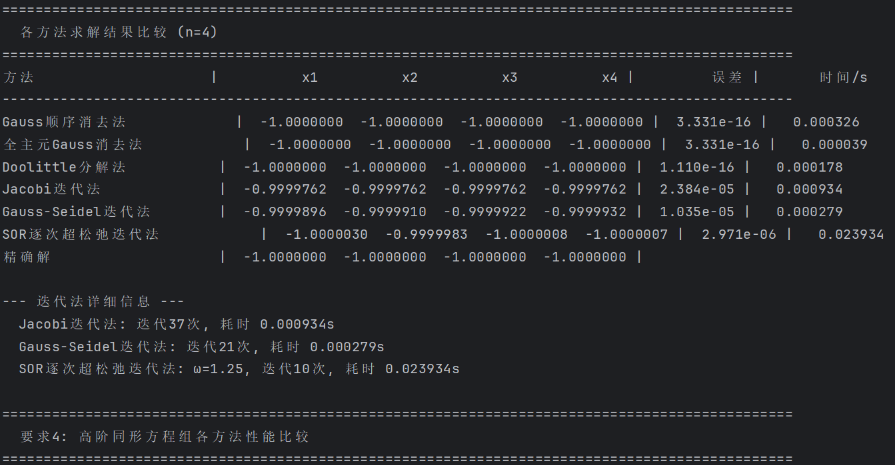

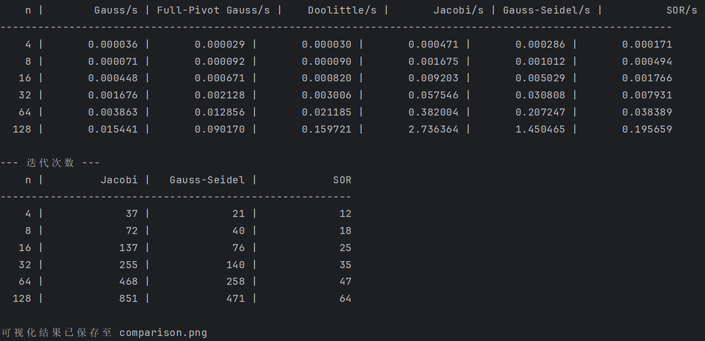

执行以下命令：

```bash
python main.py gauss
```

运行结果：

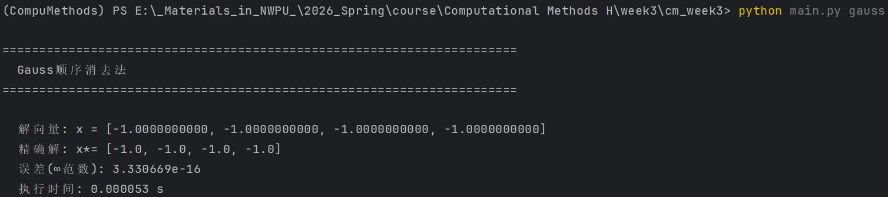

执行以下命令：

```bash
python main.py gauss_full
```

运行结果：

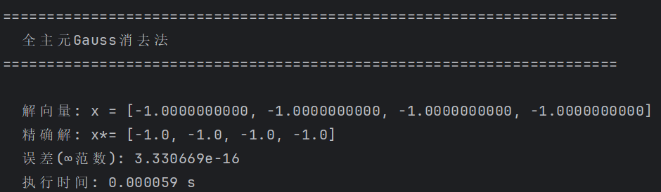

执行以下命令：

```bash
python main.py doolittle
```

运行结果：

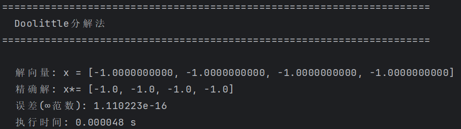

执行以下命令：

```bash
python main.py jacobi
```

运行结果：

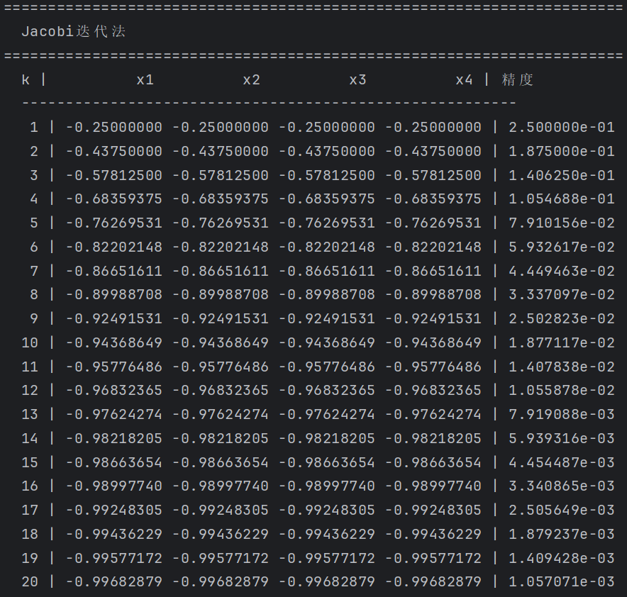

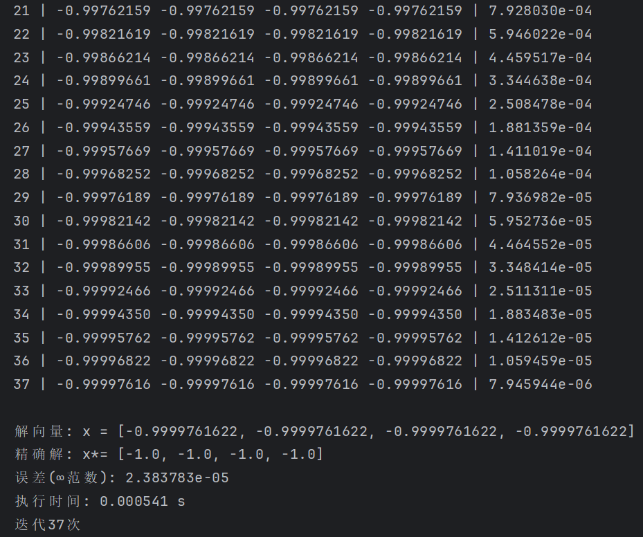

执行以下命令：

```bash
python main.py gauss_seidel
```

运行结果：

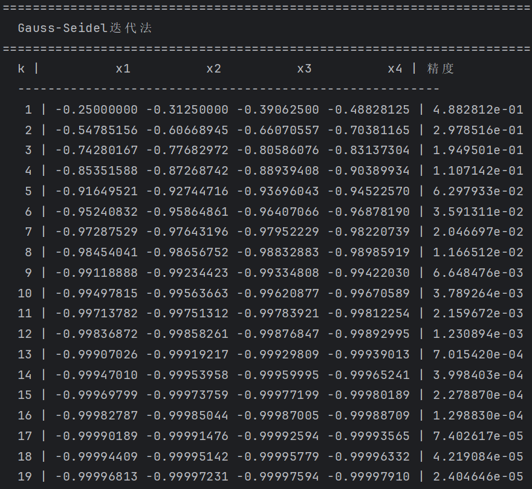

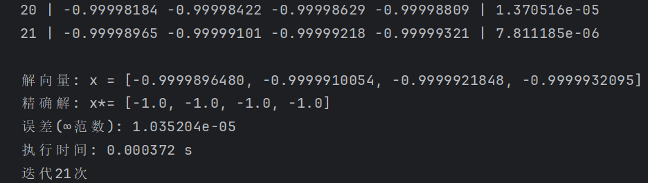

执行以下命令：

```bash
python main.py sor
```

运行结果：

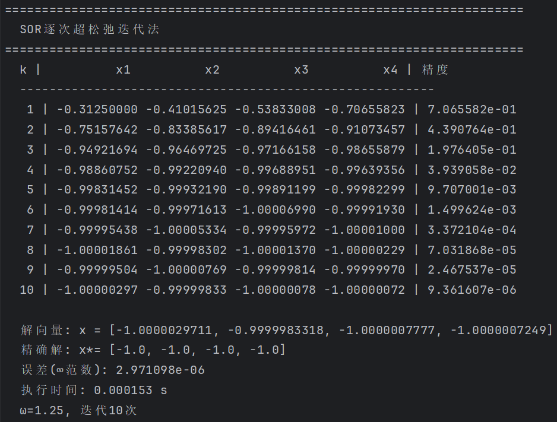