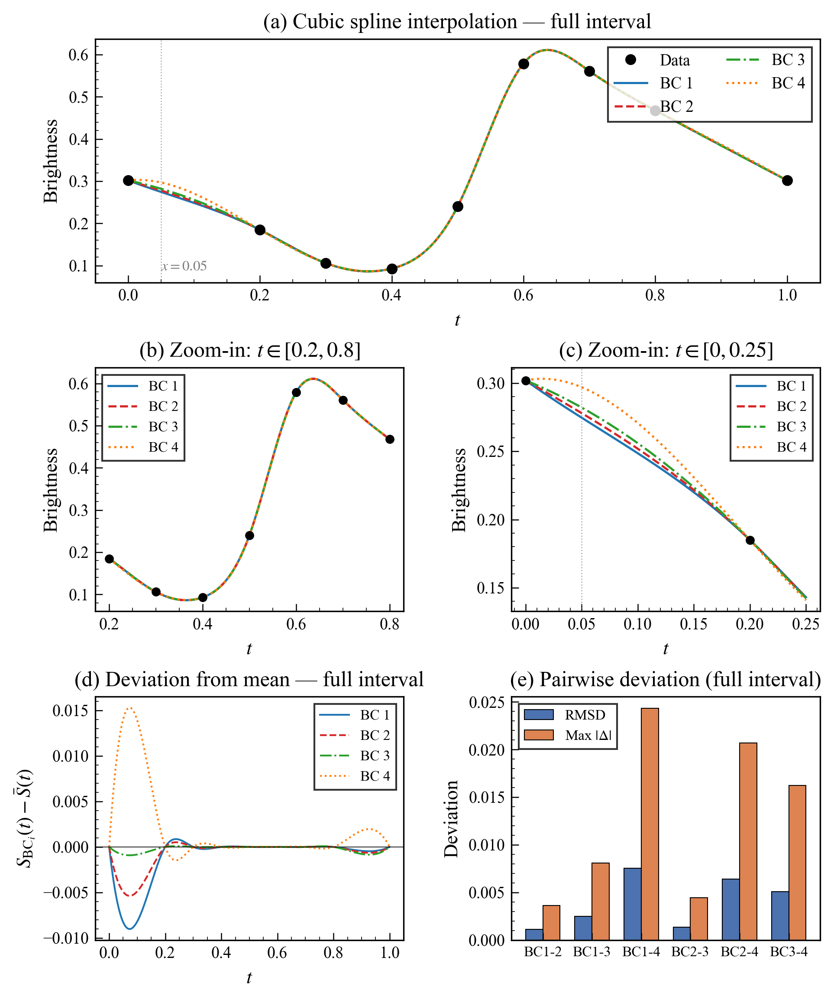

# 计算方法H第四章实践作业报告

## 一、问题描述

本次实践任务来源于对某星亮度的观察数据。在时间轴上给出了 9 个不等距的采样点，分别为 $t = 0.0, 0.2, 0.3, 0.4, 0.5, 0.6, 0.7, 0.8, 1.0$，对应的亮度值为 $y = 0.302, 0.185, 0.106, 0.093, 0.240, 0.579, 0.561, 0.468, 0.302$。任务要求采用四种不同的边界条件分别构造三次样条函数，比较各样条函数在 $t = 0.05$ 处的函数值，并在节点 $t = 0.2$ 与 $t = 0.8$ 之间的区间上进行样条曲线的对比分析，最终总结不同边界条件对样条插值结果的影响规律。

四种边界条件定义如下。

**边界条件 1（夹持边界）**：已知端点处的一阶导数值，此处采用相邻两点的平均变化率近似，即 $S'(x_0) = f[x_0, x_1]$，$S'(x_n) = f[x_{n-1}, x_n]$。

**边界条件 2（自然边界）**：端点处二阶导数为零，即 $M_0 = M_n = 0$。

**边界条件 3**：端点弯矩等于相邻内部节点弯矩，即 $M_0 = M_1$，$M_n = M_{n-1}$。

**边界条件 4（Not-a-knot）**：端点处第三导数连续，表达为 $(M_1 - M_0)/h_1 = (M_2 - M_1)/h_2$ 和 $(M_n - M_{n-1})/h_n = (M_{n-1} - M_{n-2})/h_{n-1}$。

## 二、求解方法

### 2.1 三弯矩方程组的建立

本次求解采用三弯矩法（也称为 M 关系法）。记第 $i$ 个节点处的二阶导数为 $M_i = S''(x_i)$，在每个子区间 $[x_{i-1}, x_i]$ 上，二阶导数 $S''(x)$ 是一次函数，利用线性插值表示为

$$S''(x) = M_{i-1} \frac{x_i - x}{h_i} + M_i \frac{x - x_{i-1}}{h_i}$$

对上式进行两次积分并利用插值条件 $S(x_{i-1}) = y_{i-1}$、$S(x_i) = y_i$，可得每个子区间上三次样条的完整表达式。进一步，利用内节点处一阶导数的连续性条件 $S'(x_i^-) = S'(x_i^+)$，可以建立关于 $M_0, M_1, \dots, M_n$ 的三弯矩方程组：

$$\lambda_i M_{i-1} + 2M_i + \mu_i M_{i+1} = d_i, \quad i = 1, 2, \dots, n-1$$

其中 $\lambda_i = h_i / (h_i + h_{i+1})$，$\mu_i = h_{i+1} / (h_i + h_{i+1})$，$d_i = 6f[x_{i-1}, x_i, x_{i+1}]$。该方程组共有 $n-1$ 个方程，$n+1$ 个未知量 $M_0, M_1, \dots, M_n$，需要两个边界条件来补足方程。四种不同的边界条件分别以不同的方式添加关于 $M_0$ 和 $M_n$ 的方程，从而构成 $(n+1) \times (n+1)$ 的线性方程组。

### 2.2 样条系数的计算

求得弯矩 $M_i$ 之后，每个子区间 $[x_i, x_{i+1}]$ 上的三次样条可以写成标准形式

$$S_i(x) = a_i + b_i(x - x_i) + c_i(x - x_i)^2 + d_i(x - x_i)^3$$

其中各系数为

$$a_i = y_i, \quad b_i = \frac{y_{i+1} - y_i}{h_{i+1}} - \frac{h_{i+1}(2M_i + M_{i+1})}{6}, \quad c_i = \frac{M_i}{2}, \quad d_i = \frac{M_{i+1} - M_i}{6h_{i+1}}$$

本次实践中共有 $n = 8$ 个子区间，因此每种边界条件下均产生 8 组系数。

## 三、求解结果

### 3.1 分段多项式系数

以下给出四种边界条件下各子区间的样条系数 $a_i, b_i, c_i, d_i$。

**边界条件 1（夹持边界）**

| 区间 | $a_i$ | $b_i$ | $c_i$ | $d_i$ |
|------|--------|--------|--------|--------|
| $[0.0, 0.2]$ | $0.302000$ | $-0.585000$ | $1.018288$ | $-5.091442$ |
| $[0.2, 0.3]$ | $0.185000$ | $-0.788658$ | $-2.036577$ | $20.231536$ |
| $[0.3, 0.4]$ | $0.106000$ | $-0.589027$ | $4.032884$ | $5.573858$ |
| $[0.4, 0.5]$ | $0.093000$ | $0.384766$ | $5.705041$ | $51.473033$ |
| $[0.5, 0.6]$ | $0.240000$ | $3.069965$ | $21.146951$ | $-179.465991$ |
| $[0.6, 0.7]$ | $0.579000$ | $1.915375$ | $-32.692846$ | $117.390931$ |
| $[0.7, 0.8]$ | $0.561000$ | $-1.101466$ | $2.524433$ | $-8.097733$ |
| $[0.8, 1.0]$ | $0.468000$ | $-0.839511$ | $0.095113$ | $-0.237783$ |

**边界条件 2（自然边界）**

| 区间 | $a_i$ | $b_i$ | $c_i$ | $d_i$ |
|------|--------|--------|--------|--------|
| $[0.0, 0.2]$ | $0.302000$ | $-0.472914$ | $0.000000$ | $-2.802140$ |
| $[0.2, 0.3]$ | $0.185000$ | $-0.809171$ | $-1.681284$ | $18.729963$ |
| $[0.3, 0.4]$ | $0.106000$ | $-0.583529$ | $3.937705$ | $5.975866$ |
| $[0.4, 0.5]$ | $0.093000$ | $0.383288$ | $5.730465$ | $51.366572$ |
| $[0.5, 0.6]$ | $0.240000$ | $3.070378$ | $21.140436$ | $-179.442153$ |
| $[0.6, 0.7]$ | $0.579000$ | $1.915201$ | $-32.692210$ | $117.402041$ |
| $[0.7, 0.8]$ | $0.561000$ | $-1.101180$ | $2.528403$ | $-8.166010$ |
| $[0.8, 1.0]$ | $0.468000$ | $-0.840480$ | $0.078600$ | $-0.130999$ |

**边界条件 3（$M_0 = M_1, M_n = M_{n-1}$）**

| 区间 | $a_i$ | $b_i$ | $c_i$ | $d_i$ |
|------|--------|--------|--------|--------|
| $[0.0, 0.2]$ | $0.302000$ | $-0.335720$ | $-1.246401$ | $0.000000$ |
| $[0.2, 0.3]$ | $0.185000$ | $-0.834280$ | $-1.246401$ | $16.892016$ |
| $[0.3, 0.4]$ | $0.106000$ | $-0.576800$ | $3.821204$ | $6.467930$ |
| $[0.4, 0.5]$ | $0.093000$ | $0.381479$ | $5.761583$ | $51.236265$ |
| $[0.5, 0.6]$ | $0.240000$ | $3.070884$ | $21.132463$ | $-179.412989$ |
| $[0.6, 0.7]$ | $0.579000$ | $1.914986$ | $-32.691434$ | $117.415691$ |
| $[0.7, 0.8]$ | $0.561000$ | $-1.100830$ | $2.533273$ | $-8.249775$ |
| $[0.8, 1.0]$ | $0.468000$ | $-0.841668$ | $0.058341$ | $0.000000$ |

**边界条件 4（Not-a-knot）**

| 区间 | $a_i$ | $b_i$ | $c_i$ | $d_i$ |
|------|--------|--------|--------|--------|
| $[0.0, 0.2]$ | $0.302000$ | $0.163667$ | $-5.783338$ | $10.200010$ |
| $[0.2, 0.3]$ | $0.185000$ | $-0.925667$ | $0.336668$ | $10.200010$ |
| $[0.3, 0.4]$ | $0.106000$ | $-0.552333$ | $3.396671$ | $8.266597$ |
| $[0.4, 0.5]$ | $0.093000$ | $0.374999$ | $5.876650$ | $50.733604$ |
| $[0.5, 0.6]$ | $0.240000$ | $3.072337$ | $21.096731$ | $-179.201011$ |
| $[0.6, 0.7]$ | $0.579000$ | $1.915653$ | $-32.663573$ | $117.070442$ |
| $[0.7, 0.8]$ | $0.561000$ | $-1.104948$ | $2.457560$ | $-7.080755$ |
| $[0.8, 1.0]$ | $0.468000$ | $-0.825859$ | $0.333333$ | $-1.770189$ |

### 3.2 节点弯矩 $M_i$

弯矩 $M_i$ 即各节点处样条函数的二阶导数值，其大小反映了曲线在该处的弯曲程度。四种边界条件下各节点的弯矩值如下表所示。

| 节点 | BC1 | BC2 | BC3 | BC4 |
|------|-----|-----|-----|-----|
| $x_0 = 0.0$ | $2.0366$ | $0.0000$ | $-2.4928$ | $-11.5667$ |
| $x_1 = 0.2$ | $-4.0732$ | $-3.3626$ | $-2.4928$ | $0.6733$ |
| $x_2 = 0.3$ | $8.0658$ | $7.8754$ | $7.6424$ | $6.7933$ |
| $x_3 = 0.4$ | $11.4101$ | $11.4609$ | $11.5232$ | $11.7533$ |
| $x_4 = 0.5$ | $42.2939$ | $42.2809$ | $42.2649$ | $42.1935$ |
| $x_5 = 0.6$ | $-65.3857$ | $-65.3844$ | $-65.3829$ | $-65.3271$ |
| $x_6 = 0.7$ | $5.0489$ | $5.0568$ | $5.0665$ | $4.9151$ |
| $x_7 = 0.8$ | $0.1902$ | $0.1572$ | $0.1167$ | $0.6667$ |
| $x_8 = 1.0$ | $-0.0951$ | $0.0000$ | $0.1167$ | $-1.4576$ |

从弯矩数据可以直观看出，四种边界条件在内部节点 $x_3$ 至 $x_6$ 处给出的弯矩值非常接近——例如在 $x_4 = 0.5$ 处，四个弯矩值均约为 $42.2$，差异不超过 $0.1$；在 $x_5 = 0.6$ 处，四个弯矩值均约为 $-65.4$，差异同样极小。然而在端点 $x_0$ 和 $x_8$ 处，弯矩值差异显著：$x_0$ 处最大差异达到约 $13.6$（BC1 的 $2.04$ 与 BC4 的 $-11.57$），$x_1 = 0.2$ 处差异也超过 $4.7$。这说明边界条件的影响在端点附近最为显著，而随着远离端点，其影响迅速衰减。

### 3.3 $t = 0.05$ 处的样条值

$t = 0.05$ 位于第一个子区间 $[0.0, 0.2]$ 内，距左端点 $x_0 = 0$ 很近。四种边界条件下该点的样条值如下表所示。

| 边界条件 | $S(0.05)$ |
|----------|-----------|
| BC1（夹持边界） | $0.274659$ |
| BC2（自然边界） | $0.278004$ |
| BC3（$M_0=M_1$） | $0.282098$ |
| BC4（Not-a-knot） | $0.297000$ |

四种条件下的结果并不一致。BC1、BC2、BC3 三者的差异较小，彼此之间的最大差距约为 $0.0074$（BC1 与 BC3 之间）。而 BC4 给出的值明显偏大，与 BC1 之间的差距达到 $0.0224$。这一现象与该求值点紧邻左端点有关——在端点附近，边界条件对样条行为起着主导作用。BC4（Not-a-knot 条件）通过强制 $x_1$ 处的三阶导数连续，实质上将前两个子区间合并为一个整体三次多项式，这赋予了第一段区间更大的自由度，使其行为与其他三种边界条件产生了显著差异。

## 四、比较分析

### 4.1 区间 $[0.2, 0.8]$ 上的对比

为定量比较四种样条在 $[0.2, 0.8]$ 区间上的差异，以四种边界条件的均值 $\bar{S}(t) = \frac{1}{4}\sum_{k=1}^{4} S_k(t)$ 作为参考基准，计算每种样条相对于均值基准的均方根偏差（RMSD）、最大绝对偏差和平均偏差，结果如下表所示。

| 边界条件 | RMSD | 最大绝对偏差 | 平均偏差 |
|----------|------|------------|---------|
| BC1 | $2.548 \times 10^{-4}$ | $8.636 \times 10^{-4}$ | $7.391 \times 10^{-5}$ |
| BC2 | $1.527 \times 10^{-4}$ | $5.148 \times 10^{-4}$ | $4.687 \times 10^{-5}$ |
| BC3 | $3.518 \times 10^{-5}$ | $8.776 \times 10^{-5}$ | $1.377 \times 10^{-5}$ |
| BC4 | $4.353 \times 10^{-4}$ | $1.466 \times 10^{-3}$ | $-1.346 \times 10^{-4}$ |

在 $[0.2, 0.8]$ 区间上，所有偏差指标的量级均不超过 $10^{-3}$，这意味着四种样条在该区间上几乎完全重合。BC3 表现最接近均值基准，其 RMSD 仅为 $3.518 \times 10^{-5}$，说明它在某种意义上是四种结果的"中位"。BC4 偏差最大但也仅为 $10^{-4}$ 量级，依然很小。

两两对比的结果同样证实了这一趋势，如下表所示。

| 比较对 | RMSD | 最大绝对差值 |
|--------|------|------------|
| BC1 vs BC2 | $1.030 \times 10^{-4}$ | $3.489 \times 10^{-4}$ |
| BC1 vs BC3 | $2.290 \times 10^{-4}$ | $7.759 \times 10^{-4}$ |
| BC1 vs BC4 | $6.896 \times 10^{-4}$ | $2.330 \times 10^{-3}$ |
| BC2 vs BC3 | $1.260 \times 10^{-4}$ | $4.270 \times 10^{-4}$ |
| BC2 vs BC4 | $5.880 \times 10^{-4}$ | $1.981 \times 10^{-3}$ |
| BC3 vs BC4 | $4.643 \times 10^{-4}$ | $1.554 \times 10^{-3}$ |

任意两种边界条件之间的最大差异出现在 BC1 与 BC4 之间，最大绝对差值为 $2.330 \times 10^{-3}$；最小的两两差异出现在 BC1 与 BC2 之间，最大绝对差值为 $3.489 \times 10^{-4}$。总体而言，六组两两比较的 RMSD 均在 $10^{-4}$ 量级或以下。

### 4.2 全区间 $[0.0, 1.0]$ 上的对比

当比较区间扩展至 $[0.0, 1.0]$ 时，差异显著增大，全区间两两比较结果如下表所示。

| 比较对 | RMSD | 最大绝对差值 |
|--------|------|------------|
| BC1 vs BC2 | $1.122 \times 10^{-3}$ | $3.646 \times 10^{-3}$ |
| BC1 vs BC3 | $2.495 \times 10^{-3}$ | $8.109 \times 10^{-3}$ |
| BC1 vs BC4 | $7.523 \times 10^{-3}$ | $2.435 \times 10^{-2}$ |
| BC2 vs BC3 | $1.373 \times 10^{-3}$ | $4.463 \times 10^{-3}$ |
| BC2 vs BC4 | $6.415 \times 10^{-3}$ | $2.071 \times 10^{-2}$ |
| BC3 vs BC4 | $5.067 \times 10^{-3}$ | $1.624 \times 10^{-2}$ |

BC1 与 BC4 之间的最大绝对差值从 $[0.2, 0.8]$ 上的 $2.330 \times 10^{-3}$ 跃升至全区间上的 $2.435 \times 10^{-2}$，增大了约一个数量级。类似地，BC2 与 BC4 之间的最大差值也从 $1.981 \times 10^{-3}$ 增大到 $2.071 \times 10^{-2}$。这些增大的差异完全集中在端点附近的区间 $[0.0, 0.2]$ 和 $[0.8, 1.0]$ 上。

相比之下，BC1 与 BC2 之间无论是在 $[0.2, 0.8]$ 上（最大差值 $3.489 \times 10^{-4}$）还是全区间上（最大差值 $3.646 \times 10^{-3}$），差异均相对较小。这表明 BC1（夹持边界，导数用差分近似）和 BC2（自然边界）在本数据集上具有较高的一致性。

## 五、可视化分析



上图包含五个子图，对四种边界条件下的三次样条插值结果进行了全面的可视化展示。

**子图 (a)** 展示了全区间 $[0.0, 1.0]$ 上四种样条曲线的总体走势。九个数据点以黑色圆点标出，四条样条曲线分别用不同的颜色和线型绘制。从整体上看，四条曲线的走势高度一致：亮度从 $t = 0$ 处的 $0.302$ 下降至 $t = 0.4$ 处的最低点 $0.093$，随后急剧上升至 $t = 0.6$ 处的峰值 $0.579$，之后再次下降回到 $t = 1.0$ 处的 $0.302$。在 $t = 0.2$ 到 $t = 0.8$ 的范围内，四条曲线几乎完全重叠，难以区分。但在 $t = 0.05$ 处（图中用灰色虚线标注），各曲线的差异已可隐约察觉，特别是 BC4 的曲线在左端点附近的走势明显偏离其他三种。

**子图 (b)** 对 $[0.2, 0.8]$ 区间进行了局部放大。在这一尺度下，四条曲线的差异依然极其微小，肉眼几乎无法分辨。这与前文定量分析中最大差值仅约 $2.3 \times 10^{-3}$ 的结论一致。该子图直观说明了边界条件对区间内部插值结果的影响可以忽略不计。

**子图 (c)** 放大了左端点附近的区间 $[0.0, 0.25]$。在这一区域中，四种边界条件导致的差异清晰可见。BC4（橙色虚线）的曲线行为最为特殊——它在 $t = 0$ 附近具有正的初始斜率（$b_0 = 0.1637$），而其他三种边界条件在该处的斜率均为负值（BC1 为 $-0.585$，BC2 为 $-0.473$，BC3 为 $-0.336$）。BC4 的这一特性源于 Not-a-knot 条件将 $x_0$ 处的三阶导数设置为与 $x_1$ 处相同，使得第一段三次多项式的系数 $d_0 = 10.20$ 远大于 BC2 的 $d_0 = -2.80$ 和 BC3 的 $d_0 = 0.00$，导致曲线在端点附近出现了较大的曲率变化。BC1 和 BC2 的行为较为温和，BC3 在第一段上 $d_0 = 0$（即退化为二次多项式），使其曲线在 $[0.0, 0.2]$ 上最为平滑。

**子图 (d)** 绘制了四种样条相对于均值基准的偏差曲线。从中可以清晰看到，偏差主要集中在两个端点附近：$t < 0.2$ 和 $t > 0.8$。在 $[0.2, 0.8]$ 区间内，偏差曲线基本贴近零线。BC4 在左端点附近的偏差最大，峰值约为 $0.02$；BC1 在同一区域的偏差方向相反，峰值约为 $-0.007$。右端点附近也呈现类似的分布模式，但幅度稍小。这一偏差曲线图从另一个视角印证了"边界条件的影响局限于端点附近"这一核心结论。

**子图 (e)** 以柱状图的形式展示了六组两两比较的 RMSD（蓝色）和最大绝对偏差（橙色）。从中可以看到，涉及 BC4 的三组比较（BC1-4、BC2-4、BC3-4）的偏差指标显著大于其余三组（BC1-2、BC1-3、BC2-3）。BC1 与 BC4 之间的最大绝对偏差约为 $0.024$，是 BC1 与 BC2 之间最大偏差（约 $0.004$）的六倍。这再次说明 BC4 在本数据集上与其他三种边界条件的差异最为显著。

## 六、规律总结

通过对四种边界条件下三次样条插值结果的系统比较，可以归纳出以下规律。

**边界条件的影响具有局部性。** 这是本次实践中最核心的发现。边界条件仅对端点附近区间的样条行为产生显著影响，而在远离端点的内部区间上，四种样条几乎完全一致。具体而言，在 $[0.2, 0.8]$ 区间上，任意两种边界条件之间的最大差异不超过 $2.33 \times 10^{-3}$，而在全区间 $[0.0, 1.0]$ 上，最大差异达到 $2.44 \times 10^{-2}$，两者相差一个数量级。这一局部性可以从三弯矩方程组的结构得到解释：该方程组的系数矩阵是严格对角占优的三对角矩阵，其逆矩阵元素随远离对角线而指数衰减，因此端点处的扰动在向内部传播时被迅速衰减。

**不同边界条件的端点行为差异显著。** 在 $t = 0.05$ 处，四种条件给出的函数值从 $0.2747$（BC1）到 $0.2970$（BC4），跨度约为 $0.022$。BC4 的偏差最大，这是因为 Not-a-knot 条件通过强制第三导数连续，实质上改变了端点附近的多项式结构。BC3（$M_0 = M_1$）在第一段区间上消除了三阶项（$d_0 = 0$），使曲线最为平滑。BC1 和 BC2 的端点行为较为适中。

**内部节点的弯矩值对边界条件不敏感。** 从弯矩表可以看到，$x_3$ 至 $x_6$ 处的弯矩值在四种条件下高度一致，差异在 $1\%$ 以内。这进一步证实了边界条件的局部影响特性，也说明在实际工程应用中，只要关注点不在端点附近，边界条件的选择对结果的影响可以忽略。

**在端点信息不足时，边界条件的选择应基于物理约束。** 对于本数据集中的星亮度观测问题，首尾数据点的亮度值相同（均为 $0.302$），暗示亮度变化可能具有周期性。在这种情况下，选择能够反映周期性特征的边界条件可能更为合理。然而，由于题目未提供端点处的导数信息，四种边界条件均是合理的假设。BC2（自然边界）假设端点处无弯矩，适用于端点处曲线趋于平坦的情形；BC1（夹持边界）通过差分近似端点导数，适用于端点导数变化平缓的情形；BC3 和 BC4 则通过对端点附近弯矩施加光滑性约束来补充信息。

综上所述，三次样条插值的核心优势在于其二阶连续性和内部区间的鲁棒性。在大多数应用场景中，边界条件的选择对内部区间的插值精度影响甚微，但在端点附近需要高精度的场景下，合理选择边界条件至关重要。

## 附录 代码及运行截图

```python
# cubic_spline_hw.py

import numpy as np
import matplotlib.pyplot as plt
import matplotlib.gridspec as gridspec
from matplotlib.ticker import AutoMinorLocator

# ============================================================
# SCI 学术风格全局设置
# ============================================================
plt.rcParams.update({
    'font.family': 'serif',
    'font.serif': ['Times New Roman'],
    'mathtext.fontset': 'stix',
    'font.size': 10,
    'axes.linewidth': 0.8,
    'axes.labelsize': 11,
    'axes.titlesize': 12,
    'xtick.labelsize': 9,
    'ytick.labelsize': 9,
    'xtick.direction': 'in',
    'ytick.direction': 'in',
    'xtick.major.width': 0.6,
    'ytick.major.width': 0.6,
    'xtick.minor.width': 0.4,
    'ytick.minor.width': 0.4,
    'xtick.major.size': 4,
    'ytick.major.size': 4,
    'xtick.minor.size': 2,
    'ytick.minor.size': 2,
    'legend.fontsize': 9,
    'legend.frameon': True,
    'legend.edgecolor': 'black',
    'legend.fancybox': False,
    'figure.dpi': 300,
    'savefig.dpi': 300,
    'savefig.bbox': 'tight',
})

# ============================================================
# 数据
# ============================================================
x = np.array([0.0, 0.2, 0.3, 0.4, 0.5, 0.6, 0.7, 0.8, 1.0])
y = np.array([0.302, 0.185, 0.106, 0.093, 0.240, 0.579, 0.561, 0.468, 0.302])
n = len(x) - 1  # 区间数 = 8

# 步长 h_i = x_i - x_{i-1}, i = 1,...,n
h = np.diff(x)

# 一阶差商 f[x_{i-1}, x_i]
f1 = np.diff(y) / h

# 右端项 d_i = 6 * f[x_{i-1}, x_i, x_{i+1}], i = 1,...,n-1
d = np.array([6 * (f1[i] - f1[i-1]) / (x[i+1] - x[i-1]) for i in range(1, n)])

# λ_i, μ_i
lam = np.array([h[i-1] / (h[i-1] + h[i]) for i in range(1, n)])
mu  = np.array([h[i]   / (h[i-1] + h[i]) for i in range(1, n)])

# ============================================================
# 边界条件名称
# ============================================================
bc_names = {
    1: "BC1: Clamped (slope = finite diff)",
    2: "BC2: Natural (M0=Mn=0)",
    3: "BC3: M0=M1, Mn=Mn-1",
    4: "BC4: Not-a-knot"
}

# ============================================================
# 求解三弯矩方程组
# ============================================================
def solve_spline(bc_type):
    A = np.zeros((n+1, n+1))
    b_vec = np.zeros(n+1)

    # 内部节点方程 i = 1,...,n-1
    for i in range(1, n):
        A[i, i-1] = lam[i-1]
        A[i, i]   = 2.0
        A[i, i+1] = mu[i-1]
        b_vec[i]  = d[i-1]

    if bc_type == 1:
        # 夹持边界: S'(x0)=f[x0,x1], S'(xn)=f[xn-1,xn]
        # => 2M0 + M1 = 6/h1*(f[x0,x1] - f'(x0)) = 0
        # => Mn-1 + 2Mn = 6/hn*(f'(xn) - f[xn-1,xn]) = 0
        A[0, 0] = 2.0;  A[0, 1] = 1.0;  b_vec[0] = 0.0
        A[n, n-1] = 1.0; A[n, n] = 2.0;  b_vec[n] = 0.0
    elif bc_type == 2:
        # 自然边界: M0 = 0, Mn = 0
        A[0, 0] = 1.0; b_vec[0] = 0.0
        A[n, n] = 1.0; b_vec[n] = 0.0
    elif bc_type == 3:
        # M0 = M1, Mn = Mn-1
        A[0, 0] = 1.0; A[0, 1] = -1.0; b_vec[0] = 0.0
        A[n, n] = 1.0; A[n, n-1] = -1.0; b_vec[n] = 0.0
    elif bc_type == 4:
        # (M1-M0)/h1 = (M2-M1)/h2  =>  -h2*M0 + (h1+h2)*M1 - h1*M2 = 0
        A[0, 0] = -h[1]; A[0, 1] = h[0]+h[1]; A[0, 2] = -h[0]; b_vec[0] = 0.0
        # (Mn-Mn-1)/hn = (Mn-1-Mn-2)/hn-1
        A[n, n-2] = -h[-2]; A[n, n-1] = h[-2]+h[-1]; A[n, n] = -h[-1]; b_vec[n] = 0.0

    M = np.linalg.solve(A, b_vec)

    # 样条系数: S_i(x) = a_i + b_i*(x-x_i) + c_i*(x-x_i)^2 + d_i*(x-x_i)^3
    a_c = y[:-1].copy()
    b_c = (y[1:] - y[:-1]) / h - h * (2*M[:-1] + M[1:]) / 6
    c_c = M[:-1] / 2
    d_c = (M[1:] - M[:-1]) / (6 * h)

    return M, a_c, b_c, c_c, d_c

def eval_spline(xv, a_c, b_c, c_c, d_c):
    """对标量或数组 xv 求值"""
    xv = np.atleast_1d(xv)
    result = np.empty_like(xv)
    for k, xval in enumerate(xv):
        i = np.searchsorted(x, xval) - 1
        i = np.clip(i, 0, n-1)
        dx = xval - x[i]
        result[k] = a_c[i] + b_c[i]*dx + c_c[i]*dx**2 + d_c[i]*dx**3
    return result

# ============================================================
# 求解四种边界条件
# ============================================================
results = {}
for bc in range(1, 5):
    M, a_c, b_c, c_c, d_c = solve_spline(bc)
    results[bc] = {'M': M, 'a': a_c, 'b': b_c, 'c': c_c, 'd': d_c}

# ============================================================
# 1. 输出每种边界条件下的三次样条函数（分段多项式系数）
# ============================================================
print("=" * 80)
print("Cubic Spline Functions: S_i(x) = a_i + b_i*(x-x_i) + c_i*(x-x_i)^2 + d_i*(x-x_i)^3")
print("=" * 80)
for bc in range(1, 5):
    r = results[bc]
    print(f"\n--- {bc_names[bc]} ---")
    print(f"{'Interval':<16} {'a_i':>12} {'b_i':>12} {'c_i':>12} {'d_i':>12}")
    print("-" * 68)
    for i in range(n):
        print(f"[{x[i]:.1f}, {x[i+1]:.1f}]       {r['a'][i]:12.6f} {r['b'][i]:12.6f} {r['c'][i]:12.6f} {r['d'][i]:12.6f}")

# ============================================================
# 2. 输出弯矩 M_i
# ============================================================
print("\n" + "=" * 80)
print("Moments M_i (second derivatives at nodes)")
print("=" * 80)
header = f"{'Node':>6}"
for bc in range(1, 5):
    header += f"  {'BC'+str(bc):>12}"
print(header)
print("-" * 60)
for i in range(n+1):
    row = f"x_{i} = {x[i]:.1f}"
    for bc in range(1, 5):
        row += f"  {results[bc]['M'][i]:12.6f}"
    print(row)

# ============================================================
# 3. 输出 x=0.05 处的样条值
# ============================================================
x_target = 0.05
print("\n" + "=" * 80)
print(f"Spline values at x = {x_target}")
print("=" * 80)
for bc in range(1, 5):
    r = results[bc]
    val = eval_spline(x_target, r['a'], r['b'], r['c'], r['d'])[0]
    print(f"  {bc_names[bc]}: S({x_target}) = {val:.6f}")

# ============================================================
# 4. 在 [0.2, 0.8] 区间上的比较 + 均方误差 & 最大偏差
# ============================================================
# 以 BC2（自然样条）为基准，计算其他 BC 相对于 BC2 的偏差
# 同时计算所有 BC 两两之间的偏差
x_full = np.linspace(x[0], x[-1], 500)
x_inner = np.linspace(0.2, 0.8, 300)

spline_full = {}
spline_inner = {}
for bc in range(1, 5):
    r = results[bc]
    spline_full[bc] = eval_spline(x_full, r['a'], r['b'], r['c'], r['d'])
    spline_inner[bc] = eval_spline(x_inner, r['a'], r['b'], r['c'], r['d'])

# 以四种 BC 的均值作为参考基准
ref_inner = np.mean([spline_inner[bc] for bc in range(1, 5)], axis=0)
ref_full  = np.mean([spline_full[bc]  for bc in range(1, 5)], axis=0)

print("\n" + "=" * 80)
print("Deviation analysis on [0.2, 0.8] (reference = mean of all 4 BCs)")
print("=" * 80)
print(f"{'BC':>6}  {'RMSD':>12}  {'Max |dev|':>12}  {'Mean dev':>12}")
print("-" * 50)
for bc in range(1, 5):
    diff = spline_inner[bc] - ref_inner
    rmsd = np.sqrt(np.mean(diff**2))
    maxd = np.max(np.abs(diff))
    meand = np.mean(diff)
    print(f"{'BC'+str(bc):>6}  {rmsd:12.6e}  {maxd:12.6e}  {meand:12.6e}")

# 两两之间的偏差
print("\n" + "=" * 80)
print("Pairwise comparison on [0.2, 0.8]")
print("=" * 80)
print(f"{'Pair':>10}  {'RMSD':>12}  {'Max |diff|':>12}")
print("-" * 40)
for i in range(1, 5):
    for j in range(i+1, 5):
        diff = spline_inner[i] - spline_inner[j]
        rmsd = np.sqrt(np.mean(diff**2))
        maxd = np.max(np.abs(diff))
        print(f"BC{i} vs BC{j}  {rmsd:12.6e}  {maxd:12.6e}")

# 全区间偏差
print("\n" + "=" * 80)
print("Pairwise comparison on full interval [0.0, 1.0]")
print("=" * 80)
print(f"{'Pair':>10}  {'RMSD':>12}  {'Max |diff|':>12}")
print("-" * 40)
for i in range(1, 5):
    for j in range(i+1, 5):
        diff = spline_full[i] - spline_full[j]
        rmsd = np.sqrt(np.mean(diff**2))
        maxd = np.max(np.abs(diff))
        print(f"BC{i} vs BC{j}  {rmsd:12.6e}  {maxd:12.6e}")

# ============================================================
# 5. 可视化 (SCI 学术风格, 多子图)
# ============================================================
colors = ['#1f77b4', '#d62728', '#2ca02c', '#ff7f0e']
linestyles = ['-', '--', '-.', ':']
markers_bc = ['s', '^', 'v', 'D']

fig = plt.figure(figsize=(7.2, 9.0))  # 单栏宽度 ~3.5in, 双栏 ~7.2in
gs = gridspec.GridSpec(3, 2, hspace=0.35, wspace=0.35)

# --- (a) 全区间样条曲线 ---
ax1 = fig.add_subplot(gs[0, :])
ax1.plot(x, y, 'ko', markersize=5, zorder=5, label='Data')
for idx, bc in enumerate(range(1, 5)):
    ax1.plot(x_full, spline_full[bc], color=colors[idx], ls=linestyles[idx],
             lw=1.2, label=f'BC {bc}')
ax1.axvline(0.05, color='gray', ls=':', lw=0.6, alpha=0.7)
ax1.annotate('$x=0.05$', xy=(0.05, 0.05), xycoords=('data', 'axes fraction'),
             fontsize=8, color='gray')
ax1.set_xlabel('$t$')
ax1.set_ylabel('Brightness')
ax1.set_title('(a) Cubic spline interpolation — full interval')
ax1.legend(loc='upper right', ncol=2)
ax1.xaxis.set_minor_locator(AutoMinorLocator())
ax1.yaxis.set_minor_locator(AutoMinorLocator())

# --- (b) [0.2, 0.8] 局部放大 ---
ax2 = fig.add_subplot(gs[1, 0])
for idx, bc in enumerate(range(1, 5)):
    ax2.plot(x_inner, spline_inner[bc], color=colors[idx], ls=linestyles[idx], lw=1.2,
             label=f'BC {bc}')
# 标注节点
mask = (x >= 0.2) & (x <= 0.8)
ax2.plot(x[mask], y[mask], 'ko', markersize=4, zorder=5)
ax2.set_xlabel('$t$')
ax2.set_ylabel('Brightness')
ax2.set_title('(b) Zoom-in: $t \\in [0.2, 0.8]$')
ax2.legend(loc='best', fontsize=8)
ax2.xaxis.set_minor_locator(AutoMinorLocator())
ax2.yaxis.set_minor_locator(AutoMinorLocator())

# --- (c) 端点附近放大 [0, 0.2] ---
x_left = np.linspace(0.0, 0.25, 200)
ax3 = fig.add_subplot(gs[1, 1])
for idx, bc in enumerate(range(1, 5)):
    r = results[bc]
    ax3.plot(x_left, eval_spline(x_left, r['a'], r['b'], r['c'], r['d']),
             color=colors[idx], ls=linestyles[idx], lw=1.2, label=f'BC {bc}')
ax3.plot(x[:2], y[:2], 'ko', markersize=4, zorder=5)
ax3.axvline(0.05, color='gray', ls=':', lw=0.6, alpha=0.7)
ax3.set_xlabel('$t$')
ax3.set_ylabel('Brightness')
ax3.set_title('(c) Zoom-in: $t \\in [0, 0.25]$')
ax3.legend(loc='best', fontsize=8)
ax3.xaxis.set_minor_locator(AutoMinorLocator())
ax3.yaxis.set_minor_locator(AutoMinorLocator())

# --- (d) 差异曲线 (相对于均值基准) 全区间 ---
ax4 = fig.add_subplot(gs[2, 0])
for idx, bc in enumerate(range(1, 5)):
    diff = spline_full[bc] - ref_full
    ax4.plot(x_full, diff, color=colors[idx], ls=linestyles[idx], lw=1.0,
             label=f'BC {bc}')
ax4.axhline(0, color='k', lw=0.4)
ax4.set_xlabel('$t$')
ax4.set_ylabel('$S_{\\mathrm{BC}_i}(t) - \\bar{S}(t)$')
ax4.set_title('(d) Deviation from mean — full interval')
ax4.legend(loc='best', fontsize=8)
ax4.xaxis.set_minor_locator(AutoMinorLocator())
ax4.yaxis.set_minor_locator(AutoMinorLocator())

# --- (e) RMSD & Max deviation 柱状图 ---
ax5 = fig.add_subplot(gs[2, 1])
pairs = []
rmsd_vals = []
maxd_vals = []
for i in range(1, 5):
    for j in range(i+1, 5):
        diff = spline_full[i] - spline_full[j]
        pairs.append(f'{i}-{j}')
        rmsd_vals.append(np.sqrt(np.mean(diff**2)))
        maxd_vals.append(np.max(np.abs(diff)))

x_bar = np.arange(len(pairs))
width = 0.35
bars1 = ax5.bar(x_bar - width/2, rmsd_vals, width, color='#4c72b0', edgecolor='black',
                linewidth=0.5, label='RMSD')
bars2 = ax5.bar(x_bar + width/2, maxd_vals, width, color='#dd8452', edgecolor='black',
                linewidth=0.5, label='Max $|\\Delta|$')
ax5.set_xticks(x_bar)
ax5.set_xticklabels([f'BC{p}' for p in pairs], fontsize=8)
ax5.set_ylabel('Deviation')
ax5.set_title('(e) Pairwise deviation (full interval)')
ax5.legend(loc='upper left', fontsize=8)
ax5.yaxis.set_minor_locator(AutoMinorLocator())

plt.savefig('cubic_spline_comparison.png')
plt.show()
print("\n[Figure saved: cubic_spline_comparison.png]")
```

在终端执行以下命令：

```bash
python cubic_spline_hw.py
```

运行截图：


