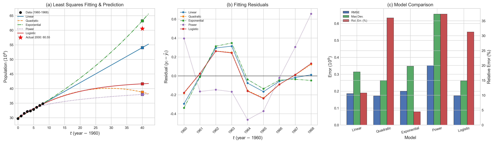

# 计算方法第五章实践报告：基于最小二乘法的世界人口预测

## 一、问题描述

下表给出了二十世纪六十年代世界人口的统计数据（单位：亿）：

| 年份 | 1960 | 1961 | 1962 | 1963 | 1964 | 1965 | 1966 | 1967 | 1968 |
|------|------|------|------|------|------|------|------|------|------|
| 人口 | 29.72 | 30.61 | 31.51 | 32.13 | 32.34 | 32.85 | 33.56 | 34.20 | 34.83 |

要求利用上述9个数据点，采用多种人口增长理论模型进行最小二乘拟合，预测2000年的世界人口（实际值为60.55亿），并通过均方偏差（RMSE）、最大偏差等指标对不同模型的拟合效果和预测精度进行比较分析。

## 二、方法原理

本题的核心方法是**曲线最小二乘拟合**。给定 $n$ 个数据点 $(x_i, y_i)$，选取一组基函数 $\varphi_0(x), \varphi_1(x), \dots, \varphi_m(x)$，构造拟合函数 $\varphi(x) = a_0\varphi_0(x) + a_1\varphi_1(x) + \cdots + a_m\varphi_m(x)$，使得误差平方和 $S = \sum_{i=1}^{n}[y_i - \varphi(x_i)]^2$ 取最小值。对 $S$ 分别关于 $a_0, a_1, \dots, a_m$ 求偏导并令其为零，可得到法方程（正规方程组）$A^T A \mathbf{a} = A^T \mathbf{b}$，其中 $A$ 为设计矩阵，$\mathbf{b}$ 为观测值向量。当 $A$ 列满秩时，$A^T A$ 正定，法方程有唯一解。

为了提高数值稳定性，本实验令 $t = \text{year} - 1960$，将年份转换为从0开始的整数序列。本实验共构建了五种模型：线性模型、二次多项式模型、指数模型、幂函数模型和Logistic模型。其中前四种可通过线性化手段转化为线性最小二乘问题，直接求解法方程；Logistic模型为非线性模型，采用Gauss-Newton迭代法求解。

## 三、模型构建与求解

**模型1：线性模型** $y = a_0 + a_1 t$。这是最简单的拟合形式，假设人口随时间匀速增长。设计矩阵 $A$ 的第一列全为1，第二列为 $t$ 值。以线性模型为例，法方程 $A^T A \mathbf{x} = A^T \mathbf{b}$ 的具体形式为：

$$A^T A = \begin{pmatrix} 9 & 36 \\ 36 & 204 \end{pmatrix}, \quad A^T \mathbf{b} = \begin{pmatrix} 291.75 \\ 1203.03 \end{pmatrix}$$

求解得 $a_0 = 30.014667$，$a_1 = 0.600500$，即拟合曲线为 $y = 30.0147 + 0.6005t$。

**模型2：二次多项式模型** $y = a_0 + a_1 t + a_2 t^2$。在线性模型基础上增加二次项，以捕捉增长率的变化趋势。求解法方程得 $a_0 = 29.904061$，$a_1 = 0.695305$，$a_2 = -0.011851$。值得注意的是，二次项系数 $a_2$ 为负值，意味着该模型预测人口增长率随时间递减，这在长期外推时会导致严重偏差。

**模型3：指数模型** $y = e^{a + bt}$。这是题目推荐的模型，符合马尔萨斯人口增长理论，假设人口按固定百分比增长。通过取对数将其线性化为 $\ln y = a + bt$，对 $\ln y$ 进行线性最小二乘拟合，得 $a = 3.403134$，$b = 0.018593$。

**模型4：幂函数模型** $y = a(t+1)^b$。通过取对数线性化为 $\ln y = \ln a + b \ln(t+1)$。这里使用 $t+1$ 而非 $t$ 是为了避免 $t=0$ 时 $\ln 0$ 无定义的问题。求解得 $a = 29.324402$，$b = 0.069659$。

**模型5：Logistic模型** $y = K / (1 + b e^{-rt})$。该模型引入环境容量上限 $K$，理论上比纯指数模型更符合实际人口增长规律。由于模型关于参数 $K, b, r$ 是非线性的，无法直接转化为线性最小二乘问题，本实验采用Gauss-Newton迭代法求解。为避免陷入局部最优，程序对多组初始值（$K_0 \in \{80, 120, 200, 500\}$，$r_0 \in \{0.02, 0.05, 0.1\}$，$b_0$ 由 $y(0) = K/(1+b)$ 估计）进行搜索，选取残差最小的结果。最终收敛得 $K = 42.349446$，$b = 0.416436$，$r = 0.079492$。

## 四、求解结果

各模型的拟合系数、拟合精度指标及2000年人口预测值汇总如下：

| 模型 | 公式 | RMSE | 最大偏差 | 预测值(亿) | 相对误差(%) |
|------|------|------|----------|------------|-------------|
| Linear | $y = a_0 + a_1 t$ | 0.1855 | 0.3138 | 54.03 | 10.76 |
| Quadratic | $y = a_0 + a_1 t + a_2 t^2$ | 0.1720 | 0.2627 | 38.76 | 36.00 |
| Exponential | $y = e^{a+bt}$ | 0.1998 | 0.3476 | 63.23 | 4.43 |
| Power | $y = a(t+1)^b$ | 0.3512 | 0.6556 | 37.98 | 37.27 |
| Logistic | $y = K/(1+be^{-rt})$ | 0.1726 | 0.2610 | 41.63 | 31.25 |

各数据点的拟合值与残差如下表所示：

| 年份 | 实际值 | Linear拟合 | Linear残差 | Exponential拟合 | Exponential残差 |
|------|--------|------------|------------|-----------------|-----------------|
| 1960 | 29.72 | 30.0147 | -0.2947 | 30.0582 | -0.3382 |
| 1961 | 30.61 | 30.6152 | -0.0052 | 30.6222 | -0.0122 |
| 1962 | 31.51 | 31.2157 | 0.2943 | 31.1969 | 0.3131 |
| 1963 | 32.13 | 31.8162 | 0.3138 | 31.7824 | 0.3476 |
| 1964 | 32.34 | 32.4167 | -0.0767 | 32.3788 | -0.0388 |
| 1965 | 32.85 | 33.0172 | -0.1672 | 32.9864 | -0.1364 |
| 1966 | 33.56 | 33.6177 | -0.0577 | 33.6055 | -0.0455 |
| 1967 | 34.20 | 34.2182 | -0.0182 | 34.2361 | -0.0361 |
| 1968 | 34.83 | 34.8187 | 0.0113 | 34.8786 | -0.0486 |

## 五、可视化分析

下图展示了五种模型的拟合曲线、残差分布及误差对比：



**图(a) 拟合曲线与外推预测分析。** 图(a)中黑色圆点为1960—1968年的9个原始数据点，各彩色曲线为五种模型在 $t \in [0, 42]$ 范围内的拟合与外推结果，红色五角星标记了2000年的实际人口值60.55亿，各彩色方块为对应模型的预测点。从图中可以直观地看出，在数据范围（$t=0$到$t=8$）内，五种模型的拟合曲线几乎重合，差异极小，这说明在短期内不同模型对已知数据的拟合能力相近。然而，当外推到 $t=40$（即2000年）时，各模型的预测值出现了显著分化。指数模型（绿色点划线）的预测点最接近红色五角星，预测值为63.23亿；线性模型（蓝色实线）预测值为54.03亿，虽然偏低但仍在合理范围内；而二次多项式模型（橙色虚线）、幂函数模型（紫色点线）和Logistic模型（红色实线）的预测值均在38—42亿之间，严重低估了实际人口。这一现象深刻揭示了**拟合精度高不等于预测精度高**的重要规律——模型的外推能力取决于其是否正确反映了数据背后的物理机制。

**图(b) 拟合残差分析。** 图(b)展示了各模型在9个数据点上的残差 $r_i = y_i - \hat{y}_i$ 分布。理想情况下，残差应随机分布在零线两侧，无明显系统性趋势。从图中可以观察到，线性模型、二次多项式模型和Logistic模型的残差曲线形态相似，呈现先负后正再负的波动模式，残差幅度较小（绝对值均在0.35以内）。指数模型的残差分布与前三者类似，但在1963年处出现了最大正残差0.3476。幂函数模型的残差表现最差，呈现明显的系统性偏差——前半段以负残差为主，后半段以正残差为主，且在1968年出现了高达0.6556的最大偏差，说明幂函数模型对该数据集的拟合效果最差。

**图(c) 模型误差对比分析。** 图(c)以柱状图的形式对比了五种模型的三项误差指标：RMSE（蓝色柱）、最大偏差（绿色柱）和预测相对误差（红色柱，对应右侧纵轴）。从RMSE和最大偏差来看，二次多项式模型和Logistic模型的拟合精度最高（RMSE约0.17，最大偏差约0.26），线性模型次之（RMSE为0.19），指数模型略逊（RMSE为0.20），幂函数模型最差（RMSE为0.35）。然而，从预测相对误差（红色柱）来看，排名发生了戏剧性的逆转：指数模型以4.43%的相对误差遥遥领先，线性模型以10.76%位居第二，而拟合精度最高的二次多项式模型和Logistic模型的预测相对误差反而高达36%和31%。这一对比清楚地表明，**在数据范围内的拟合精度与外推预测精度之间并不存在简单的正相关关系**。

## 六、结果讨论

从上述分析中可以得出以下几点认识。

首先，关于**指数模型为何预测最准确**。指数模型 $y = e^{a+bt}$ 假设人口按固定百分比持续增长，其增长率参数 $b = 0.018593$ 对应年增长率约1.86%。这一假设与20世纪后半叶全球人口的实际增长趋势较为吻合——尽管各国人口增长率有所差异，但全球总人口在1960—2000年间确实保持了较为稳定的指数增长态势。因此，指数模型虽然在数据范围内的拟合精度并非最优（RMSE为0.1998，排名第四），但其预测值63.23亿与实际值60.55亿仅相差4.43%，是五种模型中最接近真实值的。

其次，关于**二次多项式模型和Logistic模型为何拟合好但预测差**。二次多项式模型的二次项系数 $a_2 = -0.011851$ 为负值，这意味着模型预测的抛物线在达到顶点后将开始下降。在数据范围内（$t=0$到$t=8$），二次项的影响很小，因此拟合效果好；但外推到 $t=40$ 时，$a_2 t^2 = -0.011851 \times 1600 = -18.96$ 的负贡献被急剧放大，导致预测值仅为38.76亿。Logistic模型的问题则在于参数辨识困难：仅有9个近似线性增长的数据点，无法有效约束3个非线性参数（$K, b, r$），导致环境容量 $K$ 被严重低估为42.35亿（远低于实际值），从而使预测值被限制在42亿以下。这一现象说明，**模型复杂度与可用数据量之间需要合理匹配**——当数据不足以支撑复杂模型的参数估计时，简单模型反而可能表现更好。

最后，关于**幂函数模型为何表现最差**。幂函数模型 $y = a(t+1)^b$ 的指数 $b = 0.069659$ 远小于1，意味着增长率随时间急剧递减。这种"对数型"增长模式与人口增长的实际规律不符，因此无论是拟合精度（RMSE为0.3512，最大偏差为0.6556）还是预测精度（相对误差37.27%）都是五种模型中最差的。

## 七、结论

本实验基于1960—1968年的9个世界人口数据点，分别采用线性模型、二次多项式模型、指数模型、幂函数模型和Logistic模型进行最小二乘拟合，并外推预测2000年的世界人口。实验结果表明，指数模型 $y = e^{3.4031 + 0.0186t}$ 的预测效果最佳，预测值为63.23亿，与实际值60.55亿的相对误差仅为4.43%。这一结果验证了马尔萨斯指数增长理论在中长期人口预测中的适用性。同时，实验也揭示了一个重要的方法论启示：在曲线拟合问题中，数据范围内的拟合精度（如RMSE、最大偏差）并不能直接反映模型的外推预测能力，选择拟合模型时应优先考虑其是否符合数据背后的物理规律，而非单纯追求拟合误差的最小化。此外，当可用数据量有限时，应谨慎使用参数过多的复杂模型，以避免过拟合和参数辨识困难的问题。

## 附录 代码及运行截图

```python
# population_prediction.py

import numpy as np
import matplotlib.pyplot as plt
import matplotlib
matplotlib.rcParams['font.sans-serif'] = ['SimHei', 'Microsoft YaHei', 'KaiTi']
matplotlib.rcParams['axes.unicode_minus'] = False

# ==================== 数据 ====================
years = np.array([1960, 1961, 1962, 1963, 1964, 1965, 1966, 1967, 1968], dtype=float)
population = np.array([29.72, 30.61, 31.51, 32.13, 32.34, 32.85, 33.56, 34.20, 34.83], dtype=float)

t = years - 1960  # t = year - 1960
y = population
n = len(t)

actual_2000 = 60.55
t_predict = 2000 - 1960


# ==================== 最小二乘法核心函数 ====================
def least_squares_fit(A, b):
    """通过法方程 (A^T A) x = A^T b 求解最小二乘问题"""
    ATA = A.T @ A
    ATb = A.T @ b
    x = np.linalg.solve(ATA, ATb)
    return x


def compute_errors(y_true, y_fit):
    """计算均方偏差(RMSE)和最大偏差"""
    residuals = y_true - y_fit
    rmse = np.sqrt(np.sum(residuals**2) / len(y_true))
    max_dev = np.max(np.abs(residuals))
    return rmse, max_dev


def gauss_newton_logistic(t, y, K0=100.0, b0=2.0, r0=0.05, max_iter=200, tol=1e-10):
    """
    Gauss-Newton 迭代求解 Logistic 模型: y = K / (1 + b * exp(-r * t))
    返回: (K, b, r)
    """
    K, b, r = K0, b0, r0
    for _ in range(max_iter):
        exp_rt = np.exp(-r * t)
        denom = 1 + b * exp_rt
        f = K / denom
        res = y - f
        # Jacobian
        J_K = 1.0 / denom
        J_b = -K * exp_rt / denom**2
        J_r = K * b * t * exp_rt / denom**2
        J = np.column_stack([J_K, J_b, J_r])
        delta = np.linalg.lstsq(J, res, rcond=None)[0]
        K += delta[0]
        b += delta[1]
        r += delta[2]
        if np.linalg.norm(delta) < tol:
            break
    return K, b, r


# ==================== 模型拟合 ====================
results = {}  # {name: (formula_str, coeffs_str, y_fit, y_pred, rmse, max_dev)}

# --- 模型1: 线性模型 y = a0 + a1*t ---
A1 = np.column_stack([np.ones(n), t])
c1 = least_squares_fit(A1, y)
y_fit1 = A1 @ c1
y_pred1 = c1[0] + c1[1] * t_predict
rmse1, maxd1 = compute_errors(y, y_fit1)
results['Linear'] = (
    'y = a0 + a1*t',
    f'a0={c1[0]:.6f}, a1={c1[1]:.6f}',
    y_fit1, y_pred1, rmse1, maxd1
)

# --- 模型2: 二次多项式 y = a0 + a1*t + a2*t^2 ---
A2 = np.column_stack([np.ones(n), t, t**2])
c2 = least_squares_fit(A2, y)
y_fit2 = A2 @ c2
y_pred2 = c2[0] + c2[1] * t_predict + c2[2] * t_predict**2
rmse2, maxd2 = compute_errors(y, y_fit2)
results['Quadratic'] = (
    'y = a0 + a1*t + a2*t^2',
    f'a0={c2[0]:.6f}, a1={c2[1]:.6f}, a2={c2[2]:.6f}',
    y_fit2, y_pred2, rmse2, maxd2
)

# --- 模型3: 指数模型 y = e^(a + b*t) ---
ln_y = np.log(y)
A3 = np.column_stack([np.ones(n), t])
c3 = least_squares_fit(A3, ln_y)
y_fit3 = np.exp(c3[0] + c3[1] * t)
y_pred3 = np.exp(c3[0] + c3[1] * t_predict)
rmse3, maxd3 = compute_errors(y, y_fit3)
results['Exponential'] = (
    'y = exp(a + b*t)',
    f'a={c3[0]:.6f}, b={c3[1]:.6f}',
    y_fit3, y_pred3, rmse3, maxd3
)

# --- 模型4: 幂函数模型 y = a*(t+1)^b ---
ln_t1 = np.log(t + 1)
A4 = np.column_stack([np.ones(n), ln_t1])
c4 = least_squares_fit(A4, ln_y)
a4_val = np.exp(c4[0])
y_fit4 = a4_val * (t + 1)**c4[1]
y_pred4 = a4_val * (t_predict + 1)**c4[1]
rmse4, maxd4 = compute_errors(y, y_fit4)
results['Power'] = (
    'y = a*(t+1)^b',
    f'a={a4_val:.6f}, b={c4[1]:.6f}',
    y_fit4, y_pred4, rmse4, maxd4
)

# --- 模型5: Logistic模型 y = K / (1 + b*exp(-r*t)) (Gauss-Newton) ---
# 尝试多组初始值, 选择残差最小的结果
best_logistic = None
best_logistic_rmse = np.inf
for K0 in [80, 120, 200, 500]:
    for r0 in [0.02, 0.05, 0.1]:
        try:
            b0 = K0 / y[0] - 1  # 由 y(0) = K/(1+b) 估计 b0
            Kt, bt, rt = gauss_newton_logistic(t, y, K0=K0, b0=b0, r0=r0)
            if Kt > 0 and bt > 0 and rt > 0:
                yf = Kt / (1 + bt * np.exp(-rt * t))
                rmse_t, _ = compute_errors(y, yf)
                if rmse_t < best_logistic_rmse:
                    best_logistic_rmse = rmse_t
                    best_logistic = (Kt, bt, rt)
        except Exception:
            continue

K5, b5, r5 = best_logistic
y_fit5 = K5 / (1 + b5 * np.exp(-r5 * t))
y_pred5 = K5 / (1 + b5 * np.exp(-r5 * t_predict))
rmse5, maxd5 = compute_errors(y, y_fit5)
results['Logistic'] = (
    'y = K / (1 + b*exp(-r*t))',
    f'K={K5:.6f}, b={b5:.6f}, r={r5:.6f}',
    y_fit5, y_pred5, rmse5, maxd5
)


# ==================== 数据输出 ====================
print("=" * 90)
print(f"{'Model':<14} {'Formula':<28} {'RMSE':<10} {'MaxDev':<10} {'Pred(2000)':<12} {'RelErr(%)':<10}")
print("=" * 90)
for name, (formula, coeffs, yf, yp, rmse, maxd) in results.items():
    rel_err = abs(yp - actual_2000) / actual_2000 * 100
    print(f"{name:<14} {formula:<28} {rmse:<10.6f} {maxd:<10.6f} {yp:<12.4f} {rel_err:<10.4f}")
print("=" * 90)
print(f"Actual population in 2000: {actual_2000} (unit: 100 million)")
print()

# 输出各模型拟合系数
print("-" * 60)
print("Fitted coefficients:")
print("-" * 60)
for name, (formula, coeffs, *_) in results.items():
    print(f"  {name:<14} {coeffs}")
print()

# 输出各数据点的拟合值与残差
print("-" * 90)
header = f"{'Year':<6}"
for name in results:
    header += f" {name+'_fit':<12} {name+'_res':<12}"
print(header)
print("-" * 90)
for i in range(n):
    row = f"{int(years[i]):<6}"
    for name, (_, _, yf, *__) in results.items():
        res_i = y[i] - yf[i]
        row += f" {yf[i]:<12.4f} {res_i:<12.4f}"
    print(row)
print("-" * 90)
print()

# 输出法方程矩阵 (以线性模型为例)
print("Normal equation (A^T A)x = A^T b for Linear model:")
print(f"  A^T A = \n{A1.T @ A1}")
print(f"  A^T b = {A1.T @ y}")
print(f"  x     = {c1}")
print()


# ==================== 学术风格可视化 ====================
plt.style.use('seaborn-v0_8-whitegrid')
fig, axes = plt.subplots(1, 3, figsize=(18, 5.5))

t_plot = np.linspace(0, 42, 300)

# 各模型预测曲线
y_plots = {
    'Linear':      c1[0] + c1[1] * t_plot,
    'Quadratic':   c2[0] + c2[1] * t_plot + c2[2] * t_plot**2,
    'Exponential': np.exp(c3[0] + c3[1] * t_plot),
    'Power':       a4_val * (t_plot + 1)**c4[1],
    'Logistic':    K5 / (1 + b5 * np.exp(-r5 * t_plot)),
}

colors = {
    'Linear': '#1f77b4', 'Quadratic': '#ff7f0e',
    'Exponential': '#2ca02c', 'Power': '#9467bd', 'Logistic': '#d62728'
}
linestyles = {
    'Linear': '-', 'Quadratic': '--',
    'Exponential': '-.', 'Power': ':', 'Logistic': '-'
}

# --- 图(a): 拟合曲线与外推预测 ---
ax = axes[0]
ax.scatter(t, y, c='k', s=40, zorder=5, marker='o', label='Data (1960-1968)', edgecolors='k', linewidths=0.5)
for name, yp in y_plots.items():
    ax.plot(t_plot, yp, color=colors[name], ls=linestyles[name], lw=1.5, label=name)
ax.scatter([t_predict], [actual_2000], c='red', s=120, zorder=5, marker='*', label=f'Actual 2000: {actual_2000}')
# 标注各模型预测点
for name, (_, _, _, yp, *__) in results.items():
    ax.scatter([t_predict], [yp], c=colors[name], s=50, zorder=4, marker='s', edgecolors='k', linewidths=0.3)
ax.set_xlabel(r'$t$ (year $-$ 1960)', fontsize=11)
ax.set_ylabel('Population ($10^8$)', fontsize=11)
ax.set_title('(a) Least Squares Fitting & Prediction', fontsize=12)
ax.legend(fontsize=7.5, loc='upper left', framealpha=0.9, edgecolor='gray')
ax.set_xlim(-1, 44)
ax.tick_params(labelsize=9)

# --- 图(b): 拟合残差 ---
ax = axes[1]
for name, (_, _, yf, *__) in results.items():
    res = y - yf
    ax.plot(t, res, color=colors[name], marker='o', ms=4, lw=1.2,
            ls=linestyles[name], label=name)
ax.axhline(y=0, color='k', lw=0.8, ls='-')
ax.set_xlabel(r'$t$ (year $-$ 1960)', fontsize=11)
ax.set_ylabel(r'Residual ($y_i - \hat{y}_i$)', fontsize=11)
ax.set_title('(b) Fitting Residuals', fontsize=12)
ax.legend(fontsize=7.5, framealpha=0.9, edgecolor='gray')
ax.set_xticks(t)
ax.set_xticklabels([str(int(yr)) for yr in years], fontsize=8, rotation=45)
ax.tick_params(labelsize=9)

# --- 图(c): 模型误差对比柱状图 ---
ax = axes[2]
model_names = list(results.keys())
rmse_vals = [results[m][4] for m in model_names]
maxd_vals = [results[m][5] for m in model_names]
rel_errs = [abs(results[m][3] - actual_2000) / actual_2000 * 100 for m in model_names]

x_idx = np.arange(len(model_names))
w = 0.25
bars1 = ax.bar(x_idx - w, rmse_vals, w, label='RMSE', color='#4c72b0', edgecolor='k', linewidth=0.5)
bars2 = ax.bar(x_idx, maxd_vals, w, label='Max Dev.', color='#55a868', edgecolor='k', linewidth=0.5)

ax2 = ax.twinx()
bars3 = ax2.bar(x_idx + w, rel_errs, w, label='Rel. Err. (%)', color='#c44e52', edgecolor='k', linewidth=0.5)

ax.set_xlabel('Model', fontsize=11)
ax.set_ylabel('Error ($10^8$)', fontsize=11)
ax2.set_ylabel('Relative Error (%)', fontsize=11)
ax.set_title('(c) Model Comparison', fontsize=12)
ax.set_xticks(x_idx)
ax.set_xticklabels(model_names, fontsize=8.5, rotation=15)
ax.tick_params(labelsize=9)
ax2.tick_params(labelsize=9)

# 合并图例
lines1, labels1 = ax.get_legend_handles_labels()
lines2, labels2 = ax2.get_legend_handles_labels()
ax.legend(lines1 + lines2, labels1 + labels2, fontsize=7.5, loc='upper left',
          framealpha=0.9, edgecolor='gray')

plt.tight_layout(pad=2.0)
plt.savefig('population_prediction.png', dpi=300, bbox_inches='tight')
plt.show()

print("Figure saved: population_prediction.png")
```

在终端执行以下命令：

```bash
python population_prediction.py
```

运行截图：


