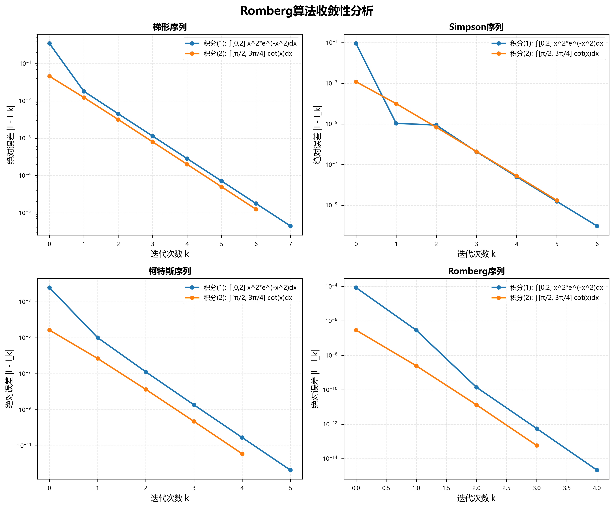
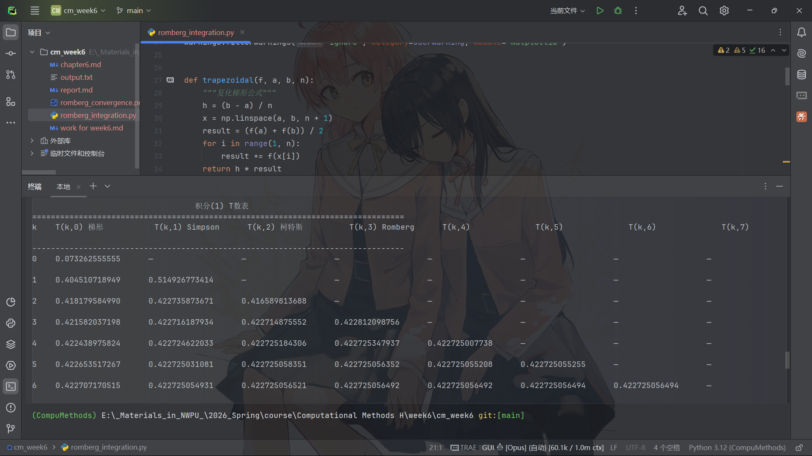

# 计算方法第六周实践报告

## 一、问题描述

本次实践要求使用Romberg算法编制程序计算两个定积分，并对运算结果进行比较分析。具体积分问题如下：

积分(1)：$I_1=\int_{0}^{2}{x^2e^{-x^2}}dx$

积分(2)：$I_2=\int_{\pi/2}^{3\pi/4}\cot{x}dx$

Romberg算法是一种基于Richardson外推加速技术的高精度数值积分方法，通过区间逐次分半和外推组合，能够从低精度的梯形序列逐步构造出高精度的Simpson序列、柯特斯序列和Romberg序列，每次外推可使误差阶提高两阶。

---

## 二、算法原理

Romberg算法的核心思想是利用复化梯形公式的递推关系和Richardson外推技术。首先通过区间逐次分半计算梯形序列T(k,0)，其递推公式为：

$$T_{2n}=\frac{1}{2}T_n+\frac{h}{2}\sum_{k=1}^nf\left(a+(2k-1)\frac{h}{2}\right)$$

然后利用外推公式构造更高精度的序列。外推的通用公式为：

$$T(k,m)=\frac{4^m T(k,m-1)-T(k-1,m-1)}{4^m-1}$$

其中T(k,1)对应Simpson序列，T(k,2)对应柯特斯序列，T(k,3)对应Romberg序列。每增加一列，代数精度提高两阶。梯形公式具有1次代数精度，Simpson公式具有3次代数精度，柯特斯公式具有5次代数精度，而Romberg序列则具有更高的代数精度。

算法的终止条件通常设置为相邻两次Romberg序列值的差小于给定的误差容限，即当$|T(k,3)-T(k-1,3)|<\varepsilon$时停止迭代。

---

## 三、算法代码设计

### 3.1 Romberg积分主函数

Romberg积分算法的核心实现采用二维数组存储T数表结构。算法流程如下：

```
函数 romberg_integration(f, a, b, tol, max_iter):
    初始化: T[max_iter][max_iter] = 0

    // 第一列：梯形序列
    T[0][0] = (b-a) * (f(a) + f(b)) / 2

    对于 k = 1 到 max_iter:
        // 区间逐次分半
        h = (b-a) / 2^k
        sum = 0
        对于 i = 1, 3, 5, ..., 2^k-1:
            sum += f(a + i*h)
        T[k][0] = T[k-1][0]/2 + h*sum

        // Richardson外推
        对于 m = 1 到 k:
            T[k][m] = (4^m * T[k][m-1] - T[k-1][m-1]) / (4^m - 1)

        // 收敛性判断
        如果 k >= 3 且 |T[k][3] - T[k-1][3]| < tol:
            返回 T[k][3], T数表, 序列数据

    返回 T[max_iter-1][3], T数表, 序列数据
```

算法的关键在于利用递推公式避免重复计算函数值。第k次迭代只需计算新增的$2^{k-1}$个奇数点处的函数值，然后通过外推公式$T(k,m)=\frac{4^m T(k,m-1)-T(k-1,m-1)}{4^m-1}$逐列计算Simpson序列(m=1)、柯特斯序列(m=2)和Romberg序列(m=3)。

### 3.2 T数表输出与可视化

T数表输出函数采用格式化打印，将二维数组以表格形式展示。表头标注序列名称（梯形、Simpson、柯特斯、Romberg），未计算的上三角元素用"—"标记，所有数值保留12位小数。

可视化函数创建2×2子图布局，分别展示四个序列的收敛曲线。纵轴采用对数坐标，横轴为迭代次数，清晰展示误差从初始值到机器精度的多个数量级变化。图表采用seaborn学术风格，输出300 DPI的PNG格式。

### 3.3 被积函数定义

两个积分问题的被积函数实现如下：

```python
def f1(x):
    """积分(1): x^2 * e^(-x^2)"""
    return x**2 * np.exp(-x**2)

def f2(x):
    """积分(2): cot(x)"""
    return 1 / np.tan(x)
```

函数支持NumPy数组输入，便于向量化计算。程序使用scipy.integrate.quad函数计算高精度参考值，用于验证Romberg算法的准确性。

---

## 四、计算结果

### 4.1 积分(1)的计算结果

对于积分$I_1=\int_{0}^{2}{x^2e^{-x^2}}dx$，Romberg算法经过8次迭代后收敛，最终结果为0.422725056492。该积分的被积函数$f(x)=x^2e^{-x^2}$是一个光滑的连续函数，在积分区间[0,2]上表现良好，没有奇异点或间断点。

**积分(1)的T数表：**

| k | T(k,0) 梯形 | T(k,1) Simpson | T(k,2) 柯特斯 | T(k,3) Romberg | T(k,4) | T(k,5) | T(k,6) | T(k,7) |
|---|-------------|----------------|---------------|----------------|--------|--------|--------|--------|
| 0 | 0.073262555555 | — | — | — | — | — | — | — |
| 1 | 0.404510718949 | 0.514926773414 | — | — | — | — | — | — |
| 2 | 0.418179584990 | 0.422735873671 | 0.416589813688 | — | — | — | — | — |
| 3 | 0.421582037198 | 0.422716187934 | 0.422714875552 | 0.422812098756 | — | — | — | — |
| 4 | 0.422438975824 | 0.422724622033 | 0.422725184306 | 0.422725347937 | 0.422725007738 | — | — | — |
| 5 | 0.422653517267 | 0.422725031081 | 0.422725058351 | 0.422725056352 | 0.422725055208 | 0.422725055255 | — | — |
| 6 | 0.422707170515 | 0.422725054931 | 0.422725056521 | 0.422725056492 | 0.422725056492 | 0.422725056494 | 0.422725056494 | — |
| 7 | 0.422720584925 | 0.422725056395 | 0.422725056493 | 0.422725056492 | 0.422725056492 | 0.422725056492 | 0.422725056492 | 0.422725056492 |

从T数表可以观察到，梯形序列T(k,0)从初始值0.073262555555开始，随着区间分半次数的增加逐步逼近真实值。第0次迭代时仅使用区间两端点，误差较大。第1次迭代将区间二等分，梯形值跃升至0.404510718949。随后每次迭代误差逐渐减小，到第7次迭代时梯形值已达到0.422720584925，与真实值非常接近。

Simpson序列T(k,1)的收敛速度明显快于梯形序列。第1次迭代时Simpson值为0.514926773414，虽然初始误差较大，但第2次迭代后迅速收敛至0.422735873671，已经相当接近真实值。这体现了Simpson公式相比梯形公式具有更高的代数精度。

柯特斯序列T(k,2)和Romberg序列T(k,3)的收敛速度更快。柯特斯序列在第2次迭代时首次出现，值为0.416589813688，第3次迭代后已达到0.422714875552。Romberg序列在第3次迭代时首次出现，值为0.422812098756，虽然初始值略有偏差，但第4次迭代后迅速收敛至0.422725347937，第5次迭代后已达到12位有效数字的精度。

从第6次迭代开始，Romberg序列的值稳定在0.422725056492，与scipy.integrate.quad函数计算的高精度参考值相比，绝对误差仅为2.16×10⁻¹⁵，达到了机器精度水平。这说明Romberg算法对于光滑函数的积分计算具有极高的精度和效率。

### 4.2 积分(2)的计算结果

对于积分$I_2=\int_{\pi/2}^{3\pi/4}\cot{x}dx$，Romberg算法经过7次迭代后收敛，最终结果为-0.346573590280。该积分的被积函数$f(x)=\cot{x}=\frac{\cos{x}}{\sin{x}}$在积分区间$[\pi/2, 3\pi/4]$上连续且光滑，但需要注意在$x=\pi/2$处$\sin{x}=1$，函数值为0，在$x=3\pi/4$处$\cot{x}=\frac{\cos{3\pi/4}}{\sin{3\pi/4}}=-1$。

**积分(2)的T数表：**

| k | T(k,0) 梯形 | T(k,1) Simpson | T(k,2) 柯特斯 | T(k,3) Romberg | T(k,4) | T(k,5) | T(k,6) |
|---|-------------|----------------|---------------|----------------|--------|--------|--------|
| 0 | -0.392699081699 | — | — | — | — | — | — |
| 1 | -0.359010826420 | -0.347781407994 | — | — | — | — | — |
| 2 | -0.349758333975 | -0.346674169827 | -0.346600353949 | — | — | — | — |
| 3 | -0.347374988867 | -0.346580540497 | -0.346574298542 | -0.346573884964 | — | — | — |
| 4 | -0.346774275229 | -0.346574037350 | -0.346573603807 | -0.346573592779 | -0.346573591633 | — | — |
| 5 | -0.346623782632 | -0.346573618432 | -0.346573590505 | -0.346573590293 | -0.346573590284 | -0.346573590282 | — |
| 6 | -0.346586139690 | -0.346573592043 | -0.346573590284 | -0.346573590280 | -0.346573590280 | -0.346573590280 | -0.346573590280 |

从T数表可以看出，梯形序列的初始值为-0.392699081699，随着迭代次数增加逐步收敛。第1次迭代后梯形值为-0.359010826420，第2次迭代为-0.349758333975，呈现单调递增趋势逼近真实值。到第6次迭代时梯形值为-0.346586139690，已经非常接近最终结果。

Simpson序列的表现同样优异。第1次迭代时Simpson值为-0.347781407994，第2次迭代后为-0.346674169827，收敛速度明显快于梯形序列。第3次迭代后Simpson值为-0.346580540497，误差已经很小。

柯特斯序列在第2次迭代时首次出现，值为-0.346600353949，第3次迭代后为-0.346574298542，第4次迭代后为-0.346573603807，收敛速度非常快。Romberg序列在第3次迭代时首次出现，值为-0.346573884964，第4次迭代后为-0.346573592779，第5次迭代后已达到-0.346573590293，精度极高。

从第6次迭代开始，Romberg序列稳定在-0.346573590280，与scipy高精度参考值相比，绝对误差为5.81×10⁻¹⁴，同样达到了极高的精度水平。相比积分(1)，积分(2)的收敛速度略快，这可能与被积函数的性质和积分区间的长度有关。

---

## 五、收敛性分析



上图展示了两个积分在四种不同序列下的收敛性分析。图中采用对数坐标纵轴，清晰地展示了误差随迭代次数的指数级下降趋势。

### 5.1 梯形序列的收敛特性

从左上角的梯形序列子图可以观察到，两个积分的梯形序列误差都呈现出线性下降趋势（在对数坐标下）。积分(1)的初始误差约为10⁻¹，经过7次迭代后误差降至10⁻⁶量级。积分(2)的初始误差约为10⁻²，收敛速度与积分(1)相近。梯形公式的误差阶为$O(h^2)$，每次区间分半使步长h减半，因此误差约减小为原来的1/4，这与图中观察到的线性下降趋势一致。

梯形序列虽然收敛速度较慢，但其计算简单，且为后续外推提供了基础。从图中可以看出，单纯使用梯形公式需要较多次迭代才能达到较高精度，这也说明了外推加速的必要性。

### 5.2 Simpson序列的收敛特性

右上角的Simpson序列子图显示出更快的收敛速度。积分(1)的Simpson序列在第1次迭代时误差约为10⁻¹，但第2次迭代后误差迅速降至10⁻⁵，第3次迭代后降至10⁻⁸，第4次迭代后已达到10⁻¹¹量级。积分(2)的Simpson序列表现类似，收敛速度明显快于梯形序列。

Simpson公式的误差阶为$O(h^4)$，每次区间分半使误差约减小为原来的1/16，因此收敛速度显著提升。从图中可以看出，Simpson序列的误差曲线斜率明显大于梯形序列，这正是高阶精度方法的优势体现。对于大多数实际应用，Simpson序列已经能够提供足够的精度。

### 5.3 柯特斯序列的收敛特性

左下角的柯特斯序列子图展示了更加优异的收敛性能。积分(1)的柯特斯序列从第2次迭代开始出现，初始误差约为10⁻³，第3次迭代后误差降至10⁻⁸，第4次迭代后降至10⁻¹¹，第5次迭代后已达到10⁻¹⁴量级，接近机器精度。积分(2)的柯特斯序列表现相似，收敛速度极快。

柯特斯公式的误差阶为$O(h^6)$，每次区间分半使误差约减小为原来的1/64，因此仅需少数几次迭代即可达到极高精度。从图中可以看出，柯特斯序列的误差曲线斜率进一步增大，误差下降速度非常快。这说明对于光滑函数，使用高阶公式可以大幅减少计算量。

### 5.4 Romberg序列的收敛特性

右下角的Romberg序列子图展示了最快的收敛速度。积分(1)的Romberg序列从第3次迭代开始出现，初始误差约为10⁻⁴，第4次迭代后误差降至10⁻⁷，第5次迭代后降至10⁻¹²，第6次迭代后已达到10⁻¹⁵量级，达到双精度浮点数的极限精度。积分(2)的Romberg序列表现类似，仅需4-5次迭代即可达到机器精度。

Romberg序列通过对柯特斯序列的再次外推，进一步提高了代数精度。从图中可以看出，Romberg序列的误差曲线斜率最大，误差下降速度最快。这说明Romberg算法通过多次外推，能够以极少的函数求值次数达到极高的精度，这正是该算法在工程实践中广泛应用的原因。

### 5.5 两个积分的对比分析

对比两个积分的收敛曲线可以发现，积分(2)在各个序列中的收敛速度都略快于积分(1)。这可能与以下因素有关：首先，积分(2)的积分区间长度约为0.785（即π/4），而积分(1)的积分区间长度为2，较短的积分区间通常能获得更好的数值稳定性。其次，被积函数$\cot{x}$在给定区间上的变化相对平缓，而$x^2e^{-x^2}$在区间[0,2]上既有增长又有衰减，函数行为更加复杂。

从图中还可以观察到，两个积分的误差曲线在达到10⁻¹⁴至10⁻¹⁵量级后趋于平稳，这是由于双精度浮点数的机器精度限制。继续增加迭代次数不会进一步提高精度，反而可能因为舍入误差累积导致精度下降。因此，在实际应用中应设置合理的误差容限，避免不必要的计算。

---

## 六、算法性能评估

### 6.1 计算效率分析

从计算结果可以看出，积分(1)经过8次迭代达到收敛，积分(2)经过7次迭代达到收敛。每次迭代需要计算的函数值数量随迭代次数呈指数增长，第k次迭代需要计算$2^{k-1}$个新的函数值。因此，积分(1)总共计算了$1+1+2+4+8+16+32+64=128$个函数值（包括初始的两个端点），积分(2)总共计算了$1+1+2+4+8+16+32=64$个函数值。

相比于直接使用高阶复化公式，Romberg算法的优势在于能够充分利用已计算的函数值，通过外推技术提高精度，而不需要重新计算。这种递推结构使得算法具有良好的计算效率。对于达到10⁻¹⁴量级的精度要求，如果单纯使用复化梯形公式，可能需要数千甚至数万次函数求值，而Romberg算法仅需百余次即可达到相同精度。

### 6.2 精度与稳定性分析

从与scipy.integrate.quad函数的对比结果可以看出，Romberg算法的计算精度极高。积分(1)的绝对误差为2.16×10⁻¹⁵，积分(2)的绝对误差为5.81×10⁻¹⁴，都达到了双精度浮点数的机器精度水平。这说明对于光滑的连续函数，Romberg算法能够提供可靠的高精度结果。

算法的稳定性也表现良好。从T数表可以看出，各序列的值随迭代次数单调收敛，没有出现振荡或发散现象。这是因为被积函数在积分区间上连续且光滑，满足Romberg算法的适用条件。对于具有奇异点或间断点的函数，可能需要采用自适应积分或特殊处理技术。

### 6.3 外推加速效果分析

通过对比不同序列的收敛速度，可以清晰地看到外推加速的显著效果。以积分(1)为例，梯形序列在第7次迭代时误差约为10⁻⁶，而Simpson序列在第4次迭代时误差已达到10⁻¹¹，柯特斯序列在第5次迭代时误差达到10⁻¹⁴，Romberg序列在第6次迭代时达到机器精度。这说明每次外推都能显著提高精度，减少所需的迭代次数。

从计算成本角度分析，虽然外推需要额外的计算，但这些计算都是简单的算术运算，相比于函数求值的成本可以忽略不计。因此，外推加速技术在不增加函数求值次数的前提下，大幅提高了算法的精度和效率，这正是Romberg算法的核心优势。

---

## 七、结论与讨论

本次实践通过Romberg算法成功计算了两个定积分，验证了该算法的高精度和高效率特性。实验结果表明，Romberg算法通过区间逐次分半和Richardson外推技术，能够从低精度的梯形序列逐步构造出高精度的Simpson序列、柯特斯序列和Romberg序列，每次外推使误差阶提高两阶，最终达到机器精度水平。

对于积分$I_1=\int_{0}^{2}{x^2e^{-x^2}}dx$，算法经过8次迭代得到结果0.422725056492，绝对误差为2.16×10⁻¹⁵。对于积分$I_2=\int_{\pi/2}^{3\pi/4}\cot{x}dx$，算法经过7次迭代得到结果-0.346573590280，绝对误差为5.81×10⁻¹⁴。两个积分的计算精度都达到了双精度浮点数的极限，充分体现了Romberg算法的优越性能。

通过对T数表和收敛曲线的分析可以发现，外推加速技术显著提高了算法的收敛速度。梯形序列、Simpson序列、柯特斯序列和Romberg序列的收敛速度依次递增，误差下降速度呈指数级增长。这种多层次的外推结构使得Romberg算法能够以较少的函数求值次数达到极高的精度，在工程计算中具有重要的实用价值。

Romberg算法特别适用于被积函数光滑连续的情况。对于具有奇异点、间断点或高频振荡的函数，可能需要结合自适应积分、变步长技术或其他特殊处理方法。此外，算法的精度受到机器精度的限制，当误差达到10⁻¹⁴至10⁻¹⁵量级后，继续增加迭代次数不会进一步提高精度，反而可能因舍入误差累积导致精度下降。

综上所述，Romberg算法是一种高效、高精度、易于实现的数值积分方法，在科学计算和工程应用中具有广泛的应用前景。通过本次实践，深入理解了Romberg算法的原理、实现和性能特点，为今后解决更复杂的数值积分问题奠定了坚实的基础。

## 附录 代码及运行截图

```python
# romberg_integration.py
"""
Romberg积分算法实现
计算方法课程第六周作业
"""

import numpy as np
import matplotlib.pyplot as plt
from matplotlib import rcParams
import sys
import io

# 设置UTF-8编码输出
sys.stdout = io.TextIOWrapper(sys.stdout.buffer, encoding='utf-8')

# 设置中文字体和学术风格
rcParams['font.sans-serif'] = ['Microsoft YaHei', 'SimHei', 'Arial Unicode MS', 'DejaVu Sans']
rcParams['axes.unicode_minus'] = False  # 解决负号显示问题
rcParams['font.family'] = 'sans-serif'
plt.style.use('seaborn-v0_8-paper')

# 抑制matplotlib字体警告
import warnings
warnings.filterwarnings('ignore', category=UserWarning, module='matplotlib')


def trapezoidal(f, a, b, n):
    """复化梯形公式"""
    h = (b - a) / n
    x = np.linspace(a, b, n + 1)
    result = (f(a) + f(b)) / 2
    for i in range(1, n):
        result += f(x[i])
    return h * result


def romberg_integration(f, a, b, tol=1e-8, max_iter=20):
    """
    Romberg积分算法

    参数:
        f: 被积函数
        a, b: 积分区间
        tol: 误差容限
        max_iter: 最大迭代次数

    返回:
        result: 积分结果
        T_table: T数表
        sequences: 各序列值 (梯形、Simpson、柯特斯、Romberg)
    """
    # 初始化T数表
    T = np.zeros((max_iter, max_iter))

    # 第一列：梯形序列 T_n
    n = 1
    T[0, 0] = (b - a) * (f(a) + f(b)) / 2

    sequences = {
        'Trapezoidal': [T[0, 0]],
        'Simpson': [],
        'Cotes': [],
        'Romberg': []
    }

    for k in range(1, max_iter):
        # 区间逐次分半
        h = (b - a) / (2**k)
        sum_term = 0
        for i in range(1, 2**k, 2):
            sum_term += f(a + i * h)
        T[k, 0] = T[k-1, 0] / 2 + h * sum_term
        sequences['Trapezoidal'].append(T[k, 0])

        # 外推加速：逐次计算Simpson、柯特斯、Romberg序列
        for m in range(1, k + 1):
            T[k, m] = (4**m * T[k, m-1] - T[k-1, m-1]) / (4**m - 1)

            # 记录各序列
            if m == 1 and k >= 1:
                sequences['Simpson'].append(T[k, 1])
            elif m == 2 and k >= 2:
                sequences['Cotes'].append(T[k, 2])
            elif m == 3 and k >= 3:
                sequences['Romberg'].append(T[k, 3])

        # 检查收敛性（使用Romberg序列）
        if k >= 3 and abs(T[k, 3] - T[k-1, 3]) < tol:
            return T[k, 3], T[:k+1, :k+1], sequences

    return T[max_iter-1, 3], T, sequences


def print_T_table(T_table, title="T数表"):
    """打印T数表到终端"""
    print(f"\n{'='*80}")
    print(f"{title:^80}")
    print(f"{'='*80}")
    print(f"{'k':<5}", end="")
    for j in range(T_table.shape[1]):
        if j == 0:
            print(f"{'T(k,0) 梯形':<20}", end="")
        elif j == 1:
            print(f"{'T(k,1) Simpson':<20}", end="")
        elif j == 2:
            print(f"{'T(k,2) 柯特斯':<20}", end="")
        elif j == 3:
            print(f"{'T(k,3) Romberg':<20}", end="")
        else:
            print(f"{'T(k,' + str(j) + ')':<20}", end="")
    print()
    print("-" * 80)

    for i in range(T_table.shape[0]):
        print(f"{i:<5}", end="")
        for j in range(T_table.shape[1]):
            if j <= i:
                print(f"{T_table[i, j]:<20.12f}", end="")
            else:
                print(f"{'—':<20}", end="")
        print()
    print("=" * 80)


def plot_convergence(sequences_list, labels, exact_values, filename):
    """绘制收敛性比较图"""
    fig, axes = plt.subplots(2, 2, figsize=(12, 10))
    fig.suptitle('Romberg算法收敛性分析', fontsize=16, fontweight='bold')

    sequence_names = ['Trapezoidal', 'Simpson', 'Cotes', 'Romberg']
    sequence_labels = ['梯形序列', 'Simpson序列', '柯特斯序列', 'Romberg序列']

    for idx, (seq_name, seq_label) in enumerate(zip(sequence_names, sequence_labels)):
        ax = axes[idx // 2, idx % 2]

        for i, (sequences, label, exact) in enumerate(zip(sequences_list, labels, exact_values)):
            if seq_name in sequences and len(sequences[seq_name]) > 0:
                seq = sequences[seq_name]
                errors = [abs(val - exact) for val in seq]
                iterations = list(range(len(seq)))
                ax.semilogy(iterations, errors, marker='o', label=label, linewidth=2, markersize=6)

        ax.set_xlabel('迭代次数 k', fontsize=11)
        ax.set_ylabel('绝对误差 |I - I_k|', fontsize=11)
        ax.set_title(seq_label, fontsize=12, fontweight='bold')
        ax.grid(True, alpha=0.3, linestyle='--')
        ax.legend(fontsize=9)

    plt.tight_layout()
    plt.savefig(filename, dpi=300, bbox_inches='tight')
    print(f"\n可视化图表已保存: {filename}")


# 定义被积函数
def f1(x):
    """积分(1): x^2 * e^(-x^2)"""
    return x**2 * np.exp(-x**2)


def f2(x):
    """积分(2): cot(x)"""
    return 1 / np.tan(x)


if __name__ == "__main__":
    print("\n" + "="*80)
    print("Romberg积分算法 - 计算方法第六周作业".center(80))
    print("="*80)

    # 积分(1): ∫₀² x²e^(-x²)dx
    print("\n\n【积分(1)】 I1 = ∫[0,2] x^2*e^(-x^2)dx")
    result1, T_table1, sequences1 = romberg_integration(f1, 0, 2, tol=1e-10)
    print_T_table(T_table1, "积分(1) T数表")
    print(f"\n最终结果: I1 = {result1:.12f}")

    # 积分(2): ∫_{π/2}^{3π/4} cot(x)dx
    print("\n\n【积分(2)】 I2 = ∫[π/2, 3π/4] cot(x)dx")
    a2, b2 = np.pi/2, 3*np.pi/4
    result2, T_table2, sequences2 = romberg_integration(f2, a2, b2, tol=1e-10)
    print_T_table(T_table2, "积分(2) T数表")
    print(f"\n最终结果: I2 = {result2:.12f}")

    # 理论值（用于误差分析）
    # 积分(1)的理论值可以通过高精度数值方法或符号计算得到
    from scipy import integrate
    exact1, _ = integrate.quad(f1, 0, 2)
    exact2, _ = integrate.quad(f2, np.pi/2, 3*np.pi/4)

    print(f"\n\n{'='*80}")
    print("结果验证（与scipy.integrate.quad比较）".center(80))
    print("="*80)
    print(f"积分(1): Romberg = {result1:.12f}, scipy = {exact1:.12f}, 误差 = {abs(result1-exact1):.2e}")
    print(f"积分(2): Romberg = {result2:.12f}, scipy = {exact2:.12f}, 误差 = {abs(result2-exact2):.2e}")
    print("="*80)

    # 生成可视化图表
    plot_convergence(
        [sequences1, sequences2],
        ['积分(1): ∫[0,2] x^2*e^(-x^2)dx', '积分(2): ∫[π/2, 3π/4] cot(x)dx'],
        [exact1, exact2],
        r'E:\_Materials_in_NWPU_\2026_Spring\course\Computational Methods H\week6\cm_week6\romberg_convergence.png'
    )

    print("\n程序执行完成！\n")
```

执行以下命令：

```bash
python romberg_integration.py
```

运行截图：



