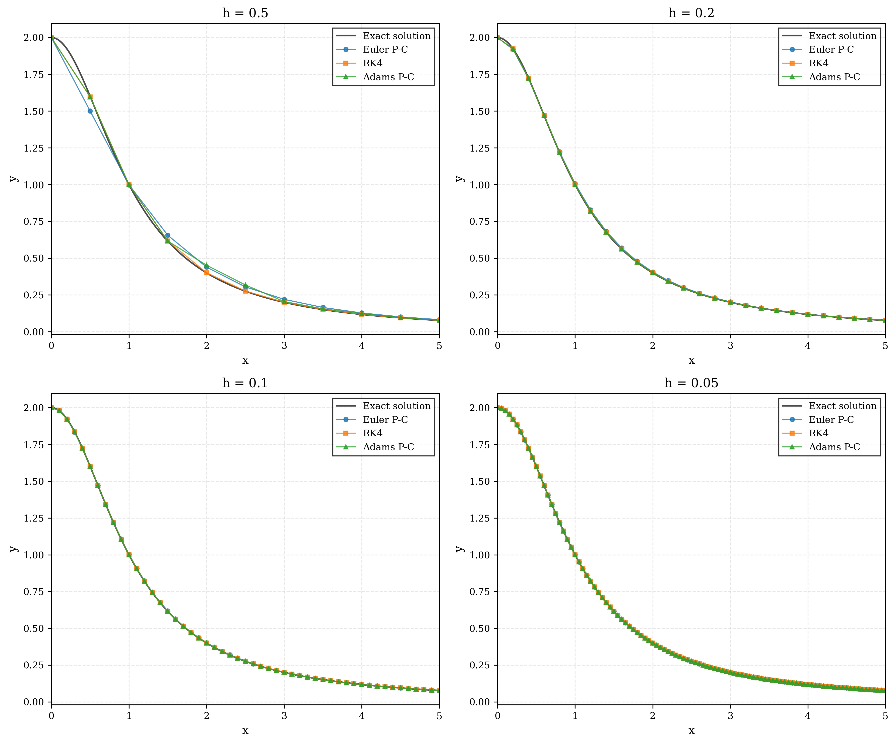
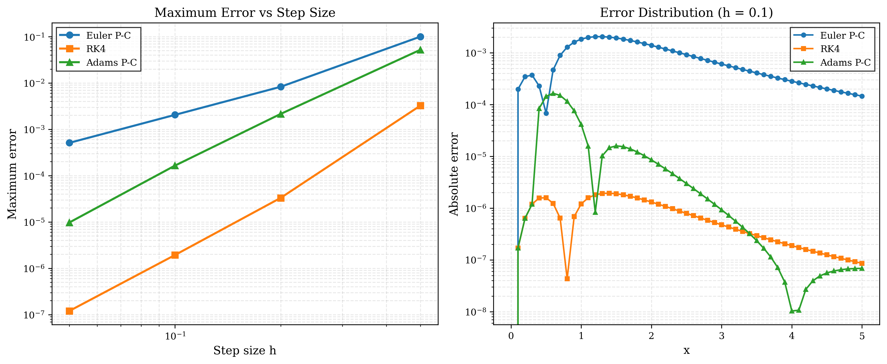

# 计算方法H第七章实践报告

## 一、问题描述

本次实践作业要求分别使用Euler预估-校正方法、经典四阶Runge-Kutta方法以及四阶Adams预估-校正方法，对如下常微分方程初值问题进行数值求解，并取不同步长对运算结果进行比较分析：

$$\begin{cases} y' = -xy^2, & 0 \le x \le 5 \\ y(0) = 2 \end{cases}$$

该方程为一阶非线性常微分方程，右端函数 $f(x,y) = -xy^2$ 在求解区域上连续，且对 $y$ 的偏导数 $\frac{\partial f}{\partial y} = -2xy$ 有界，因此满足Lipschitz条件，初值问题的解存在且唯一。

通过分离变量法可以求得该方程的解析解。将方程改写为 $\frac{dy}{y^2} = -x\,dx$，两端积分得 $-\frac{1}{y} = -\frac{x^2}{2} + C$。代入初始条件 $y(0)=2$，解得 $C = -\frac{1}{2}$，从而得到解析解：

$$y(x) = \frac{2}{1+x^2}$$

该解析解将作为评估各数值方法精度的基准。

## 二、数值方法简述

**Euler预估-校正方法**（改进Euler法）是一种二阶单步法。其基本思想是先用显式Euler公式进行预估，再用梯形公式进行一次校正。具体格式为：先计算预估值 $y_{n+1}^{(0)} = y_n + hf(x_n, y_n)$，然后通过校正公式 $y_{n+1} = y_n + \frac{h}{2}[f(x_n, y_n) + f(x_{n+1}, y_{n+1}^{(0)})]$ 得到最终结果。该方法的局部截断误差为 $O(h^3)$，属于二阶方法。

**经典四阶Runge-Kutta方法**是工程中最常用的高精度单步法。它通过在每一步内计算四个不同位置的斜率 $K_1, K_2, K_3, K_4$，并以加权平均的方式组合这些斜率来推进解。其公式为 $y_{n+1} = y_n + \frac{h}{6}(K_1 + 2K_2 + 2K_3 + K_4)$，其中 $K_1 = f(x_n, y_n)$，$K_2 = f(x_n+\frac{h}{2}, y_n+\frac{h}{2}K_1)$，$K_3 = f(x_n+\frac{h}{2}, y_n+\frac{h}{2}K_2)$，$K_4 = f(x_n+h, y_n+hK_3)$。该方法的局部截断误差为 $O(h^5)$，属于四阶方法，精度高且计算量适中。

**四阶Adams预估-校正方法**是一种线性多步法。它利用前若干步的信息来提高精度，而不显著增加每步的计算量。预估阶段采用Adams外插公式（显式四步法）$y_{n+1}^{(0)} = y_n + \frac{h}{24}(55f_n - 59f_{n-1} + 37f_{n-2} - 9f_{n-3})$，校正阶段采用Adams内插公式 $y_{n+1} = y_n + \frac{h}{24}(9f_{n+1}^{(0)} + 19f_n - 5f_{n-1} + f_{n-2})$。由于多步法需要多个初始值，本实现中使用四阶Runge-Kutta方法计算前三个出发值，以保证精度匹配。该方法同样为四阶方法，局部截断误差为 $O(h^5)$。

## 三、数值求解结果

本次实验分别取步长 $h = 0.5, 0.2, 0.1, 0.05$ 进行计算。以下给出各步长下三种方法的数值结果。

### 3.1 步长 $h = 0.5$ 的计算结果

| $n$ | $x_n$ | $y(x_n)$（精确解） | Euler预估-校正 | 四阶RK4 | Adams预估-校正 |
|-----|--------|-------------------|---------------|---------|---------------|
| 0 | 0.0 | 2.00000000 | 2.00000000 | 2.00000000 | 2.00000000 |
| 1 | 0.5 | 1.60000000 | 1.50000000 | 1.59675852 | 1.59675852 |
| 2 | 1.0 | 1.00000000 | 0.99902344 | 0.99940305 | 0.99940305 |
| 3 | 1.5 | 0.61538462 | 0.65576166 | 0.61633382 | 0.61633382 |
| 4 | 2.0 | 0.40000000 | 0.43897707 | 0.40081134 | 0.45197480 |
| 5 | 2.5 | 0.27586207 | 0.30471916 | 0.27638068 | 0.31777819 |
| 6 | 3.0 | 0.20000000 | 0.21999339 | 0.20031862 | 0.20482775 |
| 7 | 3.5 | 0.15094340 | 0.16468523 | 0.15114245 | 0.15539414 |
| 8 | 4.0 | 0.11764706 | 0.12721291 | 0.11777534 | 0.12298496 |
| 9 | 4.5 | 0.09411765 | 0.10090941 | 0.09420309 | 0.09540200 |
| 10 | 5.0 | 0.07692308 | 0.08184919 | 0.07698179 | 0.07753627 |

### 3.2 步长 $h = 0.2$ 的计算结果

| $n$ | $x_n$ | $y(x_n)$（精确解） | Euler预估-校正 | 四阶RK4 | Adams预估-校正 |
|-----|--------|-------------------|---------------|---------|---------------|
| 0 | 0.0 | 2.00000000 | 2.00000000 | 2.00000000 | 2.00000000 |
| 1 | 0.2 | 1.92307692 | 1.92000000 | 1.92306550 | 1.92306550 |
| 2 | 0.4 | 1.72413793 | 1.72059551 | 1.72410484 | 1.72410484 |
| 3 | 0.6 | 1.47058824 | 1.47008500 | 1.47055669 | 1.47055669 |
| 4 | 0.8 | 1.21951220 | 1.22314334 | 1.21950367 | 1.21736522 |
| 5 | 1.0 | 1.00000000 | 1.00667651 | 1.00001441 | 0.99868570 |
| 10 | 2.0 | 0.40000000 | 0.40597684 | 0.40002191 | 0.40044979 |
| 15 | 3.0 | 0.20000000 | 0.20263435 | 0.20000802 | 0.20008418 |
| 20 | 4.0 | 0.11764706 | 0.11887002 | 0.11765024 | 0.11766757 |
| 25 | 5.0 | 0.07692308 | 0.07755256 | 0.07692452 | 0.07692997 |

### 3.3 步长 $h = 0.1$ 的计算结果（部分节点）

| $n$ | $x_n$ | $y(x_n)$（精确解） | Euler预估-校正 | 四阶RK4 | Adams预估-校正 |
|-----|--------|-------------------|---------------|---------|---------------|
| 0 | 0.0 | 2.00000000 | 2.00000000 | 2.00000000 | 2.00000000 |
| 5 | 0.5 | 1.60000000 | 1.60006805 | 1.59999842 | 1.59985604 |
| 10 | 1.0 | 1.00000000 | 1.00183715 | 1.00000120 | 0.99995882 |
| 15 | 1.5 | 0.61538462 | 0.61731703 | 0.61538650 | 0.61540052 |
| 20 | 2.0 | 0.40000000 | 0.40138913 | 0.40000131 | 0.40000853 |
| 25 | 2.5 | 0.27586207 | 0.27678051 | 0.27586286 | 0.27586505 |
| 30 | 3.0 | 0.20000000 | 0.20060545 | 0.20000047 | 0.20000093 |
| 35 | 3.5 | 0.15094340 | 0.15135092 | 0.15094369 | 0.15094363 |
| 40 | 4.0 | 0.11764706 | 0.11792881 | 0.11764725 | 0.11764707 |
| 45 | 4.5 | 0.09411765 | 0.09431772 | 0.09411777 | 0.09411759 |
| 50 | 5.0 | 0.07692308 | 0.07706871 | 0.07692316 | 0.07692301 |

### 3.4 步长 $h = 0.05$ 的计算结果（部分节点）

| $n$ | $x_n$ | $y(x_n)$（精确解） | Euler预估-校正 | 四阶RK4 | Adams预估-校正 |
|-----|--------|-------------------|---------------|---------|---------------|
| 0 | 0.0 | 2.00000000 | 2.00000000 | 2.00000000 | 2.00000000 |
| 10 | 0.5 | 1.60000000 | 1.60008601 | 1.59999992 | 1.59999027 |
| 20 | 1.0 | 1.00000000 | 1.00047266 | 1.00000008 | 0.99999806 |
| 30 | 1.5 | 0.61538462 | 0.61585628 | 0.61538473 | 0.61538499 |
| 40 | 2.0 | 0.40000000 | 0.40033507 | 0.40000008 | 0.40000019 |
| 50 | 2.5 | 0.27586207 | 0.27608293 | 0.27586212 | 0.27586211 |
| 60 | 3.0 | 0.20000000 | 0.20014554 | 0.20000003 | 0.19999999 |
| 70 | 3.5 | 0.15094340 | 0.15104142 | 0.15094341 | 0.15094338 |
| 80 | 4.0 | 0.11764706 | 0.11771489 | 0.11764707 | 0.11764704 |
| 90 | 4.5 | 0.09411765 | 0.09416586 | 0.09411765 | 0.09411763 |
| 100 | 5.0 | 0.07692308 | 0.07695821 | 0.07692308 | 0.07692307 |

### 3.5 各步长下的误差统计

| 步长 $h$ | 方法 | 最大误差 | 平均误差 |
|---------|------|---------|---------|
| 0.5 | Euler预估-校正 | 1.000×10⁻¹ | 2.402×10⁻² |
| 0.5 | 四阶RK4 | 3.241×10⁻³ | 6.280×10⁻⁴ |
| 0.5 | Adams预估-校正 | 5.197×10⁻² | 1.047×10⁻² |
| 0.2 | Euler预估-校正 | 8.269×10⁻³ | 3.301×10⁻³ |
| 0.2 | 四阶RK4 | 3.309×10⁻⁵ | 1.273×10⁻⁵ |
| 0.2 | Adams预估-校正 | 2.147×10⁻³ | 2.761×10⁻⁴ |
| 0.1 | Euler预估-校正 | 2.050×10⁻³ | 7.934×10⁻⁴ |
| 0.1 | 四阶RK4 | 1.935×10⁻⁶ | 7.424×10⁻⁷ |
| 0.1 | Adams预估-校正 | 1.647×10⁻⁴ | 1.822×10⁻⁵ |
| 0.05 | Euler预估-校正 | 5.099×10⁻⁴ | 1.971×10⁻⁴ |
| 0.05 | 四阶RK4 | 1.201×10⁻⁷ | 4.514×10⁻⁸ |
| 0.05 | Adams预估-校正 | 9.734×10⁻⁶ | 1.119×10⁻⁶ |

## 四、数值结果分析

### 4.1 三种方法的精度比较

从误差统计表中可以清晰地看出三种方法在精度上的显著差异。在所有测试步长下，四阶Runge-Kutta方法的精度始终远优于其他两种方法。以步长 $h=0.1$ 为例，RK4方法的最大误差仅为 $1.935 \times 10^{-6}$，而Euler预估-校正方法的最大误差为 $2.050 \times 10^{-3}$，Adams预估-校正方法的最大误差为 $1.647 \times 10^{-4}$。RK4方法的精度比Euler预估-校正方法高出约三个数量级，比Adams预估-校正方法高出约两个数量级。

Euler预估-校正方法作为二阶方法，其精度在三种方法中最低，这与其理论阶数一致。该方法每步仅需计算两次右端函数 $f(x,y)$，计算量最小，但精度也最为有限。从 $h=0.5$ 时的数据可以看到，在 $x=0.5$ 处Euler预估-校正法给出的数值解为 1.50000000，而精确解为 1.60000000，绝对误差高达 0.1，这说明在步长较大时该方法的近似效果较差。

Adams预估-校正方法虽然同为四阶方法，但在大步长 $h=0.5$ 时表现不如RK4。这是因为Adams方法作为多步法，在步长较大时，前几步的误差会通过多步递推格式传播和放大。特别是在 $h=0.5$ 时，Adams方法在 $x=2.0$ 处的误差达到了 $5.197 \times 10^{-2}$，甚至超过了Euler预估-校正方法在同一点的误差。这一现象说明多步法对步长的选取更为敏感，当步长过大时，前几步积累的误差会在后续计算中产生较大影响。然而随着步长减小，Adams方法的四阶精度优势逐渐显现，在 $h=0.05$ 时其最大误差降至 $9.734 \times 10^{-6}$，远优于二阶的Euler预估-校正方法。

### 4.2 步长对精度的影响——收敛阶验证

通过比较不同步长下的最大误差，可以验证各方法的理论收敛阶。对于 $p$ 阶方法，当步长减半时，误差应大致缩小为原来的 $\frac{1}{2^p}$ 倍。

对于Euler预估-校正方法（二阶），当步长从 $h=0.2$ 减小到 $h=0.1$ 时，最大误差从 $8.269 \times 10^{-3}$ 降至 $2.050 \times 10^{-3}$，比值约为 4.03，接近 $2^2 = 4$。当步长从 $h=0.1$ 减小到 $h=0.05$ 时，最大误差从 $2.050 \times 10^{-3}$ 降至 $5.099 \times 10^{-4}$，比值约为 4.02。这两组数据均与二阶方法的理论预期高度吻合。

对于四阶Runge-Kutta方法，当步长从 $h=0.2$ 减小到 $h=0.1$ 时，最大误差从 $3.309 \times 10^{-5}$ 降至 $1.935 \times 10^{-6}$，比值约为 17.1，接近 $2^4 = 16$。当步长从 $h=0.1$ 减小到 $h=0.05$ 时，比值约为 16.1。这充分验证了RK4方法的四阶收敛性。

对于Adams预估-校正方法，排除大步长 $h=0.5$ 的异常情况后，当步长从 $h=0.2$ 减小到 $h=0.1$ 时，最大误差从 $2.147 \times 10^{-3}$ 降至 $1.647 \times 10^{-4}$，比值约为 13.0。当步长从 $h=0.1$ 减小到 $h=0.05$ 时，比值约为 16.9，逐渐趋近于 $2^4 = 16$。这表明在步长足够小时，Adams方法确实表现出四阶收敛特性，但在大步长下由于多步递推的误差传播效应，实际收敛行为会偏离理论值。

### 4.3 误差的空间分布特征

从各步长的详细数值结果中可以观察到，三种方法的误差并非在整个求解区间上均匀分布。以 $h=0.1$ 为例，Euler预估-校正方法的误差在 $x=1.0$ 附近达到峰值 $1.837 \times 10^{-3}$，随后逐渐减小。这一现象与解函数 $y(x) = \frac{2}{1+x^2}$ 的特性密切相关：在 $x$ 较小时，$y$ 值较大，$f(x,y) = -xy^2$ 的绝对值也较大，函数变化剧烈，因此数值方法的截断误差较大；而当 $x$ 增大后，$y$ 值趋近于零，$f(x,y)$ 也趋近于零，函数变化趋于平缓，截断误差随之减小。

RK4方法和Adams方法也呈现类似的误差分布规律，只是误差的绝对量级更小。值得注意的是，在 $x$ 较大的区域（如 $x > 3.5$），Adams方法的误差甚至略小于RK4方法，这说明在解变化平缓的区域，多步法利用历史信息的优势得以体现。

## 五、可视化结果分析

### 5.1 数值解比较图



上图展示了四种不同步长下三种数值方法与精确解的对比情况。图中黑色实线为精确解 $y(x) = \frac{2}{1+x^2}$，圆形标记为Euler预估-校正方法，方形标记为四阶RK4方法，三角形标记为Adams预估-校正方法。

在 $h=0.5$ 的子图中，三种方法与精确解之间的偏差肉眼可见。Euler预估-校正方法的折线明显偏离精确解曲线，尤其在 $x \in [0.5, 2.5]$ 区间内偏差最为显著。Adams预估-校正方法在 $x=2.0$ 附近出现了较大的偏离，这与前文分析的大步长下多步法误差传播现象一致。相比之下，RK4方法的数值解与精确解几乎重合，仅在局部放大后才能观察到微小差异。

随着步长减小到 $h=0.2$，三种方法的数值解曲线均更加贴近精确解，但Euler预估-校正方法仍然存在可辨识的偏差。在 $h=0.1$ 和 $h=0.05$ 的子图中，三种方法的数值解与精确解在图形尺度上已经完全重合，无法通过肉眼区分差异，这说明在步长足够小时，即使是低阶的Euler预估-校正方法也能给出视觉上令人满意的结果。然而，这并不意味着各方法的精度相同，实际的误差差异需要通过误差分析图来揭示。

### 5.2 误差分析图



上图左侧为步长-最大误差的双对数图，右侧为 $h=0.1$ 时三种方法的误差沿 $x$ 轴的分布图。

在左侧的双对数图中，三条曲线近似为直线，其斜率反映了各方法的收敛阶数。Euler预估-校正方法的曲线斜率约为 2，对应其二阶收敛特性；RK4方法的曲线斜率约为 4，对应其四阶收敛特性；Adams预估-校正方法的曲线在小步长区域的斜率也接近 4，但在大步长端（$h=0.5$）出现了偏离，这再次印证了多步法在大步长下的不稳定表现。三条曲线之间的垂直间距清晰地展示了不同阶数方法之间的精度差距：在相同步长下，RK4方法的误差比Euler预估-校正方法低约三到四个数量级。

右侧的误差分布图以半对数坐标展示了 $h=0.1$ 时各方法的绝对误差随 $x$ 的变化。Euler预估-校正方法的误差曲线位于最上方，在 $x \approx 1.0$ 处达到峰值后缓慢下降。RK4方法的误差曲线位于最下方，整体比Euler方法低约三个数量级。Adams预估-校正方法的误差曲线介于两者之间，在 $x$ 较小时（$x < 1.5$）误差相对较大，这是由于Adams方法在前几步使用RK4计算出发值后切换到多步格式时产生了过渡误差；随着计算推进，Adams方法逐渐稳定，在 $x > 3.0$ 的区域其误差与RK4方法趋于接近。三种方法的误差均在 $x$ 增大后呈下降趋势，这与解函数在大 $x$ 处变化平缓的特性一致。

## 六、结论

本次实践通过对常微分方程初值问题 $y' = -xy^2,\; y(0)=2$ 的数值求解，系统比较了Euler预估-校正方法、经典四阶Runge-Kutta方法和四阶Adams预估-校正方法在不同步长下的计算精度和收敛性能。

实验结果表明，四阶Runge-Kutta方法在所有测试条件下均表现出最优的精度，其四阶收敛特性使得步长每减半一次，误差即缩小约16倍。在 $h=0.05$ 时，RK4方法的最大误差仅为 $1.201 \times 10^{-7}$，达到了极高的计算精度。Euler预估-校正方法作为二阶方法，精度最低但实现最为简单，适用于对精度要求不高或需要快速估算的场合。四阶Adams预估-校正方法在步长较小时能够发挥四阶精度的优势，且由于每步仅需计算两次右端函数（预估和校正各一次），在长时间积分中具有计算效率上的优势；但在步长较大时，多步递推格式的误差传播效应会导致精度下降，因此使用时需要合理选择步长。

综合来看，对于一般的工程计算问题，经典四阶Runge-Kutta方法以其高精度、良好的稳定性和适中的计算量，是最为推荐的选择。当求解区间较长且步长较小时，Adams预估-校正方法凭借其较低的单步计算成本，也是一种值得考虑的高效方案。

## 附录 代码及运行截图

```python
# ode_solver.py

import numpy as np
import matplotlib.pyplot as plt
from matplotlib import rcParams

# 设置学术风格的绘图参数
rcParams['font.family'] = 'serif'
rcParams['font.size'] = 10
rcParams['axes.labelsize'] = 11
rcParams['axes.titlesize'] = 12
rcParams['xtick.labelsize'] = 9
rcParams['ytick.labelsize'] = 9
rcParams['legend.fontsize'] = 9
rcParams['figure.dpi'] = 300
rcParams['savefig.dpi'] = 300
rcParams['savefig.bbox'] = 'tight'


def f(x, y):
    """微分方程右端函数: y' = -xy^2"""
    return -x * y**2


def exact_solution(x):
    """
    理论解析解
    y' = -xy^2 可分离变量求解
    dy/y^2 = -x dx
    -1/y = -x^2/2 + C
    y(0) = 2 => C = -1/2
    y = 2/(1 + x^2)
    """
    return 2 / (1 + x**2)


def euler_predictor_corrector(f, x0, y0, x_end, h):
    """
    Euler预估-校正方法（改进Euler法）
    预估: y_{n+1}^(0) = y_n + h*f(x_n, y_n)
    校正: y_{n+1} = y_n + h/2 * [f(x_n, y_n) + f(x_{n+1}, y_{n+1}^(0))]
    """
    n = int((x_end - x0) / h)
    x = np.zeros(n + 1)
    y = np.zeros(n + 1)
    x[0], y[0] = x0, y0

    for i in range(n):
        x[i+1] = x[i] + h
        # 预估
        y_pred = y[i] + h * f(x[i], y[i])
        # 校正
        y[i+1] = y[i] + h/2 * (f(x[i], y[i]) + f(x[i+1], y_pred))

    return x, y


def runge_kutta_4(f, x0, y0, x_end, h):
    """
    经典四阶Runge-Kutta方法
    y_{n+1} = y_n + h/6 * (K1 + 2*K2 + 2*K3 + K4)
    K1 = f(x_n, y_n)
    K2 = f(x_n + h/2, y_n + h/2*K1)
    K3 = f(x_n + h/2, y_n + h/2*K2)
    K4 = f(x_n + h, y_n + h*K3)
    """
    n = int((x_end - x0) / h)
    x = np.zeros(n + 1)
    y = np.zeros(n + 1)
    x[0], y[0] = x0, y0

    for i in range(n):
        x[i+1] = x[i] + h
        K1 = f(x[i], y[i])
        K2 = f(x[i] + h/2, y[i] + h/2*K1)
        K3 = f(x[i] + h/2, y[i] + h/2*K2)
        K4 = f(x[i] + h, y[i] + h*K3)
        y[i+1] = y[i] + h/6 * (K1 + 2*K2 + 2*K3 + K4)

    return x, y


def adams_predictor_corrector(f, x0, y0, x_end, h):
    """
    四阶Adams预估-校正方法
    需要前4个点，使用RK4方法计算前3个点
    预估（Adams外插公式）:
    y_{n+1}^(0) = y_n + h/24 * [55*f_n - 59*f_{n-1} + 37*f_{n-2} - 9*f_{n-3}]
    校正（Adams内插公式）:
    y_{n+1} = y_n + h/24 * [9*f_{n+1}^(0) + 19*f_n - 5*f_{n-1} + f_{n-2}]
    """
    n = int((x_end - x0) / h)
    x = np.zeros(n + 1)
    y = np.zeros(n + 1)
    x[0], y[0] = x0, y0

    # 使用RK4计算前3个点
    for i in range(min(3, n)):
        x[i+1] = x[i] + h
        K1 = f(x[i], y[i])
        K2 = f(x[i] + h/2, y[i] + h/2*K1)
        K3 = f(x[i] + h/2, y[i] + h/2*K2)
        K4 = f(x[i] + h, y[i] + h*K3)
        y[i+1] = y[i] + h/6 * (K1 + 2*K2 + 2*K3 + K4)

    # Adams预估-校正方法
    for i in range(3, n):
        x[i+1] = x[i] + h
        # 预估
        f_vals = [f(x[i-j], y[i-j]) for j in range(4)]
        y_pred = y[i] + h/24 * (55*f_vals[0] - 59*f_vals[1] + 37*f_vals[2] - 9*f_vals[3])
        # 校正
        f_pred = f(x[i+1], y_pred)
        y[i+1] = y[i] + h/24 * (9*f_pred + 19*f_vals[0] - 5*f_vals[1] + f_vals[2])

    return x, y


def compute_errors(x, y_numerical, y_exact):
    """计算数值解的误差"""
    errors = np.abs(y_numerical - y_exact)
    max_error = np.max(errors)
    mean_error = np.mean(errors)
    return errors, max_error, mean_error


def main():
    """主程序"""
    x0, y0 = 0, 2
    x_end = 5
    step_sizes = [0.5, 0.2, 0.1, 0.05]
    results = {}

    print("=" * 70)
    print("常微分方程初值问题数值解法比较")
    print("问题: y' = -xy^2, y(0) = 2, x ∈ [0, 5]")
    print("解析解: y(x) = 2/(1 + x^2)")
    print("=" * 70)

    for h in step_sizes:
        print(f"\n步长 h = {h}")
        print("-" * 70)

        # 三种方法求解
        x_euler, y_euler = euler_predictor_corrector(f, x0, y0, x_end, h)
        x_rk4, y_rk4 = runge_kutta_4(f, x0, y0, x_end, h)
        x_adams, y_adams = adams_predictor_corrector(f, x0, y0, x_end, h)

        # 计算精确解
        y_exact_euler = exact_solution(x_euler)
        y_exact_rk4 = exact_solution(x_rk4)
        y_exact_adams = exact_solution(x_adams)

        # 输出数值结果表格
        print(f"\n{'n':<5} {'x_n':<10} {'y(x_n)':<12} {'Euler P-C':<12} {'RK4':<12} {'Adams P-C':<12}")
        print("-" * 70)
        for i in range(len(x_euler)):
            print(f"{i:<5} {x_euler[i]:<10.4f} {y_exact_euler[i]:<12.8f} {y_euler[i]:<12.8f} {y_rk4[i]:<12.8f} {y_adams[i]:<12.8f}")

        # 计算误差
        _, max_err_euler, mean_err_euler = compute_errors(x_euler, y_euler, y_exact_euler)
        _, max_err_rk4, mean_err_rk4 = compute_errors(x_rk4, y_rk4, y_exact_rk4)
        _, max_err_adams, mean_err_adams = compute_errors(x_adams, y_adams, y_exact_adams)

        # 输出误差统计
        print(f"\n{'方法':<25} {'最大误差':<15} {'平均误差':<15}")
        print(f"Euler预估-校正法        {max_err_euler:.6e}    {mean_err_euler:.6e}")
        print(f"四阶Runge-Kutta法       {max_err_rk4:.6e}    {mean_err_rk4:.6e}")
        print(f"四阶Adams预估-校正法    {max_err_adams:.6e}    {mean_err_adams:.6e}")

        # 存储结果用于绘图
        results[h] = {
            'euler': (x_euler, y_euler, y_exact_euler),
            'rk4': (x_rk4, y_rk4, y_exact_rk4),
            'adams': (x_adams, y_adams, y_exact_adams)
        }

    # 绘制比较图
    plot_comparison(results, step_sizes)
    plot_error_analysis(results, step_sizes)

    print("\n" + "=" * 70)
    print("计算完成！图像已保存为 PNG 文件。")
    print("=" * 70)


def plot_comparison(results, step_sizes):
    """绘制不同步长下三种方法的比较图"""
    fig, axes = plt.subplots(2, 2, figsize=(12, 10))
    axes = axes.flatten()

    for idx, h in enumerate(step_sizes):
        ax = axes[idx]
        x_euler, y_euler, y_exact_euler = results[h]['euler']
        x_rk4, y_rk4, y_exact_rk4 = results[h]['rk4']
        x_adams, y_adams, y_exact_adams = results[h]['adams']

        # 绘制精确解
        x_fine = np.linspace(0, 5, 1000)
        y_fine = exact_solution(x_fine)
        ax.plot(x_fine, y_fine, 'k-', linewidth=1.5, label='Exact solution', alpha=0.7)

        # 绘制数值解
        ax.plot(x_euler, y_euler, 'o-', markersize=4, linewidth=1, label='Euler P-C', alpha=0.8)
        ax.plot(x_rk4, y_rk4, 's-', markersize=4, linewidth=1, label='RK4', alpha=0.8)
        ax.plot(x_adams, y_adams, '^-', markersize=4, linewidth=1, label='Adams P-C', alpha=0.8)

        ax.set_xlabel('x')
        ax.set_ylabel('y')
        ax.set_title(f'h = {h}')
        ax.legend(loc='best', frameon=True, fancybox=False, edgecolor='black')
        ax.grid(True, linestyle='--', alpha=0.3)
        ax.set_xlim([0, 5])

    plt.tight_layout()
    plt.savefig('comparison.png')
    print("\n数值解比较图已保存: comparison.png")
    plt.close()


def plot_error_analysis(results, step_sizes):
    """绘制误差分析图"""
    fig, axes = plt.subplots(1, 2, figsize=(12, 5))

    # 左图：不同步长下的最大误差
    max_errors = {'Euler P-C': [], 'RK4': [], 'Adams P-C': []}
    for h in step_sizes:
        x_euler, y_euler, y_exact_euler = results[h]['euler']
        x_rk4, y_rk4, y_exact_rk4 = results[h]['rk4']
        x_adams, y_adams, y_exact_adams = results[h]['adams']

        _, max_err_euler, _ = compute_errors(x_euler, y_euler, y_exact_euler)
        _, max_err_rk4, _ = compute_errors(x_rk4, y_rk4, y_exact_rk4)
        _, max_err_adams, _ = compute_errors(x_adams, y_adams, y_exact_adams)

        max_errors['Euler P-C'].append(max_err_euler)
        max_errors['RK4'].append(max_err_rk4)
        max_errors['Adams P-C'].append(max_err_adams)

    ax1 = axes[0]
    ax1.loglog(step_sizes, max_errors['Euler P-C'], 'o-', label='Euler P-C', linewidth=2, markersize=6)
    ax1.loglog(step_sizes, max_errors['RK4'], 's-', label='RK4', linewidth=2, markersize=6)
    ax1.loglog(step_sizes, max_errors['Adams P-C'], '^-', label='Adams P-C', linewidth=2, markersize=6)
    ax1.set_xlabel('Step size h')
    ax1.set_ylabel('Maximum error')
    ax1.set_title('Maximum Error vs Step Size')
    ax1.legend(loc='best', frameon=True, fancybox=False, edgecolor='black')
    ax1.grid(True, which='both', linestyle='--', alpha=0.3)

    # 右图：h=0.1时的误差分布
    h_selected = 0.1
    x_euler, y_euler, y_exact_euler = results[h_selected]['euler']
    x_rk4, y_rk4, y_exact_rk4 = results[h_selected]['rk4']
    x_adams, y_adams, y_exact_adams = results[h_selected]['adams']

    err_euler, _, _ = compute_errors(x_euler, y_euler, y_exact_euler)
    err_rk4, _, _ = compute_errors(x_rk4, y_rk4, y_exact_rk4)
    err_adams, _, _ = compute_errors(x_adams, y_adams, y_exact_adams)

    ax2 = axes[1]
    ax2.semilogy(x_euler, err_euler, 'o-', label='Euler P-C', linewidth=1.5, markersize=4)
    ax2.semilogy(x_rk4, err_rk4, 's-', label='RK4', linewidth=1.5, markersize=4)
    ax2.semilogy(x_adams, err_adams, '^-', label='Adams P-C', linewidth=1.5, markersize=4)
    ax2.set_xlabel('x')
    ax2.set_ylabel('Absolute error')
    ax2.set_title(f'Error Distribution (h = {h_selected})')
    ax2.legend(loc='best', frameon=True, fancybox=False, edgecolor='black')
    ax2.grid(True, which='both', linestyle='--', alpha=0.3)

    plt.tight_layout()
    plt.savefig('error_analysis.png')
    print("误差分析图已保存: error_analysis.png")
    plt.close()


if __name__ == '__main__':
    main()

```

终端执行命令：

```bash
python ode_solver.py
```

运行截图：


