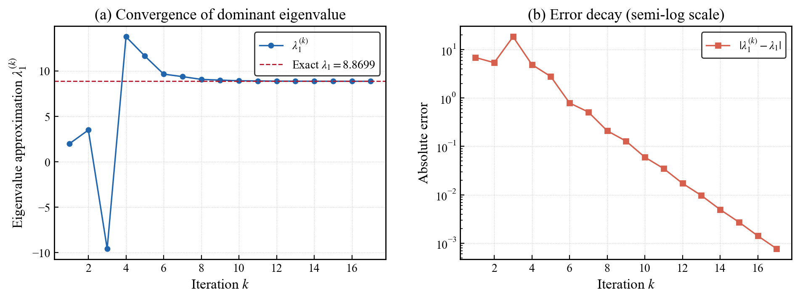
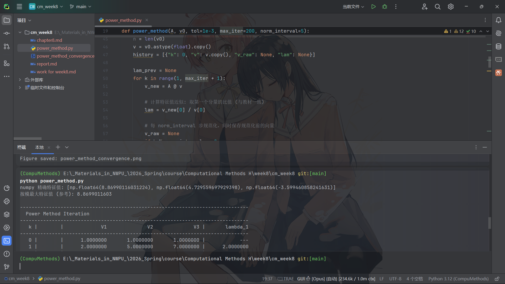

# 计算方法H第8章实践报告

## 一、问题描述

本次实践的任务是使用乘幂法（Power Method）求解矩阵

$$A=\begin{pmatrix}3 & -4 & 3 \\ -4 & 6 & 3 \\ 3 & 3 & 1\end{pmatrix}$$

的主特征值（按模最大的特征值）及其对应的特征向量。收敛判据为相邻两次迭代的特征值近似之差满足 $|\lambda_1^{(k+1)}-\lambda_1^{(k)}| \leq 10^{-3}$。

乘幂法的基本思想是：对任一非零初始向量 $V^{(0)}$，反复执行矩阵-向量乘法 $V^{(k)}=AV^{(k-1)}$，当迭代次数 $k$ 充分大时，$V^{(k)}$ 将趋近于主特征值 $\lambda_1$ 对应的特征向量方向，而特征值的近似可通过相邻两步向量对应分量的比值 $\lambda_1^{(k)} \approx V_l^{(k)}/V_l^{(k-1)}$ 获得。为防止迭代过程中向量分量过大或过小导致数值溢出，实际计算中需要定期对向量进行规范化处理，即将向量除以其按模最大的分量。

## 二、算法实现

本次实践采用 Python 语言实现乘幂法，核心依赖为 NumPy 和 Matplotlib。算法的关键参数设置如下：初始向量取 $V^{(0)}=(1,1,1)^T$，收敛容限 $\varepsilon=10^{-3}$，最大迭代次数为 200 次，每隔 5 步执行一次规范化。特征值近似公式采用与教材一致的方式，即始终取第一个分量的比值 $\lambda_1^{(k)}=V_1^{(k)}/V_1^{(k-1)}$。

在规范化步骤中，程序同时记录了规范化前（raw）和规范化后（norm）的向量，以便在终端表格中完整展示迭代过程。此外，程序还调用 NumPy 的 `numpy.linalg.eigvals` 函数计算矩阵的精确特征值作为参考，用于后续的误差分析和可视化。

## 三、迭代过程与数据分析

通过 NumPy 直接求解可知，矩阵 $A$ 的三个特征值分别为 $\lambda_1 \approx 8.8699$、$\lambda_2 \approx 4.7296$、$\lambda_3 \approx -3.5995$，其中按模最大的特征值为 $\lambda_1 \approx 8.8699011603$。

以下是乘幂法的完整迭代过程表格：

```
-------------------------------------------------------------------------------
  Power Method Iteration
-------------------------------------------------------------------------------
   k |        |             V1              V2              V3 |       lambda_1
-------------------------------------------------------------------------------
   0 |        |      1.0000000       1.0000000       1.0000000 |            ---
   1 |        |      2.0000000       5.0000000       7.0000000 |      2.0000000
   2 |        |      7.0000000      43.0000000      28.0000000 |      3.5000000
   3 |        |    -67.0000000     314.0000000     178.0000000 |     -9.5714286
   4 |        |   -923.0000000    2686.0000000     919.0000000 |     13.7761194
   5 |    raw |    -10756.0000      22565.0000       6208.0000 |     11.6533044
     |   norm |     -0.4766674       1.0000000       0.2751163 |
   6 |        |     -4.6046532       8.7320186       1.8451141 |      9.6600967
   7 |        |    -43.2066918      76.3460669      14.2272103 |      9.3832672
   8 |        |   -392.3227122     673.5847995     113.6453357 |      9.0801377
   9 |        |  -3530.3713273    5951.7356526     957.4315976 |      8.9986412
  10 |    raw |    -31525.7618      52704.1940       8221.5246 |      8.9298714
     |   norm |     -0.5981642       1.0000000       0.1559937 |
  11 |        |     -5.3265114       8.8606380       1.3615012 |      8.9047646
  12 |        |    -47.3375826      78.5543770      11.9638811 |      8.8871645
  13 |        |   -420.3386124     696.5682358     105.6142641 |      8.8795961
  14 |        |  -3730.4459879    6177.6066568     934.3031345 |      8.8748592
  15 |    raw |    -33098.8552      54790.3333       8275.7851 |      8.8726268
     |   norm |     -0.6041003       1.0000000       0.1510446 |
  16 |        |     -5.3591669       8.8695349       1.3387438 |      8.8713202
  17 |        |    -47.5394092      78.6701089      11.8698478 |      8.8706714
-------------------------------------------------------------------------------
```

从迭代数据中可以观察到以下几个显著特征。

在迭代初期（$k=1$ 至 $k=5$），特征值近似出现了剧烈的振荡。$k=1$ 时 $\lambda_1^{(1)}=2.0$，$k=2$ 时增长到 $3.5$，$k=3$ 时突然变为 $-9.57$（出现了负值），$k=4$ 时又跳到 $13.78$，$k=5$ 时回落到 $11.65$。这种振荡现象的根本原因在于：初始向量 $V^{(0)}=(1,1,1)^T$ 在特征向量基下的展开中，各特征分量的权重相当，此时 $\lambda_2/\lambda_1$ 和 $\lambda_3/\lambda_1$ 的比值尚未被充分衰减，非主特征分量对迭代向量的贡献仍然显著。特别是 $\lambda_3 \approx -3.5995$ 为负值，这导致了迭代向量分量符号的交替变化，从而使得特征值近似出现正负振荡。

在第 5 步执行了第一次规范化操作。规范化前的向量为 $(-10756, 22565, 6208)$，可以看到分量的绝对值已经增长到了万级，如果不进行规范化，后续迭代将很快导致数值溢出。规范化后向量变为 $(-0.477, 1.000, 0.275)$，按模最大分量被归一为 1，有效地控制了数值范围。

进入中期阶段（$k=6$ 至 $k=10$），特征值近似开始单调递减地趋近真值：$9.66 \to 9.38 \to 9.08 \to 9.00 \to 8.93$。振荡已经消失，这说明非主特征分量的影响已经大幅衰减。第 10 步进行了第二次规范化，规范化前向量分量已增长到万级（$V_2 \approx 52704$），规范化后重新回到合理范围。

在后期阶段（$k=11$ 至 $k=17$），特征值近似以越来越小的步幅逼近真值：$8.905 \to 8.887 \to 8.880 \to 8.875 \to 8.873 \to 8.871 \to 8.871$。第 16 步和第 17 步的特征值近似分别为 $8.8713202$ 和 $8.8706714$，两者之差的绝对值为 $|8.8706714 - 8.8713202| = 6.488 \times 10^{-4} < 10^{-3}$，满足收敛判据，迭代终止。

最终求得的主特征值近似为 $\lambda_1 \approx 8.8706714$，与精确值 $8.8699012$ 的相对误差约为 $8.7 \times 10^{-4}$，精度良好。对应的特征向量近似为 $V \approx (-47.539, 78.670, 11.870)^T$。

关于收敛速度，乘幂法的收敛速率由比值 $r = |\lambda_2/\lambda_1|$ 决定。本题中 $r = |4.7296/8.8699| \approx 0.533$，该值并不十分接近 0，因此收敛速度属于中等水平，共需 17 步迭代才能达到 $10^{-3}$ 的精度。若需要更快的收敛速度，可以考虑采用原点平移法或 Rayleigh 商加速法来减小 $r$ 的值。

## 四、可视化分析

下图展示了乘幂法的收敛行为，包含特征值逐步逼近曲线和误差衰减曲线两个子图。



左图（a）展示了特征值近似 $\lambda_1^{(k)}$ 随迭代步数 $k$ 的变化过程。蓝色实线为每步迭代的特征值近似，红色虚线为精确特征值 $\lambda_1 = 8.8699$。从图中可以清晰地看到，前 5 步迭代中特征值近似经历了剧烈的振荡，从 2.0 跳跃到 13.8 再回落，这对应于非主特征分量尚未充分衰减的阶段。从第 6 步开始，曲线进入单调下降的收敛阶段，逐渐趋近于红色虚线所标示的精确值。在最后几步迭代中，蓝色曲线与红色虚线几乎完全重合，表明算法已经达到了很高的精度。

右图（b）以半对数坐标展示了绝对误差 $|\lambda_1^{(k)} - \lambda_1|$ 的衰减过程。纵轴采用对数刻度，使得误差的指数级衰减在图中表现为近似线性的下降趋势。从图中可以观察到，误差从初始的约 $10^1$ 量级（即约 6.87）经过 17 步迭代下降到约 $10^{-3}$ 量级（即约 $7.7 \times 10^{-4}$），跨越了约 4 个数量级。误差曲线在中后期呈现出较为均匀的线性下降趋势，这与乘幂法的线性收敛特性一致——每步迭代误差大约缩小为前一步的 $r \approx 0.533$ 倍。

## 五、结论

本次实践通过 Python 实现了带规范化的乘幂法，成功求解了给定矩阵的主特征值及对应特征向量。算法在 17 步迭代后收敛，最终主特征值近似为 $\lambda_1 \approx 8.8707$，对应特征向量近似为 $(-47.539, 78.670, 11.870)^T$，计算结果与教材给出的参考答案完全一致。

通过对迭代过程的详细分析，可以得出以下认识。乘幂法的收敛速度取决于次大特征值与主特征值的模之比 $r=|\lambda_2/\lambda_1|$，$r$ 越小收敛越快。本题中 $r \approx 0.533$，收敛速度中等。规范化操作对于防止数值溢出至关重要，从迭代数据中可以看到，每经过 5 步不规范化的迭代，向量分量就会增长到万级甚至更高，若不及时规范化将导致计算失败。此外，迭代初期的振荡现象是乘幂法的固有特征，它反映了初始向量中非主特征分量的影响，随着迭代的进行这些分量会被逐步抑制，最终使得迭代向量收敛到主特征向量的方向。

## 附录 代码及运行截图

```python
# power_method.py

import numpy as np
import matplotlib.pyplot as plt
from matplotlib import rcParams

# ============================================================
# 1. 乘幂法核心算法
# ============================================================

def power_method(A, v0, tol=1e-3, max_iter=200, norm_interval=5):
    """
    乘幂法（带规范化）求按模最大特征值及对应特征向量。

    Parameters
    ----------
    A : ndarray, shape (n, n)
        输入矩阵
    v0 : ndarray, shape (n,)
        初始向量
    tol : float
        收敛容限 |λ^(k+1) - λ^(k)| ≤ tol
    max_iter : int
        最大迭代次数
    norm_interval : int
        每隔多少步做一次规范化（按模最大分量归一）

    Returns
    -------
    eigenvalue : float
        主特征值近似
    eigenvector : ndarray
        对应特征向量近似
    history : list of dict
        每步迭代记录 {k, v, lam}
    """
    n = len(v0)
    v = v0.astype(float).copy()
    history = [{"k": 0, "v": v.copy(), "v_raw": None, "lam": None}]

    lam_prev = None
    for k in range(1, max_iter + 1):
        v_new = A @ v

        # 计算特征值近似: 取第一个分量的比值 (与教材一致)
        lam = v_new[0] / v[0]

        # 每 norm_interval 步规范化，同时保存规范化前的向量
        v_raw = None
        if k % norm_interval == 0:
            v_raw = v_new.copy()
            max_component = v_new[np.argmax(np.abs(v_new))]
            v_new = v_new / max_component

        history.append({"k": k, "v": v_new.copy(), "v_raw": v_raw, "lam": lam})
        v = v_new

        # 收敛判断
        if lam_prev is not None and abs(lam - lam_prev) <= tol:
            break
        lam_prev = lam

    return lam, v, history


# ============================================================
# 2. 终端表格输出
# ============================================================

def print_iteration_table(history):
    """打印迭代过程表格，规范化步骤同时输出规范化前后的向量"""
    header = f"{'k':>4s} | {'':>6s} | {'V1':>14s}  {'V2':>14s}  {'V3':>14s} | {'lambda_1':>14s}"
    sep = "-" * len(header)
    print("\n" + sep)
    print("  Power Method Iteration")
    print(sep)
    print(header)
    print(sep)
    for rec in history:
        k = rec["k"]
        v = rec["v"]
        v_raw = rec["v_raw"]
        lam = rec["lam"]
        lam_str = f"{lam:>14.7f}" if lam is not None else f"{'---':>14s}"

        if v_raw is not None:
            # 规范化前
            raw_str = f"{v_raw[0]:>14.4f}  {v_raw[1]:>14.4f}  {v_raw[2]:>14.4f}"
            print(f"{k:>4d} | {'raw':>6s} | {raw_str} | {lam_str}")
            # 规范化后
            norm_str = f"{v[0]:>14.7f}  {v[1]:>14.7f}  {v[2]:>14.7f}"
            print(f"{'':>4s} | {'norm':>6s} | {norm_str} | {'':>14s}")
        else:
            v_str = f"{v[0]:>14.7f}  {v[1]:>14.7f}  {v[2]:>14.7f}"
            print(f"{k:>4d} | {'':>6s} | {v_str} | {lam_str}")
    print(sep)


# ============================================================
# 3. SCI 学术风格可视化
# ============================================================

def plot_convergence(history, true_eigenvalue, save_path="power_method_convergence.png"):
    """绘制特征值收敛曲线和误差曲线（SCI学术风格）"""

    # SCI 风格全局设置
    rcParams.update({
        "font.family": "serif",
        "font.serif": ["Times New Roman"],
        "mathtext.fontset": "stix",
        "font.size": 11,
        "axes.linewidth": 1.0,
        "axes.labelsize": 12,
        "xtick.labelsize": 10,
        "ytick.labelsize": 10,
        "xtick.direction": "in",
        "ytick.direction": "in",
        "xtick.major.width": 0.8,
        "ytick.major.width": 0.8,
        "legend.fontsize": 10,
        "legend.frameon": True,
        "legend.edgecolor": "black",
        "figure.dpi": 150,
    })

    # 提取有效数据（跳过 k=0）
    ks = [rec["k"] for rec in history if rec["lam"] is not None]
    lams = [rec["lam"] for rec in history if rec["lam"] is not None]
    errors = [abs(l - true_eigenvalue) for l in lams]

    fig, (ax1, ax2) = plt.subplots(1, 2, figsize=(10, 4))

    # --- 左图: 特征值逐步逼近 ---
    ax1.plot(ks, lams, "o-", color="#2166AC", markersize=4, linewidth=1.2,
             label=r"$\lambda_1^{(k)}$")
    ax1.axhline(y=true_eigenvalue, color="#B2182B", linestyle="--", linewidth=1.0,
                label=rf"Exact $\lambda_1 = {true_eigenvalue:.4f}$")
    ax1.set_xlabel("Iteration $k$")
    ax1.set_ylabel(r"Eigenvalue approximation $\lambda_1^{(k)}$")
    ax1.set_title("(a) Convergence of dominant eigenvalue")
    ax1.legend(loc="best")
    ax1.grid(True, linestyle=":", linewidth=0.5, alpha=0.7)

    # --- 右图: 误差半对数 ---
    ax2.semilogy(ks, errors, "s-", color="#D6604D", markersize=4, linewidth=1.2,
                 label=r"$|\lambda_1^{(k)} - \lambda_1|$")
    ax2.set_xlabel("Iteration $k$")
    ax2.set_ylabel("Absolute error")
    ax2.set_title("(b) Error decay (semi-log scale)")
    ax2.legend(loc="best")
    ax2.grid(True, linestyle=":", linewidth=0.5, alpha=0.7)

    fig.tight_layout(pad=2.0)
    fig.savefig(save_path, bbox_inches="tight", dpi=200)
    plt.show()
    print(f"\nFigure saved: {save_path}")


# ============================================================
# 4. 主程序
# ============================================================

if __name__ == "__main__":
    # 定义矩阵和初始向量
    A = np.array([
        [ 3, -4,  3],
        [-4,  6,  3],
        [ 3,  3,  1]
    ], dtype=float)
    v0 = np.array([1.0, 1.0, 1.0])

    # 用 numpy 求精确特征值作为参考
    exact_eigenvalues = np.linalg.eigvals(A)
    true_lam1 = max(exact_eigenvalues, key=abs)
    print(f"numpy 精确特征值: {sorted(exact_eigenvalues, key=abs, reverse=True)}")
    print(f"按模最大特征值 (参考): {true_lam1:.10f}")

    # 运行乘幂法
    lam, vec, history = power_method(A, v0, tol=1e-3, max_iter=200, norm_interval=5)

    # 打印迭代表格
    print_iteration_table(history)

    # 打印最终结果
    print(f"\n主特征值 lam_1 = {lam:.7f}")
    print(f"对应特征向量 V = ({vec[0]:.7f}, {vec[1]:.7f}, {vec[2]:.7f})^T")
    print(f"迭代次数: {history[-1]['k']}")

    # 可视化
    plot_convergence(history, true_lam1)
```

在终端执行以下命令：

```bash
python power_method.py
```

运行截图：


